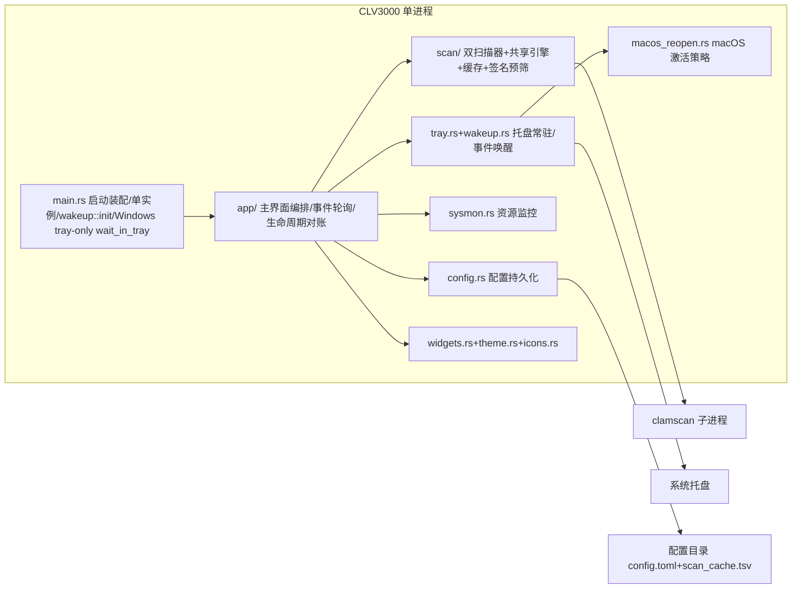

## 项目概览
CLV3000 是纯 Rust 实现的极简 **手动杀毒工具**（egui 桌面 GUI + 外部 ClamAV），**Windows/macOS 真实扫描、Linux 等仅 mock 预览**，专为老旧机器设计：绿色分发、体积小（release 用 `opt-level=s`/lto/strip/panic=abort）、扫完即走。能力 = "两类扫描 + 快速文件扫描 + 五项辅助 + 两项提速"：**闪电扫描**（枚举活动进程加载的模块）与**全盘扫描**（遍历磁盘上的可执行文件）交给 ClamAV 比对签名；右键"用 CLV3000 扫描"/`--scan-path` 单目标快扫复用全盘扫描页；辅助为系统托盘常驻、实时 CPU/内存状态条、病毒库手动更新（freshclam）、威胁忽略记忆、设置页（开机自启 + 右键菜单开关 + 隔离区/忽略管理）；检出可**隔离**（移入隔离目录，可恢复/删除）。提速为 blake3 **文件基因缓存**（双索引：哈希→结果 + 路径→`{size,mtime,hash}` 戳，按病毒库修订号失效）与**可信签名预筛**（WinVerifyTrust / codesign）。刻意**不做**实时防护。约 6500 行 / 32 个源文件，无 async 运行时、无网络依赖、无数据库。
## 架构设计
单进程、单二进制，分层 + 管道-过滤器模式。核心信条：**UI 线程不做重活**——所有重任务 `std::thread::spawn` 到后台线程，经 `std::sync::mpsc` channel 推事件，UI 每帧 `try_recv` 轮询；每个外部依赖都可优雅降级（引擎缺失→提示不崩溃、托盘失败→无托盘运行、枚举权限不足→跳过）。

| 架构特征 | 实现 | 目的 |
|---------|------|------|
| 分层 | 表现层(app/、widgets、theme) → 服务层(scan/sysmon/config) → 平台层(Win32/AppKit/ClamAV 子进程) | 职责分离，重活下沉线程 |
| 管道-过滤器 | 扫描器(quick/full_scan) 收集路径（内存列表或流式写入临时文件）→ `engine::run`（缓存/签名预筛 → 临时文件 → clamscan）→ 逐行解析回传 | 一次子进程启动、一次病毒库加载 |
| 状态机 | `ScanPhase`(Idle/Enumerating/Scanning/Done) 驱动扫描页 | 异步扫描收敛为确定性 UI 状态 |
| 事件驱动(事件唤醒) | 后台发 `ScanEvent`，UI 每帧 `try_recv`；UI 唤醒由 `wakeup` 转发线程 + sysmon 1Hz + 扫描 ~30fps 驱动，闲置时事件循环真正睡死 | 后台→前台唯一数据通道，老机器零空转 |
| 启动形态 | `InitialMode`(ShowWindow/TrayOnly/QuickScan/About/ScanPath) 决定 eframe 初始姿态；Windows `--tray-only` 在 eframe 之外跑 Win32 消息循环（`wait_in_tray`：不创建窗口、零 OpenGL 上下文/纹理内存、不闪窗），macOS 仍启动 eframe（隐藏，因托盘事件投递依赖 NSApplication 事件循环）；QuickScan/About/ScanPath 以隐藏姿态创建、reconcile 首帧按目标尺寸显示 | 托盘态内存最小化 |
## 模块地图
| 模块 | 职责 | 主路径 |
|------|------|--------|
| 扫描引擎 | 封装 clamscan 子进程：`run(PathSource)`（闪电 InMemory / 全盘 File 预写盘列表）→ 预筛并行（`std::thread::scope` ≤8 线程、<64 文件回退串行：stat + blake3 哈希 + `CacheSnapshot` 缓存命中 + 可信签名直接判结果、逐文件发进度、随时响应取消）→ `run_clamscan_batch` 写 PID 临时文件 → `--file-list=<temp> -v --no-summary --stdout`；解析 `Scanning <path>` 进度行与 `path: status` 结果行、结果回写缓存；`finish_scan` 先发 `Finished` 再后台线程落盘缓存；看门狗 kill 取消。Windows/macOS 真实、Linux mock | `src/scan/engine.rs` |
| 闪电扫描 | Windows ToolHelp 拍进程快照枚举各进程模块、macOS 用 sysinfo 枚举进程取主 exe、HashSet 去重；两阶段（先枚举拿总数再扫）；无文件时直接结束 | `src/scan/quick_scan.rs` |
| 全盘扫描 | Windows `GetLogicalDrives`/`GetDriveTypeW` + 可执行扩展名白名单；macOS `/` + 可选 `/Volumes` 用 Mach-O 魔数过滤；walkdir 遍历并**流式写入** `clv3000_walklist_<pid>.txt` 临时文件（`WalkListWriter`，内存只留计数不收集整表），遍历中经 `WalkProgress` 汇报已发现数、结束后发 `ScanStarted{total}` 并把 `PathSource::File{path,count}` 交给引擎（空列表直接 `Finished`）；`run_single_target`/`walk_single` 支持右键菜单/`--scan-path` 单目标快速扫描（`is_excluded`/`has_never_executable_extension` 快速过滤，直接复用扫描页渲染） | `src/scan/full_scan.rs` |
| 扫描缓存 | 双索引 blake3 缓存：主索引 `scan_cache.tsv`（哈希→结果，按病毒库修订号失效、TTL/LRU 驱逐）+ 伴生路径索引文件（路径→`PathStamp{size,mtime_ns,hash}`，`quick_hash` 按尺寸/时间戳命中免内容哈希）；`CacheSnapshot` 只读快照供并行预筛共享，结果回写后台线程落盘（`save()` 双 compact 全量落盘）；>64MB 文件跳过 | `src/scan/cache.rs` |
| Authenticode 校验 | PE `WinVerifyTrust` 信任签名验证 / macOS `codesign --verify`（Mach-O）；`is_trusted_signed` 作引擎预筛；`is_macho_file` 判 PE/Mach-O | `src/scan/authenticode.rs` |
| 扫描协议 | `ScanEvent`（含 `Enumerating`/`EngineLoading{remaining}`/`ScanningFile{path}`/`WalkProgress{files_found}` 进度事件；`ScanStarted` 由闪电枚举后与全盘 walk 结束后各发一次）/`PathSource`(InMemory / File)/`Threat`/`ScanKind`/`CancelFlag(AtomicBool)` 统一契约 | `src/scan/mod.rs` |
| 主界面编排 | `App` 主循环（每帧 `poll_background` 事件全排空、`poll_tray` 置顶、`poll_scan_requests` 处理右键/`--scan-path` 转发、`reconcile_lifecycle` 对账生命周期↔视口可见性、macOS `sync_macos_minimized_viewport`、Toast、注册/注销 wakeup Context）；`App::new(…, initial: InitialMode)` 按启动形态初始化（QuickScan 直接开扫、ScanPath 直接开单目标扫、About 开关于覆盖层）；扫描期间 macOS `ScanActivity` 防 App Nap、`hide_to_tray` 清空 egui 跨帧状态 + Windows 压缩工作集；五页面(Dashboard/QuickScan/VirusDb/FullScan/Settings) 绘制拆到 `pages.rs`（设置页在 `settings.rs`）、自绘标题栏/侧栏/资源条拆到 `chrome.rs`，`AppCore`（含 `page`/`quick`/`full`/`settings`）/`ScanPageState`/`VirusDbState`/`SettingsState` 状态与轮询拆到 `core.rs` | `src/app/mod

…
## 核心流程
**1. 闪电扫描**（闪电扫描页/仪表盘/托盘触发）— `ScanPageState::start` spawn 线程：
1. `snapshot_pids`（Windows ToolHelp / macOS sysinfo）→ 逐进程 `modules_of_process`（权限不足跳过）→ HashSet 去重保序，发 `Enumerating` 进度事件。
2. 枚举完成拿到总数后发 `ScanStarted{total}` 并 `engine::run(PathSource::InMemory(paths), tx, cancel)`（此时 UI 可画确定百分比圆环）。
3. 引擎内部：预筛并行处理（`std::thread::scope` 分 ≤8 线程、<64 文件回退串行；stat + blake3 哈希 + `CacheSnapshot` 缓存命中 + 可信签名直接判结果，发 `ScanningFile`/`FileScanned` 进度，随时响应取消）→ 剩余路径写 PID 临时文件 → clamscan 逐行回 stdout（`Scanning <path>` 行转进度、`path: status` 行转结果）→ 结果回写缓存；`Finished` 立即发出，缓存落盘转到后台线程。
4. UI 每帧 `try_recv` 全排空推进 `ScanPhase`（进程退出时的突发 flush 一帧内处理完、尾部不滞后）；完成后写 `last_quick_scan` 摘要并 `config.save()`。

**2. 全盘扫描**（流式收集后扫描）— 遍历磁盘时把发现的可执行文件逐行**流式写入** `clv3000_walklist_<pid>.txt` 临时文件（`WalkListWriter`，内存只留计数；Windows 盘符+扩展名白名单 / macOS `/`+`/Volumes`+Mach-O 魔数），遍历中经 `WalkProgress` 汇报已发现文件数（UI 显示"N to scan"、可随时取消）；walk 结束、总数已知后发 `ScanStarted{total}` 切带百分比的扫描 UI（空列表直接 `Finished`）；随后 `engine::run(PathSource::File{path,count})` 读列表扫描；结束写 `last_full_scan`。可选"包含可移动磁盘"（`scan_removable_drives`，默认关）。

**3. 取消扫描**：UI 置 `CancelFlag=true` → 引擎预筛阶段逐文件检查并立即短路；进入子进程后看门狗线程 100ms 轮询到即 `child.kill()`（`Arc<Mutex<Child>>` 共享句柄），stdout 关闭、读取循环退出，最终发 `Finished{cancelled:true}`。路径已预先写入临时文件，无 stdin 可关，软取消已不需要。

**4. 托盘生命周期**：Windows `--tray-only` 启动时 `main` 在 eframe **之外**跑 Win32 消息循环（`wait_in_tray`：`PeekMessage`/`DispatchMessage` + `MsgWaitForMultipleObjectsEx` 30ms 超时兜底，零 CPU），不创建任何窗口——零 OpenGL/纹理内存、不闪窗；用户从托盘请求窗口/关于/闪电扫描时按 `InitialMode` 才 `run_native`（macOS tray-only 仍直接启动 eframe 隐藏，因托盘事件投递依赖 NSApplication 事件循环）。窗口会话启动后 eframe **全程存活**（不再销毁/重建——macOS 重建会让托盘事件投递失效）：关闭按钮被拦截为"隐藏到托盘"（`hide_to_tray` 立即发 `Visible(false)` + 置 `window_hidden` + 释放 GPU 纹理/sysmon + 清空 egui 跨帧状态，Windows 再 `SetProcessWorkingSetSize(-1,-1)` 压缩工作集降内存，macOS 切 `Accessory` 离开 Dock）→ 托盘/菜单点击由 `wakeup` 转发线程（阻塞在 tray-icon/muda 全局 channel，零 CPU）`request_repaint` 唤醒 → `reconcile_lifecycle` 每帧对账视口可见性（"已隐藏"分支每帧重发 `Visible(false)` 兜底），唤回时 `bring_to_front` 以 60ms 间隔重试至多 `ACTIVATE_FRAMES` 帧（macOS 12 / 其它 2），App 已 active、窗口已是 key window 即返回 true 提前清零收敛；About 以隐藏姿态创建、reconcile 首帧按关于尺寸显示（避免闪 900x600 主窗）；从最小化恢复时 `sync_macos_minimized_viewport` 把 egui 陈旧的 `minimized` 标记与 `NSWindow` 真实状态对齐并补发 `Minimized(false)`（否则 `ui()` 整帧跳过、窗口卡死）。关于为主窗内覆盖层（来自托盘时独占整窗，关闭自动缩回托盘）。仅托盘"退出"置 `allow_exit` 真正结束。单实例：Windows `G

…
## 技术选型
- **语言/版本**：Rust 2024 edition，v0.7.5；无 async 运行时（ADR：阻塞 IO 场景线程更简单、取消=kill 直白）。
- **GUI**：eframe/egui 0.36（glow + default_fonts）；即时模式，自绘深色主题与矢量图标（`theme.rs`/`icons.rs`，参照 `clv3000-design` skill 设计令牌）。
- **平台 API**：windows crate 0.62（ToolHelp 进程/模块枚举、磁盘枚举、CreateMutexW、GetLocalTime、`CREATE_NO_WINDOW` 隐藏子进程控制台；`Win32_Security_WinTrust`/`Win32_Security_Cryptography` 支撑 Authenticode 信任签名校验；`Win32_System_Registry` 支撑右键菜单 shell verb 与开机自启 Run 键；`SetProcessWorkingSetSize(-1,-1)` 托盘态压缩工作集降内存）；macOS：objc2 + objc2-app-kit + objc2-foundation（NSApplication 激活策略 Accessory/Regular、窗口最小化状态、`bring_to_front` 提前收敛；`NSProcessInfo` 的 `beginActivityWithOptions_reason`（UserInitiated）做扫描期防 App Nap）、sysinfo 枚举进程、`codesign` 子进程验 Mach-O 签名；开机自启 macOS 走用户 LaunchAgent plist。
- **哈希**：blake3 1（文件内容哈希，作扫描缓存键）。
- **托盘**：tray-icon 0.24 + muda 0.19（菜单）；事件经 `src/wakeup.rs` 转发线程唤醒 UI。
- **系统监控**：sysinfo 0.39（CPU/内存采样，兼作 macOS 进程枚举）。
- **持久化**：serde + toml → 配置目录 `config.toml`（directories 6 BaseDirs：Windows `%APPDATA%\CLV3000` / macOS `~/Library/Application Support/CLV3000`）；扫描缓存 `scan_cache.tsv` + 伴生路径索引文件同目录；隔离文件在配置目录 `quarantine/`。
- **遍历**：walkdir 2.5。
- **扫描引擎**：外部 ClamAV `clamscan`/`freshclam` 子进程（Windows 便携版 `clamscan.exe` / macOS 内置 `clamav/` 或系统安装或 PATH；进程边界隔离，非内嵌 libclamav）。
- **构建**：winresource（Windows 图标/版本资源 + `[package.metadata.winresource]`）+ objc2（macOS 原生支持）；macOS `.app` 打包走 cargo-bundle（`[package.metadata.bundle]` + `assets/icons/icon_app.icns`，`scripts/bundle-macos.sh` 打包后把本地 `clamav/` 拷入 `Contents/Resources/clamav`）；release 面向体积（`opt-level=s`、lto、codegen-units=1、panic=abort、strip）。
## 系统边界
| 边界 | 说明 | 信任假设 |
|------|------|----------|
| clamscan 子进程 | 契约：`--file-list=<PID 临时文件>`（路径列表预写）+ `-v --no-summary --stdout`、可选 `--database=<resolved db>`；stdout 逐行解析：`Scanning <path>` 进度行转 `ScanningFile`、`path: status` 结果行（`rsplit_once(": ")`，`OK`→干净，`X FOUND`→检出）；Windows `CREATE_NO_WINDOW`+`--scan-pe=yes`、macOS `--scan-pe=no`；`apply_scan_flags` 统一提速开关（关 bytecode/PUA 等） | 从内置 `clamav\`、系统安装或 PATH 启动，视为可信；前置缓存+签名预筛 |
| freshclam 子进程 | Windows `--datadir=<db>`、macOS 需 `freshclam.conf`；跑前/跑后比对库目录签名（`database_signature`）区分"已更新/已最新"，stdout/stderr 丢弃（macOS 另写 `/tmp/clv3000_freshclam.log` 调试日志）；仅退出码判成败 | 同上；病毒库更新是唯一联网入口 |
| 配置持久化 | 配置目录下 `config.toml`（含隔离记录 `QuarantineEntry`）+ `scan_cache.tsv` + 伴生路径索引文件（缓存双索引持久化）+ 隔离目录 `quarantine/`；全盘扫描另写系统临时目录 `clv3000_walklist_<pid>.txt`；加载失败回退默认 | 应用自身数据，不做校验 |
| 平台 API | Win32（进程/模块枚举、磁盘枚举、单实例 Mutex、本地时间、隐藏子进程窗口、右键菜单 verb / 自启 Run 键注册表）+ macOS AppKit（激活策略/最小化状态/isActive）/Unix socket/codesign/LaunchAgent plist | 平台层，trusted |
| 分发布局 | Windows：exe 与 `clamav\`（clamscan/freshclam/依赖 DLL/`database\*.cvd`）同目录绿色分发；macOS：`.app` 包（cargo-bundle）可内置 `Contents/Resources/clamav`（paths 优先该目录、裸二进制退回 exe 同目录 `clamav/`），另支持系统安装（`/usr/local/clamav`）或 PATH，病毒库候选内置/系统/`~/.clamav` | 引擎缺失→页面提示"找不到扫描引擎"，不崩溃 |
| 安全模型 | 检出默认只报告，用户选择**隔离**（移入隔离目录）或忽略；对用户文件的唯一写操作是隔离/恢复/删除（显式动作），无实时防护、无 HTTP/插件接口 | 用户对威胁处置负最终责任 |
## 代码映射索引
| 概念 | 位置 | 说明 |
|------|------|------|
| 五页面编排 / 事件轮询 | `src/app/mod.rs`+`src/app/core.rs` | `App`（`core: AppCore`/`lifecycle`/`tray`/`toasts`/`window_hidden`/`activate_countdown`，macOS 另有 `scan_activity`）；`App::new(…, initial: InitialMode)` 按启动形态初始化（QuickScan 直接开扫、ScanPath 直接开单目标扫、About 开关于覆盖层）；每帧 `poll_background`（事件全排空）、`poll_tray`（`poll_tray_events` 返回 focus 请求置顶）、`poll_scan_requests`（排空右键/`--scan-path` 转发请求并 `begin_path_scan`）、`reconcile_lifecycle`（"已隐藏"分支每帧重发 Visible(false) 兜底）、macOS `sync_macos_minimized_viewport`、`wakeup::register_ctx`；`hide_to_tray` 清空 egui 跨帧状态 + `trim_working_set`；`AppCore`（`page`/`quick`/`full`/`settings`）/`ScanPageState`/`VirusDbState`/`SettingsState` 状态与 poll 在 core.rs |
| 扫描状态机 | `src/app/core.rs` | `ScanPhase`(Idle/Enumerating/Scanning/Done) 驱动扫描页渲染；`ScanPageState::start`/`start_path`/`request_cancel` |
| 扫描事件协议 | `src/scan/mod.rs` | `ScanEvent`（含 `EngineLoading`/`ScanningFile`/`WalkProgress`）/`PathSource`(InMemory/File)/`Threat`/`ScanKind`/`CancelFlag`；`authenticode`/`cache` 按平台门控发布 |
| 子进程引擎 | `src/scan/engine.rs` | `run(PathSource)` 并行预筛（≤8 线程 `thread::scope`、<64 回退串行；`prescan_one`/`prescan_chunk`/`prescan_worker_count`，`CacheWrite` 记录）→ `run_clamscan_batch()`（临时文件+子进程写/读/看门狗）→ `finish_scan()`（先发 `Finished`、后台线程落盘缓存）；`apply_scan_flags`/`rsplit_result_line`/`parse_verdict` |
| 进程模块枚举 | `src/scan/quick_scan.rs` | Windows `snapshot_pids`/`modules_of_process`（ToolHelp）；macOS sysinfo 取主 exe |
| 磁盘遍历 | `src/scan/full_scan.rs` | `walk`（`WalkListWriter` 流式写 `clv3000_walklist_<pid>.txt`、`WalkProgress` 上报、结束后发 `ScanStarted`）/`run_single_target`/`walk_single`/`is_excluded`/`has_never_executable_extension`/`local_drive_roots`/`is_macho_file`/扩展名白名单 |
| 扫描缓存 | `src/scan/cache.rs` | `ScanCache`/`Record`/`PathStamp`/`CacheSnapshot`：`open`/`lookup`/`quick_hash`/`remember_path_hash`/`save`（双 compact 全量落盘）、`path_index_file`/`db_revision`/`file_hash` |
| 签名校验 | `src/scan/authenticode.rs` | `is_pe_file`/`is_macho_file`/`is_trusted_signed`/`verify_trusted`（WinVerifyTrust）+ macOS codesign |
| 配置模型 | `src/config.rs` | `AppConfig`/`ScanRecord`/`IgnoredEntry`/`QuarantineEntry`（`quarantined` 列表持久化）；`is_ignored`/`add_ignored`/`remove_ignored`/`add_quarantined`/`remove_quarantined` |
| 隔离区操作 | `src/quarantine.rs` | `quarantine_file`/`restore_file`/`delete_permanently`/`move_file`；

…