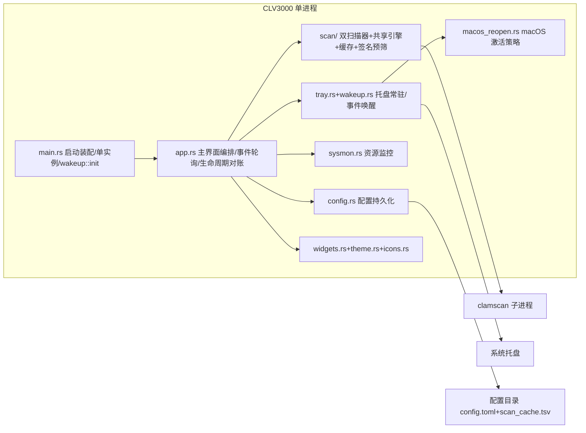

## 项目概览

CLV3000 是纯 Rust 实现的极简 **手动杀毒工具**（egui 桌面 GUI + 外部 ClamAV），**Windows/macOS 真实扫描、Linux 等仅 mock 预览**，专为老旧机器设计：绿色分发、体积小（release 用 `opt-level=s`/lto/strip/panic=abort）、扫完即走。能力 = "两类扫描 + 四项辅助 + 两项提速"：**闪电扫描**（枚举活动进程加载的模块）与**全盘扫描**（遍历磁盘上的可执行文件）交给 ClamAV 比对签名；辅助为系统托盘常驻、实时 CPU/内存状态条、病毒库手动更新（freshclam）、威胁忽略记忆；提速为 blake3 **文件基因缓存**（按病毒库修订号失效）与**可信签名预筛**（WinVerifyTrust / codesign）。刻意**不做**实时防护、检出只报告（"隔离"按钮是占位）——永不误伤系统。约 3700 行 / 23 个源文件，无 async 运行时、无网络依赖、无数据库。

## 架构设计

单进程、单二进制，分层 + 管道-过滤器模式。核心信条：**UI 线程不做重活**——所有重任务 `std::thread::spawn` 到后台线程，经 `std::sync::mpsc` channel 推事件，UI 每帧 `try_recv` 轮询；每个外部依赖都可优雅降级（引擎缺失→提示不崩溃、托盘失败→无托盘运行、枚举权限不足→跳过）。



| 架构特征 | 实现 | 目的 |
|---------|------|------|
| 分层 | 表现层(app/widgets/theme) → 服务层(scan/sysmon/config) → 平台层(Win32/AppKit/ClamAV 子进程) | 职责分离，重活下沉线程 |
| 管道-过滤器 | 扫描器(quick/full_scan) 收集完整路径列表 → `engine::run`（缓存/签名预筛 → 临时文件 → clamscan）→ 逐行解析回传 | 一次子进程启动、一次病毒库加载 |
| 状态机 | `ScanPhase`(Idle/Enumerating/Scanning/Done) 驱动扫描页 | 异步扫描收敛为确定性 UI 状态 |
| 事件驱动(事件唤醒) | 后台发 `ScanEvent`，UI 每帧 `try_recv`；UI 唤醒由 `wakeup` 转发线程 + sysmon 1Hz + 扫描 ~30fps 驱动，闲置时事件循环真正睡死 | 后台→前台唯一数据通道，老机器零空转 |

## 模块地图

| 模块 | 职责 | 主路径 |
|------|------|--------|
| 扫描引擎 | 封装 clamscan 子进程：blake3 缓存命中 + 可信签名预筛直接判结果 → 剩余路径写 PID 临时文件 → `--file-list=<temp> -v --no-summary --stdout`；逐行解析 `path: status`，结果回写缓存；看门狗 kill 取消。Windows/macOS 真实、Linux mock | `src/scan/engine.rs` |
| 闪电扫描 | Windows ToolHelp 拍进程快照枚举各进程模块、macOS 用 sysinfo 枚举进程取主 exe、HashSet 去重；两阶段（先枚举拿总数再扫） | `src/scan/quick_scan.rs` |
| 全盘扫描 | Windows `GetLogicalDrives`/`GetDriveTypeW` + 可执行扩展名白名单；macOS `/` + 可选 `/Volumes` 用 Mach-O 魔数过滤；walkdir 遍历，先收集完整列表再一次性扫 | `src/scan/full_scan.rs` |
| 扫描缓存 | blake3 内容哈希→扫描结果的磁盘缓存（`scan_cache.tsv`，按病毒库修订号失效、TTL/驱逐/compact）；引擎预筛 + 结果回写；>64MB 文件跳过 | `src/scan/cache.rs` |
| Authenticode 校验 | PE `WinVerifyTrust` 信任签名验证 / macOS `codesign --verify`（Mach-O）；`is_trusted_signed` 作引擎预筛；`is_macho_file` 判 PE/Mach-O | `src/scan/authenticode.rs` |
| 扫描协议 | `ScanEvent`/`Threat`/`ScanKind`/`CancelFlag(AtomicBool)` 统一契约 | `src/scan/mod.rs` |
| 主界面编排 | 四页面(Dashboard/QuickScan/VirusDb/FullScan)、自绘标题栏、`ScanPageState` 轮询状态机、Toast；`reconcile_lifecycle` 对账生命周期↔视口可见性，注册/注销 wakeup Context | `src/app.rs` |
| 配置持久化 | TOML：上次扫描摘要 `ScanRecord`、忽略列表 `IgnoredEntry`、可移动盘开关；损坏回退默认 | `src/config.rs` |
| 系统托盘 | tray-icon+muda 图标与菜单；事件经 `wakeup` 转发线程阻塞等待并唤醒 UI（不再轮询），关窗默认隐藏到托盘 | `src/tray.rs`+`src/wakeup.rs` |
| 生命周期 | `RunMode`(ShowWindow/TrayOnly/Quit) + `about_open`/`about_standalone` 覆盖标记；关于为主窗内覆盖层（模态/独占整窗），非独立 viewport | `src/lifecycle.rs`+`src/about_dialog.rs` |
| 资源监控 | 独立线程每秒采样 CPU/内存并按 1Hz 主动唤醒 UI（`spawn(ctx)`），渲染在底部资源条 | `src/sysmon.rs` |
| 病毒库管理 | clamscan `-V` 解析引擎/病毒库版本（异步刷新）；freshclam 手动更新（跑前/跑后比对库目录签名区分"已更新/已最新"；macOS 读 freshclam.conf） | `src/clamav_info.rs` |
| 路径定位 | exe 相对 `clamav\` 目录、配置目录（Windows `%APPDATA%\CLV3000` / macOS `~/Library/Application Support/CLV3000`）、`resolved_clamav_database_dir()`（内置/系统安装/`~/.clamav`）、macOS PATH 兜底、可用性探测 | `src/paths.rs` |
| 平台集成 | 单实例锁（Windows 具名 Mutex / macOS Unix socket）、macOS 激活策略（Accessory/Regular）、Win32 本地时间、构建时 Windows 资源 | `src/single_instance.rs`+`src/macos_reopen.rs`+`src/localtime.rs`+`build.rs` |

## 核心流程

**1. 闪电扫描**（闪电扫描页/仪表盘/托盘触发）— `ScanPageState::start` spawn 线程：
1. `snapshot_pids`（Windows ToolHelp / macOS sysinfo）→ 逐进程 `modules_of_process`（权限不足跳过）→ HashSet 去重保序，发 `Enumerating` 进度事件。
2. 枚举完成拿到总数后发 `ScanStarted{total}` 并 `engine::run(paths, tx, cancel)`（此时 UI 可画确定百分比圆环）。
3. 引擎内部：缓存命中 + 可信签名预筛直接判结果 → 剩余路径写 PID 临时文件 → clamscan 逐行回 stdout → `FileScanned`，结果回写缓存。
4. UI 每帧 `try_recv`（上限 4 条）推进 `ScanPhase`；完成后写 `last_quick_scan` 摘要并 `config.save()`。

**2. 全盘扫描**（先收集后扫描，总量未知）— 先遍历磁盘收集完整待扫列表（Windows 盘符+扩展名白名单 / macOS `/`+`/Volumes`+Mach-O 魔数），total 为 None，UI 显示"已扫描 N"；随后同样 `engine::run` 一次性扫描；结束写 `last_full_scan`。可选"包含可移动磁盘"（`scan_removable_drives`，默认关）。

**3. 取消扫描**：UI 置 `CancelFlag=true` → 引擎看门狗线程 100ms 轮询到即 `child.kill()`（`Arc<Mutex<Child>>` 共享句柄），stdout 关闭、读取循环退出，最终发 `Finished{cancelled:true}`。路径已预先写入临时文件，无 stdin 可关，软取消已不需要。

**4. 托盘生命周期**：eframe 会话**全程存活**（不再销毁/重建——macOS 上重建会让托盘事件投递失效）：关闭按钮被拦截为"隐藏到托盘"（`Visible(false)` + 释放 GPU 纹理/sysmon，macOS 切 `Accessory` 离开 Dock）→ 托盘/菜单点击由 `wakeup` 转发线程（阻塞在 tray-icon/muda 全局 channel，零 CPU）`request_repaint` 唤醒 → `reconcile_lifecycle` 每帧对账视口可见性，唤回时 macOS `bring_to_front` 连续 ~12 帧置顶。关于为主窗内覆盖层（来自托盘时独占整窗，关闭自动缩回托盘）。仅托盘"退出"置 `allow_exit` 真正结束。单实例：Windows `Global\CLV3000_SingleInstance_Mutex` / macOS Unix socket 锁（僵尸 socket 自动重绑），`CLV3000_ALLOW_MULTIPLE_INSTANCES` 可绕过。

## 技术选型

- **语言/版本**：Rust 2024 edition，v0.7.5；无 async 运行时（ADR：阻塞 IO 场景线程更简单、取消=kill 直白）。
- **GUI**：eframe/egui 0.36（glow + default_fonts）；即时模式，自绘深色主题与矢量图标（`theme.rs`/`icons.rs`，参照 `clv3000-design` skill 设计令牌）。
- **平台 API**：windows crate 0.62（ToolHelp 进程/模块枚举、磁盘枚举、CreateMutexW、GetLocalTime、`CREATE_NO_WINDOW` 隐藏子进程控制台；`Win32_Security_WinTrust`/`Win32_Security_Cryptography` 支撑 Authenticode 信任签名校验）；macOS：objc2 + objc2-app-kit（NSApplication 激活策略 Accessory/Regular）、sysinfo 枚举进程、`codesign` 子进程验 Mach-O 签名。
- **哈希**：blake3 1（文件内容哈希，作扫描缓存键）。
- **托盘**：tray-icon 0.24 + muda 0.19（菜单）；事件经 `src/wakeup.rs` 转发线程唤醒 UI。
- **系统监控**：sysinfo 0.39（CPU/内存采样，兼作 macOS 进程枚举）。
- **持久化**：serde + toml → 配置目录 `config.toml`（directories 6 BaseDirs：Windows `%APPDATA%\CLV3000` / macOS `~/Library/Application Support/CLV3000`）；扫描缓存 `scan_cache.tsv` 同目录。
- **遍历**：walkdir 2.5。
- **扫描引擎**：外部 ClamAV `clamscan`/`freshclam` 子进程（Windows 便携版 `clamscan.exe` / macOS 内置 `clamav/` 或系统安装或 PATH；进程边界隔离，非内嵌 libclamav）。
- **构建**：winresource（Windows 图标/版本资源）+ objc2（macOS 原生支持）；release 面向体积（`opt-level=s`、lto、codegen-units=1、panic=abort、strip）。

## 系统边界

| 边界 | 说明 | 信任假设 |
|------|------|----------|
| clamscan 子进程 | 契约：`--file-list=<PID 临时文件>`（路径列表预写）+ `-v --no-summary --stdout`、可选 `--database=<resolved db>`；stdout 逐行 `path: status`（`rsplit_once(": ")`，`OK`→干净，`X FOUND`→检出）；Windows `CREATE_NO_WINDOW`+`--scan-pe=yes`、macOS `--scan-pe=no`；`apply_scan_flags` 统一提速开关（关 bytecode/PUA 等） | 从内置 `clamav\`、系统安装或 PATH 启动，视为可信；前置缓存+签名预筛 |
| freshclam 子进程 | Windows `--datadir=<db>`、macOS 需 `freshclam.conf`；跑前/跑后比对库目录签名（`database_signature`）区分"已更新/已最新"，stdout/stderr 丢弃（macOS 另写 `/tmp/clv3000_freshclam.log` 调试日志）；仅退出码判成败 | 同上；病毒库更新是唯一联网入口 |
| 配置持久化 | 配置目录下 `config.toml` + `scan_cache.tsv`（程序仅有的两个自写文件）；加载失败回退默认 | 应用自身数据，不做校验 |
| 平台 API | Win32（进程/模块枚举、磁盘枚举、单实例 Mutex、本地时间、隐藏子进程窗口）+ macOS AppKit/Unix socket/codesign | 平台层，trusted |
| 分发布局 | Windows：exe 与 `clamav\`（clamscan/freshclam/依赖 DLL/`database\*.cvd`）同目录绿色分发；macOS：内置 `clamav/`、系统安装（`/usr/local/clamav`）或 PATH，病毒库候选内置/系统/`~/.clamav` | 引擎缺失→页面提示"找不到扫描引擎"，不崩溃 |
| 安全模型 | 检出只报告 + 忽略记录；**对用户文件零写操作**（隔离占位），无实时防护、无 CLI/HTTP/插件接口 | 用户对威胁处置负最终责任 |

## 代码映射索引

| 概念 | 位置 | 说明 |
|------|------|------|
| 四页面编排 / 事件轮询 | `src/app.rs` | `App`/`AppCore`/`ScanPageState`/`VirusDbState`；每帧 `poll`、`poll_tray`、`reconcile_lifecycle`、`wakeup::register_ctx` |
| 扫描状态机 | `src/app.rs` | `ScanPhase`(Idle/Enumerating/Scanning/Done) 驱动扫描页渲染 |
| 扫描事件协议 | `src/scan/mod.rs` | `ScanEvent`/`Threat`/`ScanKind`/`CancelFlag`；`authenticode`/`cache` 按平台门控发布 |
| 子进程引擎 | `src/scan/engine.rs` | `run()` 预筛+临时文件+子进程（写/读/看门狗）；`apply_scan_flags`/`rsplit_result_line`/`parse_infected` |
| 进程模块枚举 | `src/scan/quick_scan.rs` | Windows `snapshot_pids`/`modules_of_process`（ToolHelp）；macOS sysinfo 取主 exe |
| 磁盘遍历 | `src/scan/full_scan.rs` | `walk`/`local_drive_roots`/`is_macho_file`/扩展名白名单 |
| 扫描缓存 | `src/scan/cache.rs` | `ScanCache`/`Record`：`open`/`lookup`/`insert`/`save`/`compact`、`db_revision`/`file_hash` |
| 签名校验 | `src/scan/authenticode.rs` | `is_pe_file`/`is_macho_file`/`is_trusted_signed`/`verify_trusted`（WinVerifyTrust）+ macOS codesign |
| 配置模型 | `src/config.rs` | `AppConfig`/`ScanRecord`/`IgnoredEntry`；`is_ignored`/`add_ignored` |
| 路径解析 | `src/paths.rs` | exe 相对 clamav 目录 + 配置目录 + `resolved_clamav_database_dir`/`freshclam_config_path` |
| 托盘菜单与事件 | `src/tray.rs` | `Tray`/`TrayMenuIds`/`build`；事件经 wakeup 转发队列消费 |
| UI 事件唤醒 | `src/wakeup.rs` | `init`/`ping`/`register_ctx`/`tray_events`/`menu_events` 转发线程 |
| 生命周期模式 | `src/lifecycle.rs` | `RunMode` 三态 + `about_open`/`about_standalone`；`parse_start_tray_only` |
| macOS 激活策略 | `src/macos_reopen.rs` | `set_accessory`（Accessory/Regular 切 Dock）/`bring_to_front` |
| 资源监控 | `src/sysmon.rs` | `spawn(ctx)`/`SysMonHandle`/`ResourceSample`（1Hz 唤醒） |
| 病毒库信息 | `src/clamav_info.rs` | `ClamAvInfo::gather`/`database_version`，解析 `clamscan -V` |
| 关于框 | `src/about_dialog.rs` | `paint_about_modal`/`paint_about_fullscreen`/`take_closed`（主窗内覆盖层） |
| 启动装配 / 单实例 | `src/main.rs`+`src/single_instance.rs` | viewport 构建、图标、`wakeup::init`、`acquire`/`notice_already_running`（Windows Mutex / macOS socket） |
| 图标资产 | `src/icons.rs`+`src/icon_data.rs` | 手绘矢量 + PNG 解码 RGBA 程序图标 |
| UI 原语与主题 | `src/widgets.rs`+`src/theme.rs` | progress_ring/stat_pill/threat_card/Toast；深色令牌 |
```