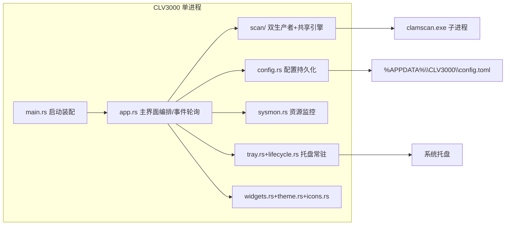

## 项目概览

CLV3000 是纯 Rust 实现的极简 **Windows 手动杀毒工具**（egui 桌面 GUI + 外部便携版 ClamAV），专为老旧机器设计：绿色分发、体积小（release 用 `opt-level=s`/lto/strip/panic=abort）、扫完即走。能力 = "两类扫描 + 四项辅助"：**闪电扫描**（枚举活动进程加载的模块）与**全盘扫描**（遍历固定磁盘上的可执行文件）交给 ClamAV 比对签名；辅助为系统托盘常驻、实时 CPU/内存状态条、病毒库手动更新（freshclam）、威胁忽略记忆。刻意**不做**实时防护、**不做**任何文件写操作（"隔离"按钮是占位），检出只报告——永不误伤系统。约 2200 行 / 16 个源文件，无 async 运行时、无网络依赖、无数据库。

## 架构设计

单进程、单二进制，分层 + 管道-过滤器模式。核心信条：**UI 线程不做重活**——所有重任务 `std::thread::spawn` 到后台线程，经 `std::sync::mpsc` channel 推事件，UI 每帧 `try_recv` 轮询；每个外部依赖都可优雅降级（引擎缺失→提示不崩溃、托盘失败→无托盘运行、枚举权限不足→跳过）。

| 架构特征 | 实现 | 目的 |
|---------|------|------|
| 分层 | 表现层(app/widgets/theme) → 服务层(scan/sysmon/config) → 平台层(Win32/ClamAV 子进程) | 职责分离，重活下沉线程 |
| 管道-过滤器 | 路径生产者(quick/full_scan) → mpsc → `engine::run` → clamscan | 一次子进程启动、一次病毒库加载、边走边扫 |
| 状态机 | `ScanPhase`(Idle/Enumerating/Scanning/Done) 驱动扫描页 | 异步扫描收敛为确定性 UI 状态 |
| 事件驱动(轮询式) | 后台发 `ScanEvent`，UI 每帧 `try_recv`（`request_repaint_after(250ms)` 保活） | 后台→前台唯一数据通道，界面永不阻塞 |

## 模块地图

| 模块 | 职责 | 主路径 |
|------|------|--------|
| 扫描引擎 | 封装 clamscan 子进程：`--file-list=- -v --no-summary` 流式喂 stdin、逐行解析 `path: status`、软+硬双保险取消 | `src/scan/engine.rs` |
| 闪电扫描 | Win32 ToolHelp 拍进程快照、枚举各进程模块、HashSet 去重；两阶段（先枚举拿总数再扫） | `src/scan/quick_scan.rs` |
| 全盘扫描 | `GetLogicalDrives`/`GetDriveTypeW` 枚举磁盘，walkdir 遍历，可执行扩展名白名单前置过滤，边发现边喂 | `src/scan/full_scan.rs` |
| 扫描缓存 | blake3 内容哈希→扫描结果(干净/检出)的磁盘缓存；按病毒库修订号失效、TTL/驱逐/压缩、TSV 持久化 | `src/scan/cache.rs` |
| Authenticode 校验 | PE 文件判定 + WinVerifyTrust 信任签名验证（`verify_trusted` 按 action GUID） | `src/scan/authenticode.rs` |
| 扫描协议 | `ScanEvent`/`Threat`/`ScanKind`/`CancelFlag(AtomicBool)` 统一契约 | `src/scan/mod.rs` |
| 主界面编排 | 四页面(Dashboard/QuickScan/VirusDb/FullScan)、自绘标题栏、`ScanPageState` 轮询状态机、Toast | `src/app.rs` |
| 配置持久化 | TOML：上次扫描摘要 `ScanRecord`、忽略列表 `IgnoredEntry`、可移动盘开关；损坏回退默认 | `src/config.rs` |
| 系统托盘 | tray-icon+muda 图标与菜单；每帧轮询事件，关窗默认隐藏到托盘 | `src/tray.rs`+`src/tray_pump.rs`+`src/tray_loop.rs` |
| 生命周期 | `RunMode`(ShowWindow/TrayOnly/AboutOnly/Quit)；关于框为独立 viewport | `src/lifecycle.rs`+`src/about_dialog.rs` |
| 资源监控 | 独立线程每秒采样 CPU/内存，渲染在底部资源条 | `src/sysmon.rs` |
| 病毒库管理 | clamscan `--version` 解析引擎/病毒库版本；freshclam 手动更新 | `src/clamav_info.rs` |
| 路径定位 | exe 相对 `clamav\` 目录、`%APPDATA%\CLV3000` 配置目录、可用性探测 | `src/paths.rs` |
| 平台集成 | 单实例互斥锁、Win32 本地时间、构建时 Windows 资源 | `src/single_instance.rs`+`src/localtime.rs`+`build.rs` |

## 核心流程

**1. 闪电扫描**（闪电扫描页/仪表盘/托盘触发）— `ScanPageState::start` spawn 线程：
1. `snapshot_pids`（TH32CS_SNAPPROCESS）→ 逐进程 `modules_of_process`（TH32CS_SNAPMODULE，权限不足跳过）→ HashSet 去重保序，发 `Enumerating` 进度事件。
2. 枚举完成拿到总数后 spawn `engine::run`（此时 UI 可画确定百分比圆环）。
3. 逐条发路径 → 引擎写 stdin；clamscan 逐行回 stdout → 解析为 `FileScanned`。
4. UI 每帧 `try_recv` 推进 `ScanPhase`；完成后写 `last_quick_scan` 摘要并 `config.save()`。

**2. 全盘扫描**（边发现边扫，总量未知）— 先 spawn 引擎，遍历器每命中一个可执行文件立即 send，UI 看到"已扫描 N"持续跳动；结束写 `last_full_scan`。可选"包含可移动磁盘"（`scan_removable_drives`，默认关）。

**3. 取消扫描（软+硬双保险）**：UI 置 `CancelFlag=true` → 写入线程停止喂路径并 `drop(stdin)` 送 EOF（软）；看门狗线程 100ms 轮询到即 `child.kill()`（硬）。`Arc<Mutex<Child>>` 三线程共享子进程句柄，最终发 `Finished{cancelled:true}`。

**4. 托盘生命周期**：启动默认显窗（或 `--tray-only` 启动模式）→ 关窗按钮被拦截为"隐藏到托盘"（`hide_to_tray` 释放 GPU 纹理/sysmon 腾内存）→ 双击托盘/菜单"显示主窗口"回前台；仅托盘"退出"置 `allow_exit` 后真正结束进程。单实例锁 `Global\CLV3000_SingleInstance_Mutex` 防重复启动。

## 技术选型

- **语言/版本**：Rust 2024 edition，v0.7.0；无 async 运行时（ADR：阻塞 IO 场景线程更简单、取消=kill 直白）。
- **GUI**：eframe/egui 0.36（glow + default_fonts）；即时模式，自绘深色主题与矢量图标（`theme.rs`/`icons.rs`，参照 `clv3000-design` skill 设计令牌）。
- **平台 API**：windows crate 0.62（ToolHelp 进程/模块枚举、磁盘枚举、CreateMutexW、GetLocalTime、`CREATE_NO_WINDOW` 隐藏子进程控制台；`Win32_Security_WinTrust`/`Win32_Security_Cryptography` 支撑 Authenticode 信任签名校验）。
- **哈希**：blake3 1（文件内容哈希，作扫描缓存键）。
- **托盘**：tray-icon 0.24 + muda 0.19（菜单）。
- **系统监控**：sysinfo 0.39（CPU/内存采样）。
- **持久化**：serde + toml → `%APPDATA%\CLV3000\config.toml`。
- **遍历**：walkdir 2.5。
- **扫描引擎**：外部便携版 ClamAV `clamscan.exe`/`freshclam.exe`（进程边界隔离，非内嵌 libclamav）。
- **构建**：winresource（Windows 图标/版本资源）+ macOS `core-foundation` 交叉编译支持；release 面向体积（`opt-level=s`、lto、codegen-units=1、panic=abort、strip）。

## 系统边界

| 边界 | 说明 | 信任假设 |
|------|------|----------|
| clamscan.exe 子进程 | 契约：`--file-list=

-`(stdin 每行一路径) `-v --no-summary --database=<db>`；stdout 逐行 `path: status`（`rsplit_once(": ")`，`OK`→干净，`X FOUND`→检出）；`CREATE_NO_WINDOW` 隐藏窗口 | 从自身目录按固定路径启动，视为可信 |
| freshclam.exe 子进程 | `--datadir=<db>`，stdout/stderr 重定向 null，仅退出码判成功 | 同上；病毒库更新是唯一联网入口 |
| 配置持久化 | `%APPDATA%\CLV3000\config.toml`（TOML），程序唯一自写文件；加载失败回退默认 | 应用自身数据，不做校验 |
| Win32 API | 进程/模块枚举、磁盘枚举、单实例 Mutex、本地时间、隐藏子进程窗口 | 平台层，trusted |
| 分发布局 | exe 与 `clamav\`（clamscan/freshclam/依赖 DLL/`database\*.cvd`）同目录绿色分发 | 引擎缺失→页面提示"找不到扫描引擎"，不崩溃 |
| 安全模型 | 检出只报告 + 忽略记录；**零文件写操作**（隔离占位），无实时防护、无 CLI/HTTP/插件接口 | 用户对威胁处置负最终责任 |

## 代码映射索引

| 概念 | 位置 | 说明 |
|------|------|------|
| 四页面编排 / 事件轮询 | `src/app.rs` | `App`/`AppCore`/`ScanPageState`/`VirusDbState`；每帧 `poll`、`poll_tray` |
| 扫描状态机 | `src/app.rs` | `ScanPhase`(Idle/Enumerating/Scanning/Done) 驱动扫描页渲染 |
| 扫描事件协议 | `src/scan/mod.rs` | `ScanEvent`/`Threat`/`ScanKind`/`CancelFlag` |
| 子进程引擎 | `src/scan/engine.rs` | `run()` 三线程(写/读/看门狗)；`rsplit_result_line`/`parse_infected` |
| 进程模块枚举 | `src/scan/quick_scan.rs` | `snapshot_pids`/`modules_of_process` |
| 磁盘遍历 | `src/scan/full_scan.rs` | `walk`/`local_drive_roots`/扩展名白名单 |
| 扫描缓存 | `src/scan/cache.rs` | `ScanCache`/`Record`：`open`/`lookup`/`insert`/`save`/`compact`、`db_revision`/`file_hash` |
| 签名校验 | `src/scan/authenticode.rs` | `is_pe_file`/`is_trusted_signed`/`verify_trusted`（WinVerifyTrust） |
| 配置模型 | `src/config.rs` | `AppConfig`/`ScanRecord`/`IgnoredEntry`；`is_ignored`/`add_ignored` |
| 路径解析 | `src/paths.rs` | exe 相对 clamav 目录 + `%APPDATA%` 配置路径 |
| 托盘菜单与事件 | `src/tray.rs` | `Tray`/`TrayMenuIds`/`build` |
| 托盘消息泵 | `src/tray_pump.rs` | Windows/macOS 平台 pump |
| 生命周期模式 | `src/lifecycle.rs` | `RunMode` 四态；`parse_start_tray_only` |
| 资源监控 | `src/sysmon.rs` | `spawn`/`SysMonHandle`/`ResourceSample` |
| 病毒库信息 | `src/clamav_info.rs` | `ClamAvInfo::gather`，解析 `clamscan -V` |
| 关于框 | `src/about_dialog.rs` | `show_standalone` 独立 viewport |
| 启动装配 / 单实例 | `src/main.rs`+`src/single_instance.rs` | viewport 构建、图标、Mutex 锁 |
| 图标资产 | `src/icons.rs`+`src/icon_data.rs` | 手绘矢量 + RGBA 程序图标 |
| UI 原语与主题 | `src/widgets.rs`+`src/theme.rs` | progress_ring/stat_pill/threat_card/Toast；深色令牌 |