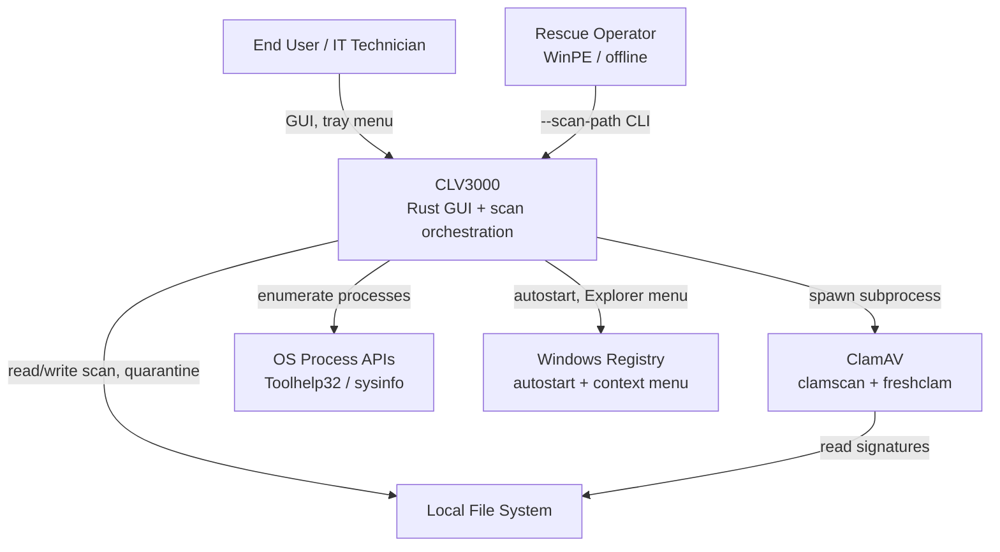

# CLV3000

CLV3000 is a portable, high-performance on-demand antivirus scanner for Windows and macOS, built in Rust and powered by ClamAV. It was designed as a tribute to the classic KV3000 emergency scanner — something you can carry on a USB drive, run without installation, and trust when a machine behaves suspiciously.

The application wraps a battle-tested open-source scan engine in a clean native GUI with system tray integration, Explorer right-click scanning (Windows), and a full suite of post-detection actions including quarantine, restore, and ignore. Unlike heavyweight always-on antivirus suites, CLV3000 focuses on **on-demand scanning** — you invoke it when you need it, and it stays out of your way otherwise.

## What It Can Do

CLV3000's capabilities span the full lifecycle of an emergency scan: from discovering what to inspect, through engine execution, to handling whatever threats are found.

**Quick Scan** — Enumerates all running processes and their loaded modules (including DLLs on Windows), deduplicates the list, and scans everything through ClamAV. This catches malware currently active in memory — the most urgent threat surface during an incident.

**Full Scan** — Walks all fixed local drives collecting executable files (`.exe`, `.dll`, `.sys`, Mach-O binaries on macOS) and scans them systematically. Optional removable drive inclusion is configurable for USB rescue scenarios.

**Single-file and folder scan** — Right-click any file or folder in Windows Explorer and select "Scan with CLV3000". If an instance is already running, the request is forwarded seamlessly via IPC rather than failing with "already running."

**Threat management** — Detected threats can be ignored (recorded so future scans skip that alert) or quarantined (moved to a secure isolated directory with full restore capability). Windows supports force-quarantine with UAC elevation when files are locked by running processes.

**Performance optimizations** — A blake3 content-hash cache remembers scan results for unchanged files, and a code-signature pre-filter skips files signed by trusted publishers before they reach ClamAV.

## C4 Context Diagram (System Landscape)

The diagram below shows CLV3000 in its operational environment: who uses it, what external systems it depends on, and where its boundaries lie.

From this view, CLV3000 sits between the user and ClamAV — it handles enumeration, caching, UI, and threat actions while delegating actual signature matching to the external engine.

## Technology Choices

CLV3000 targets older hardware and portable deployment, so every technology choice reflects size, speed, and simplicity over enterprise complexity.

| Domain | Choice | Rationale |
|--------|--------|-----------|
| Language | Rust (edition 2024) | Memory safety, small release binary (~few MB stripped), cross-compile to Windows from macOS |
| UI framework | eframe/egui 0.36 + glow | Immediate-mode GUI without web runtime; low memory footprint |
| Scan engine | ClamAV subprocess | Portable bundle, easy signature updates via freshclam, no FFI complexity |
| Persistence | TOML + TSV files | No database dependency; copy `%APPDATA%\CLV3000\` to backup all state |
| Content cache | blake3 | Pure Rust, faster than SHA-256, cross-platform |
| Release profile | `opt-level = "s"`, LTO, strip | Optimized for binary size on legacy PCs |

## What CLV3000 Can and Cannot Do

Understanding scope prevents misaligned expectations. CLV3000 is deliberately focused.

**It can:**
- Perform on-demand quick, full, and targeted path scans using ClamAV signatures
- Quarantine, restore, or ignore detected threats with persistent records
- Run silently from the system tray with autostart on boot
- Forward scan requests from Explorer context menu to a running instance
- Cache scan results and skip trusted signed files for faster rescans
- Update virus signatures manually via the built-in Database page

**It cannot:**
- Provide real-time background file monitoring (not an always-on AV agent)
- Scan network shares or cloud storage without local file access
- Register Explorer context menus on macOS (Windows-only feature)
- Replace enterprise endpoint management or centralized threat intelligence
- Guarantee detection of zero-day threats not covered by ClamAV signatures
