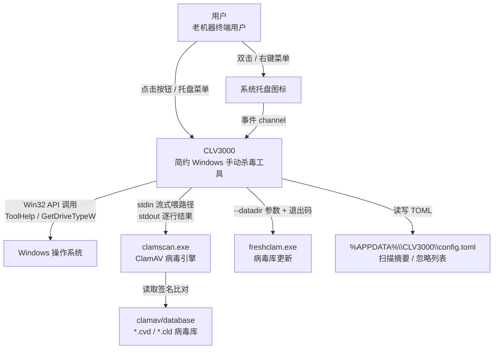

# CLV3000 项目概述

CLV3000 是一个极简的 Windows 手动杀毒工具，纯 Rust 实现，**专门为老旧机器设计**。它不是那种动辄几个 GB、装完还要注册系统服务的全家桶杀软，而是一个体积很小、扫完即走的"安检站"：你在需要的时候点一下按钮，它就会把当前活跃进程加载的模块（闪电扫描）或磁盘上的可执行文件（全盘扫描）交给内置的 ClamAV 病毒引擎比对签名，然后把结果清清楚楚地摆在你面前。

它诞生的理由很实际。老电脑跑不动大厂杀软的实时防护后台常驻，但"怀疑机器被装了东西"这种需求始终存在。CLV3000 把杀毒这件事拆成了最小闭环——收集文件、交给引擎、报告结果——并且刻意**不做**实时防护、不做文件写操作（检出的威胁只报告，"隔离"按钮是占位）。这意味着它永远不会因为误杀而弄坏系统，也永远不需要升级到复杂的后台服务。它更像一把"手动检测仪"，而不是一张"自动过滤网"。

整个项目只有 16 个 Rust 源文件、约 2200 行代码，却完整覆盖了一个桌面安全工具应有的体验：自绘深色主题的四页面窗口、系统托盘常驻、实时 CPU/内存状态条、病毒库手动更新、单实例保护。下面的内容会带你理解它的能力边界、技术选型、架构设计和每个模块的细节。

## 它能做什么

CLV3000 的核心能力可以概括为"**两类扫描 + 四项辅助**"：两条扫描路径覆盖了"查活物"和"查存量"两种检查方式，而托盘、资源监控、病毒库管理和忽略记忆构成了完整的桌面工具体验。

**闪电扫描**——扫描所有正在运行的进程加载的模块（exe 和 DLL）。它用 Win32 ToolHelp API 拍进程快照、逐个枚举模块、去重后交给 ClamAV。因为只查"活物"，通常一两秒就能枚举完，是响应最快的第一道检查（`src/scan/quick_scan.rs`）。

**全盘扫描**——扫描本地固定磁盘上所有可执行文件（`.exe/.dll/.sys/.scr/.com/.cpl/.ocx/.drv`）。它边遍历目录树边把命中的文件喂给扫描引擎（流式，不攒列表），用户立刻能看到进度在动；是否包含 U 盘等可移动盘可由配置控制（`src/scan/full_scan.rs`）。

**病毒库管理**——显示内置 ClamAV 病毒库状态与路径，支持手动触发 `freshclam.exe` 联网更新病毒签名（`src/app.rs:213-233`）。

**资源监控**——独立后台线程每秒采集一次 CPU/内存占用，渲染在全局底部状态条上，让用户直观看到机器当前负载（`src/sysmon.rs`）。

**托盘常驻**——双击托盘打开主窗口，右键菜单提供"显示主窗口 / 闪电扫描 / 关于 / 退出"；窗口关闭按钮默认最小化到托盘，只有托盘"退出"才真正结束进程（`src/tray.rs`、`src/app.rs:352-355`）。

**忽略记忆**——检出的威胁点"忽略"后，该文件+病毒名记入配置，之后的扫描不再重复提示（`src/config.rs:50-62`）。

## C4 Context 图（系统全景）

下面的图展示 CLV3000 在 Windows 桌面环境中的定位：用户通过窗口和托盘驱动它，它调用本机 Windows API 枚举进程与磁盘，并把文件路径流式交给同目录分发的便携版 ClamAV 做真正的签名比对，最后把结果写回用户界面和配置文件。

从这张图能读出 CLV3000 最关键的设计决策：**系统边界非常薄**——真正的恶意软件识别能力完全外包给 ClamAV（绿色分发、进程边界隔离），CLV3000 自己只负责"找到要扫的文件"和"把结果翻译给用户"。程序不联网、不写文件、不注册服务，外部依赖降到最低。

## 技术选型背后的思考

下表展示了 CLV3000 每一层技术选型背后的理由。仔细看会发现一条主线：**所有选择都在为"老机器 + 绿色分发"服务**。

| 技术领域 | 具体选择 | 为什么这样选 |
|---------|---------|------------|
| 语言与运行时 | Rust (edition 2024)，`#![windows_subsystem = "windows"]` | 内存安全 + 无 GC + 单一静态 exe，发布版不弹黑色控制台窗口 |
| GUI | egui 0.36 + eframe（glow 后端） | 即时模式 GUI 天然契合"每帧轮询事件"模型；无 DOM、产物小、纯 Rust 与 Win32 集成简单 |
| 托盘/菜单 | tray-icon + muda | 官方轻量维护的托盘库；事件走内置 channel，配合每帧轮询即可工作 |
| 系统监控 | sysinfo 0.39 | 简单跨平台 API，几行代码拿到 CPU/内存百分比 |
| Win32 直调 | windows crate 0.62 | ToolHelp 进程/模块枚举、磁盘类型、互斥锁、本地时间都是成熟的 Win32 API，文档完备 |
| 配置 | serde + toml | 配置只有一个小文件；derive 序列化一行代码完成 |
| 目录遍历 | walkdir | 树遍历 + 错误容忍（`filter_map(|e| e.ok())`），安全且简洁 |
| 并发 | `std::thread` + `std::sync::mpsc` | 刻意不用 tokio/async：扫描是纯阻塞 IO 等待，线程模型更直白、取消更可控 |
| 扫描引擎 | 外部便携版 ClamAV 子进程 | 不把 libclamav 编进二进制，避免体积/GPL 传染/签名冲突；用标准进程边界 + 文本流协议集成 |
| 发布配置 | `opt-level="s"` + LTO + strip + panic=abort | 面向老机器优化二进制体积与换页开销，放弃极限速度（瓶颈本就在磁盘 IO 和病毒引擎） |

## CLV3000 能做什么，不能做什么

理解系统的边界和它的能力同样重要。CLV3000 的定位非常明确：它是一个"**按需触发的检查工具**"，不是一个"自动防护的安全平台"。

**它能做的事**：在你主动点按钮时，闪电扫描或全盘扫描当前系统；把每个检出的威胁以卡片形式展示（病毒名 + 文件路径）；支持忽略某个威胁让它不再打扰；显示病毒库状态并支持手动更新；实时展示 CPU/内存占用；通过托盘在后台常驻、随时一键唤起闪电扫描。

**它不做的事**：不做实时防护——没有后台驻留监控，不会在你访问网页或打开文件时自动拦截；不做隔离和清除——检出威胁只报告，隔离按钮是占位（`src/app.rs:790-792`）；不做自动病毒库更新——只有手动触发，无定时任务；不做任何文件系统写操作——这对用户是安全承诺而非功能缺失；不联网、不收集遥测数据。这些"不做"是刻意的产品决策：对一个要跑在老机器上、且要绝对保证不误伤系统的工具来说，"克制"本身就是最大的安全性。
