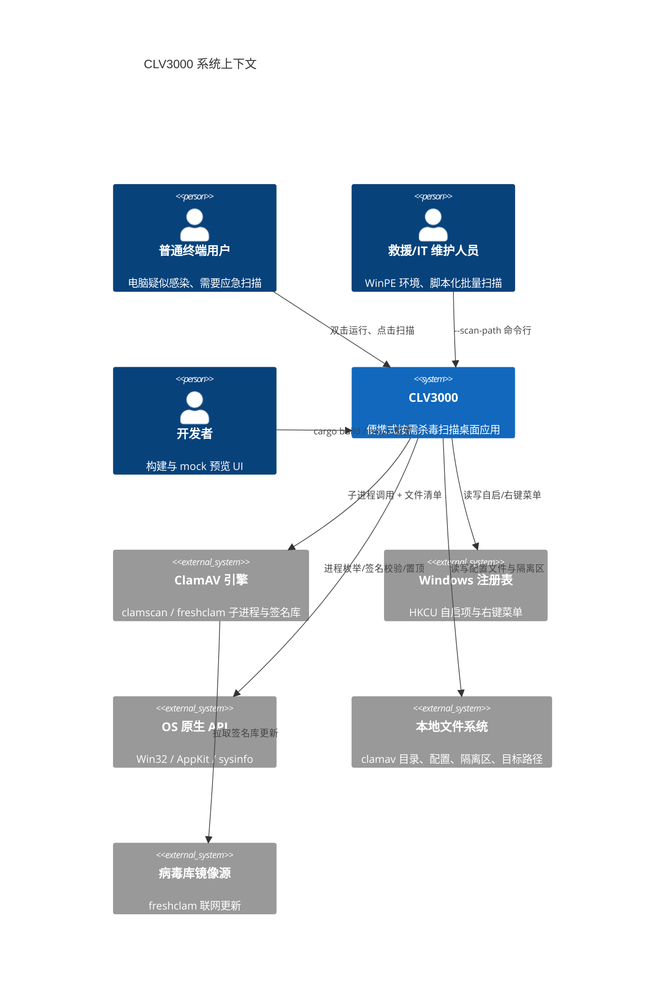

# CLV3000 —— 便携式 ClamAV 按需杀毒扫描器

CLV3000 是一个面向 Windows 的**便携式病毒扫描桌面应用**，用 Rust 编写，底层依赖 ClamAV 引擎，设计初衷是致敬经典国产杀毒工具 KV3000——做成一个"插上 U 盘就能用、不安装、不常驻重负载、老机器也能跑"的应急扫描器。与传统的杀毒软件不同，CLV3000 不提供实时防护（on-access），而是专注于**按需扫描**这一件事：当电脑疑似感染、无法正常启动，或者你只是想给一台老旧电脑快速做个安检时，把 exe 和随行的便携 ClamAV 目录放在一起，双击即可开始扫描。

这个定位决定了它的整个技术取向。代码里处处可见"低资源占用优先"的痕迹：release 构建用体积优化而非速度优化（`opt-level = "s"` + `lto`），GUI 闲置时事件循环真正睡死（零定时心跳），隐藏到托盘时会主动释放 GPU 纹理并压缩进程工作集，扫描则直接以子进程方式调用 `clamscan` 而不是在自身进程里加载引擎。系统托盘常驻、开机自启、右键菜单"用 CLV3000 扫描"这些能力，都是为了把"随手即扫"做到极致——应急场景下，用户不该在配置上花一秒钟。

在能力分档上，CLV3000 采用"真实 vs 模拟"的双轨策略：Windows 与 macOS 上所有扫描、进程枚举、签名校验都是真实行为；Linux 等其它目标则编译成 mock 引擎（模拟 ~342 个进程、~3000 个文件、交替的 OK/FOUND 结果），纯粹为了在非 Windows 环境预览 UI 与交互流程。这套设计在 README 里有专门的对照表，让开发者清楚"哪里是真的、哪里是预览"。

## 它能做什么

CLV3000 的核心能力可以概括为"三条扫描入口 + 一套完整的威胁处置闭环 + 一系列桌面集成"。所有功能都围绕"在感染现场快速给出答案"这一目标展开，下面逐一说明。

**全盘扫描**——遍历所有固定磁盘上的可执行文件（Windows 上按扩展名白名单 `.exe/.dll/.sys/.scr/.com/.cpl/.ocx/.drv` 筛选，macOS 上按 Mach-O 魔数识别），以流式方式边发现边写入临时清单（`src/scan/full_scan.rs` 的 `WalkListWriter`），避免海量路径撑爆内存。扫描期间 UI 实时显示"已发现 N 个可扫文件"，进度环在总数未知时先旋转、拿到总数后再按百分比推进。

**闪电扫描**——针对"现在正在跑的进程"做快速体检。Windows 上通过 Toolhelp32 API 枚举所有运行中的进程及其加载的模块（包括 DLL），去重后一次性交给 ClamAV 引擎；macOS 上退化为用 sysinfo 枚举进程。这类扫描通常几十秒就能完成，是日常应急的首选入口。

**单文件/文件夹扫描**——在资源管理器里右键任意文件或文件夹选择"用 CLV3000 扫描"，即可对指定目标做定向扫描。这条路径同时支持冷启动（新开一个进程）与热转发（已有实例在跑时把请求转发给它），`src/main.rs` 里 `--scan-path` 参数是它的 CLI 形态，为 WinPE 救援脚本化批量扫描提供支持。

**威胁处置闭环**——扫描出的威胁可以在结果卡片上一键"隔离"（把文件**搬移**到隔离区目录，而不是删除，方便误报后还原）或"忽略"（记录到忽略清单，后续扫描自动跳过该告警）。隔离失败（文件被占用）时，Windows 上会弹出"强制隔离"确认，通过杀占用进程 + UAC 提权子进程完成搬移。隔离区的文件可以在设置页还原或永久删除。

**病毒库管理**——病毒库页展示引擎可用性、病毒库版本与目录位置，并提供"手动更新病毒库"按钮（调用 `freshclam` 子进程）。由于 `freshclam` 在"已是最新"时也返回退出码 0，代码用"更新前后数据库目录签名比对"（`.cvd/.cld/.cud` 文件的名称/大小/修改时间）来区分"真的更新了"和"已经最新"。

**性能加速双保险**——文件基因缓存（`src/scan/cache.rs`）：用文件内容的 BLAKE3 哈希作为"基因"，把"这个内容上次扫出来是干净/某病毒"记到磁盘（30 天 TTL，上限 20 万条），下次遇到相同内容直接复用结果；同时用第二张表（路径 → 大小/修改时间/哈希）跳过未变化的文件重算。代码签名预筛（`src/scan/authenticode.rs`）：Windows 上用 WinVerifyTrust、macOS 上用 `codesign --verify`，受信任发布者签名的文件跳过引擎扫描。这两层都是**启发式加速**而非安全保证，代码注释里反复强调了这一点。

**桌面集成**——系统托盘常驻（双击唤回主窗、右键菜单快速扫描/关于/退出）、开机自启（Windows 注册表 Run 键 + `--tray-only` 静默启动）、Explorer 右键菜单（仅 Windows）、单实例锁与扫描请求转发、底部实时 CPU/内存资源条（独立采样线程 + 指数滑动平均平滑）。

## C4 Context 图（系统全景）

下面这张图把 CLV3000 放在它的完整生态中：中间是系统本体，左边是与它交互的三类用户，右边是它依赖的外部实体。读懂这张图，就基本理解了系统的边界——它是一个"站在操作系统肩膀上、只依赖 ClamAV 一个外部引擎"的离线优先工具。

从这张图能读出几个关键设计决策：**一是离线优先**——除"更新病毒库"外没有任何网络依赖，扫描与隔离的完整闭环全部本地完成，这正是应急场景对隐私和可靠性的硬性要求；**二是依赖面刻意收窄**——没有云服务、没有遥测、没有第三方 SDK，唯一的"外部系统"是 ClamAV 引擎和操作系统本身提供的 API；**三是用户接口多样但收敛**——同一个系统同时服务 GUI、命令行与 Explorer 右键菜单三类入口，但全部汇聚到同一个扫描状态机。

## 技术选型背后的思考

CLV3000 的技术栈不是随便堆出来的，每一层选择都服务于"老机器 + 便携 + 应急"这组核心诉求。语言选 Rust 首先是因为它对低资源环境友好（无 GC、二进制小、启动快），其次是内存安全——杀毒工具天天处理不可信的二进制文件，一个解析恶意文件时的内存错误就是灾难。GUI 选 eframe/egui 的 immediate-mode 范式，则是因为它让"状态即渲染"变得极简：没有复杂的 widget 状态树，业务状态（`ScanPageState` 的状态机）与界面直接一一对应，整个 UI 代码量因此能压到一个文件几百行的规模。

| 技术领域 | 具体选择 | 为什么这样选 |
|---------|---------|------------|
| 语言与运行时 | Rust (edition 2024)，release 用 `opt-level="s"` + `lto` + `panic="abort"` | 老机器优先的体积/内存优化；杀毒工具需要极致的可靠性与可预测行为 |
| GUI 框架 | eframe / egui 0.36.1（immediate-mode，glow 后端） | 状态即渲染，UI 代码极简；不依赖系统控件，跨平台视觉一致；启动快 |
| 扫描引擎 | 外部 `clamscan` / `freshclam` 子进程（便携 ClamAV） | 自身进程不加载引擎、不占用常驻内存；引擎可随 U 盘分发、版本可独立升级 |
| 文件哈希 | blake3 | 纯 Rust、跨平台、比 SHA-256 快一个量级——基因缓存的高频计算不会成为瓶颈 |
| 平台集成 | `windows` crate 0.62（仅 Windows target）；objc2 系列（仅 macOS target） | 依赖图按目标平台裁剪，非 Windows 构建不拉 windows 依赖树（避免交叉编译失败） |
| 系统信息 | sysinfo 0.39 | 跨平台进程枚举与资源监控，闪电扫描与底部资源条共用 |
| 托盘与菜单 | tray-icon + muda | eframe 拿不到 winit 的 EventLoopProxy，托盘事件走 channel + 转发线程唤醒 UI |
| 持久化 | TOML 配置 + TSV 缓存（无数据库） | 数据量小、结构简单，无需引入数据库依赖，天然人类可读、可手工救援 |

技术选型的核心思路是"**能不引入就不引入**"：没有 async 运行时、没有数据库、没有配置文件解析框架之外的任何重量级依赖，`Cargo.toml` 全长只有 91 行。每一个依赖都能回答"它直接服务于哪个核心功能"这个问题，找不到答案的依赖就不会被加进去。

## CLV3000 能做什么，不能做什么

明确系统的边界比描述它的能力更重要——尤其是杀毒软件这种用户会天然产生"它应该保护我"预期的领域。CLV3000 刻意把自己限定在"按需扫描"这一件事上，不越界、不揽活，每个"不做"背后都有清晰的理由。

**它能做的事**——全盘扫描（固定盘可执行文件）、闪电扫描（运行中进程与模块）、单文件/文件夹定向扫描（右键菜单或 `--scan-path`）；威胁的隔离/忽略/还原/删除闭环；病毒库的查看与手动更新；托盘常驻、开机自启、右键菜单、单实例锁与扫描请求转发；代码签名预筛与文件基因缓存加速；实时 CPU/内存资源条。

**它不做的事**——**实时防护（on-access）**：不挂钩文件系统、不拦截启动项，只在你主动发起扫描时工作，这是"不常驻重负载"定位的直接推论；**病毒库自动定时更新**：不内置计划任务，更新需要用户手动触发，避免后台进程偷偷联网；**云查杀/云端情报**：没有任何云交互，检测能力完全取决于本地的签名库；**非 Windows 平台的真实防护**：macOS 可真实扫描但以 Windows 为第一目标，Linux 仅为 UI 预览的 mock；**文件销毁**：隔离是搬移而非删除，永久删除必须用户在设置页显式操作。

理解这组边界，才能正确使用这个工具：CLV3000 是"关键时刻的体检仪"，不是"全年无休的保镖"。它最适合的场景是 U 盘应急、PE 救援、老旧电脑定期安检，以及任何"不想装全家桶、只想扫一下"的时刻。
