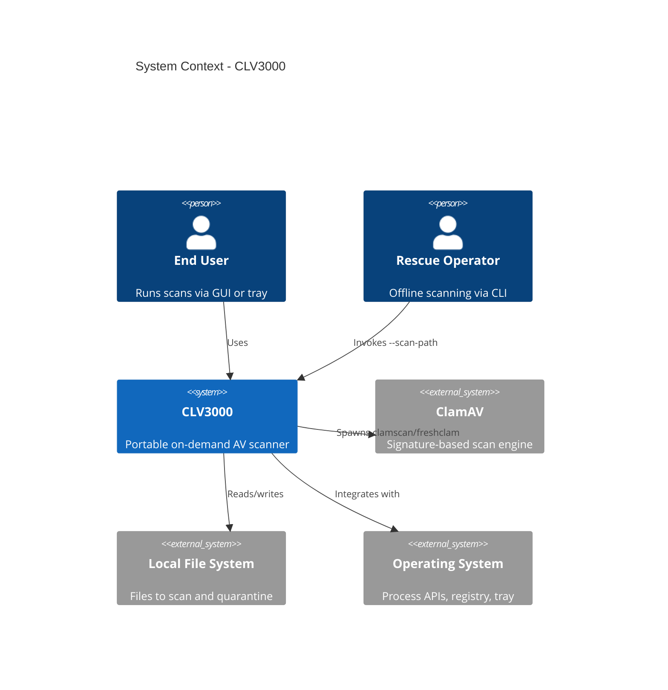
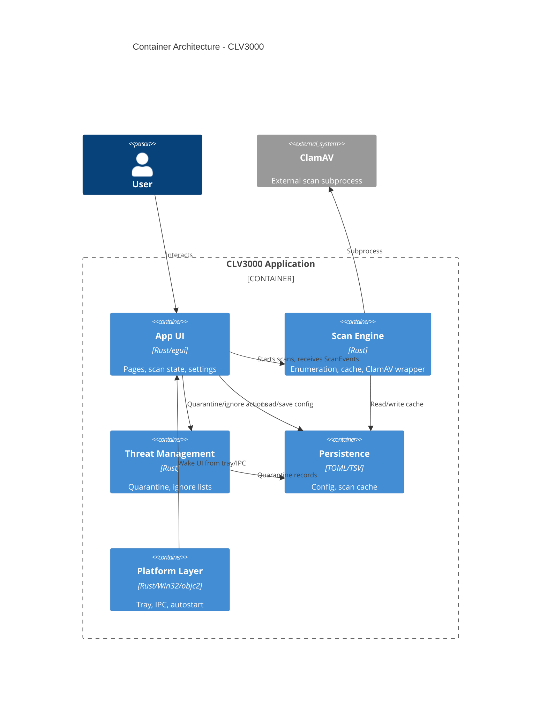
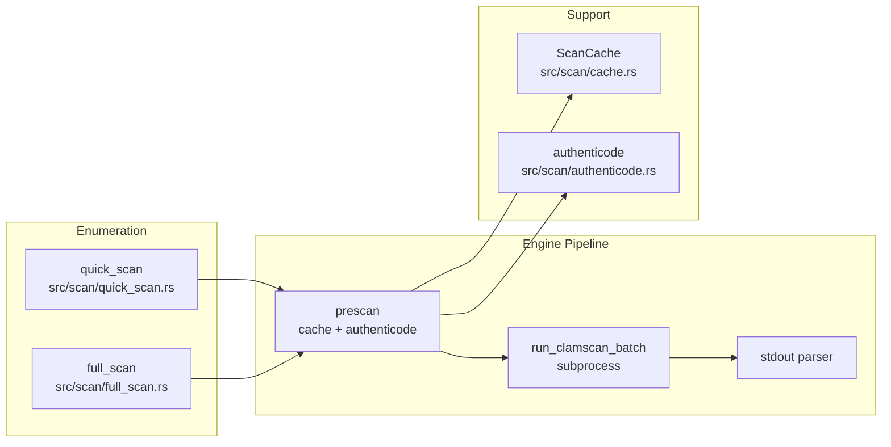
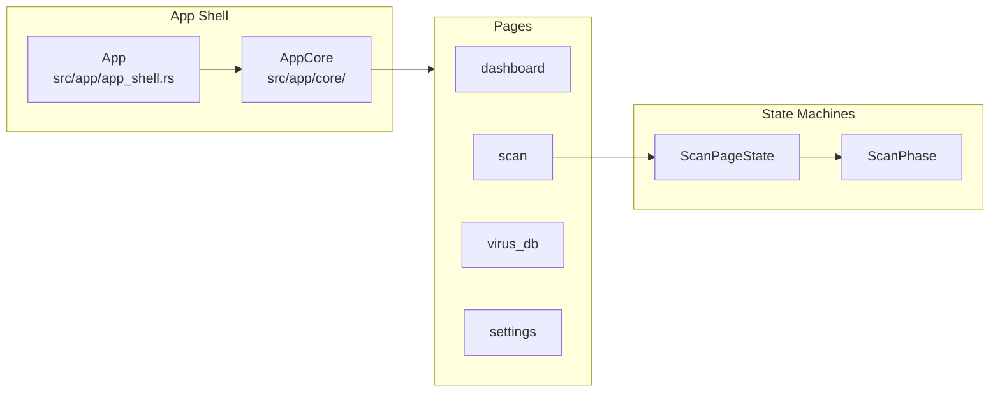
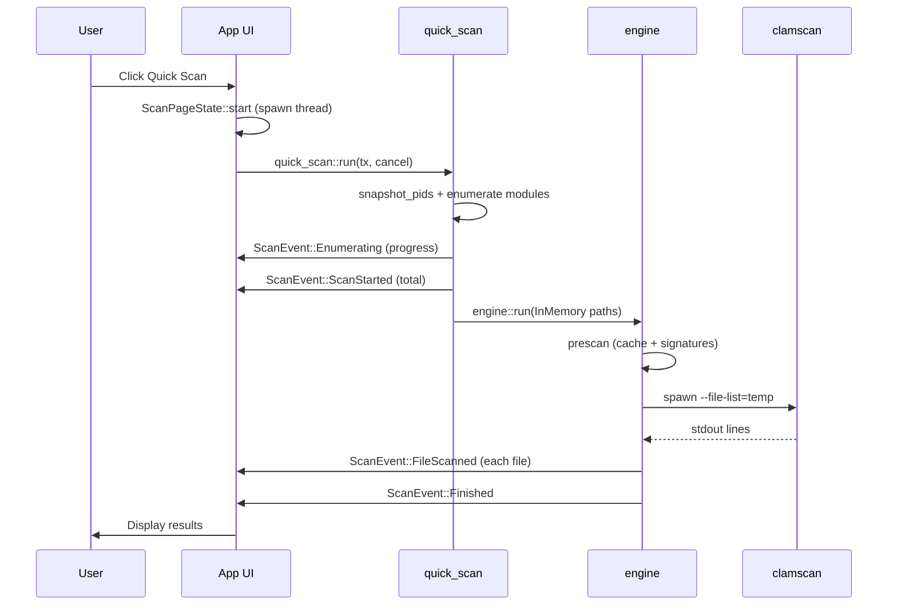
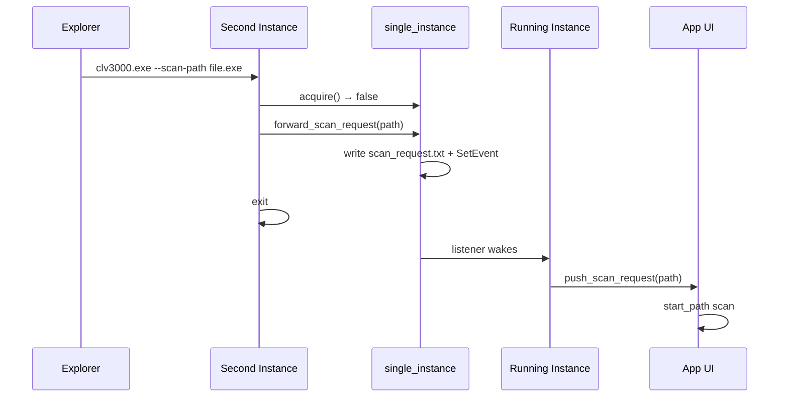

# System Architecture: CLV3000

**Version:** 1.0  
**Classification:** Internal architecture documentation  
**Generated:** 2026-08-25

---

## 1. Architecture Overview

### 1.1 Design Philosophy

CLV3000 is built around three guiding principles that shape every architectural decision:

**Portable-first deployment.** The application resolves all paths relative to the executable directory and user app-data folder — never from installation registry keys. This enables USB-stick deployment where the entire scanner (exe + ClamAV + signatures) lives in one directory tree (`src/paths.rs:7-12`).

**Pipeline over monolith.** Scanning follows a clear pipeline: enumerate paths → pre-filter (cache + signatures) → ClamAV subprocess → stream results to UI. Each stage is a separate module with typed events between them, making the flow traceable and testable (`src/scan/mod.rs:51-85`).

**Platform abstraction with mock fallbacks.** Real OS integration (Toolhelp32, WinVerifyTrust, registry) lives behind `#[cfg(...)]` modules. Linux builds get mock implementations so developers can preview UI without a Windows machine (`src/scan/engine.rs:26-29`).

### 1.2 Core Architecture Patterns

| Pattern | Implementation | Purpose |
|---------|---------------|---------|
| Pipeline-Filter | quick_scan/full_scan → engine prescan → clamscan | Separate enumeration from inspection; enable pre-filters |
| Event-Driven GUI | `mpsc::Sender<ScanEvent>` from background thread | Keep UI responsive during long scans |
| State Machine | `ScanPhase` (Idle → Enumerating → Scanning → Done) | Predictable UI transitions (`src/app/core/scan_state.rs:11-30`) |
| Strategy (platform) | `#[cfg(windows)]` real / `#[cfg(not(...))]` mock | Same API, different OS behavior |
| Single Instance + IPC | Mutex/socket lock with event forwarding | Prevent duplicate instances while supporting context menu |

### 1.3 Technology Stack

| Layer | Components |
|-------|-----------|
| Presentation | eframe 0.36, egui 0.36, custom theme (`src/theme.rs`) |
| Application | `App`, `AppCore`, page routing (`src/app/`) |
| Domain | scan, quarantine, config (`src/scan/`, `src/quarantine.rs`, `src/config.rs`) |
| Infrastructure | paths, lifecycle, platform integration |
| External | ClamAV subprocess, OS APIs (Toolhelp32, sysinfo, registry) |

---

## 2. System Context (C4 Level 1)

---

## 3. Container View (C4 Level 2)

The application decomposes into logical containers that map to source directories. Each container has a distinct responsibility and communicates through well-defined channels.

### 3.1 Domain Module Responsibilities

| Module | Path | Responsibility | Key Types |
|--------|------|----------------|-----------|
| app | `src/app/` | UI shell, page routing, scan orchestration | `App`, `Page`, `ScanPageState` |
| scan | `src/app/` | Path enumeration, ClamAV wrapper, caching | `ScanEvent`, `PathSource`, `ScanCache` |
| quarantine | `src/quarantine.rs` | Threat isolation and restore | `quarantine_file`, `QuarantineEntry` |
| persistence | `src/config.rs`, `src/paths.rs` | Config and path resolution | `AppConfig`, `exe_dir` |
| lifecycle | `src/lifecycle.rs`, `src/main.rs` | Startup modes, CLI parsing | `InitialMode`, `RunMode` |
| platform | `src/tray.rs`, `src/single_instance.rs`, etc. | OS integration | `Tray`, `acquire` |
| system-integration | `src/app/freshclam.rs`, `src/clamav_info.rs` | ClamAV discovery and updates | `run_freshclam` |
| ui-infra | `src/theme.rs`, `src/widgets.rs`, `src/sysmon.rs` | Visual infrastructure | `Toast`, `ResourceSample` |

---

## 4. Component View (C4 Level 3)

### 4.1 Scan Engine Components

The scan module is the most complex container. Its internal components form a processing pipeline:

**Component responsibilities:**
- `quick_scan::run` — Snapshots running processes, collects loaded modules, deduplicates paths
- `full_scan::run` — Walks drives for executables, streams paths to temp file via `WalkListWriter`
- `engine::prescan` — Parallel cache lookup and signature verification; emits instant results for hits
- `engine::run_clamscan_batch` — Writes temp file list, spawns clamscan once, parses `-v` stdout
- `cache::ScanCache` — blake3 content hash → result with DB revision and TTL invalidation
- `authenticode` — WinVerifyTrust (Windows) / codesign (macOS) trusted publisher skip

### 4.2 App UI Components

---

## 5. Key Flows

### 5.1 Quick Scan Sequence

### 5.2 Scan Request Forwarding

When Explorer launches a second instance with `--scan-path`:

---

## 6. Technical Implementation

### 6.1 Concurrency Model

- **UI thread**: eframe main loop; polls `ScanEvent` channel via `apply_scan_event`
- **Scan thread**: One per active scan; calls blocking `quick_scan::run` or `full_scan::run`
- **Prescan workers**: Parallel threads with immutable `CacheSnapshot` — no shared mutable state
- **Cancel mechanism**: `Arc<AtomicBool>` shared between UI and scan thread; watchdog kills clamscan on cancel
- **Wake-up threads**: Two blocking forwarders in `wakeup.rs` call `request_repaint()` on tray/menu events

### 6.2 Performance Optimizations

| Optimization | Location | Effect |
|-------------|----------|--------|
| Content hash cache | `src/scan/cache.rs` | Skip unchanged files on rescan |
| Signature pre-filter | `src/scan/authenticode.rs` | Skip trusted signed files |
| Single clamscan spawn | `src/scan/engine.rs` | Avoid per-file process overhead |
| Streaming full scan walk | `src/scan/full_scan.rs` | Avoid holding 100K+ paths in memory |
| Event-driven wake-up | `src/wakeup.rs` | Zero CPU when idle in tray |
| Release size optimization | `Cargo.toml:65-70` | `opt-level=s`, LTO, strip |

### 6.3 Error Handling Philosophy

Errors never panic on user file operations. The scan engine sends `ScanEvent::Error` and continues; quarantine returns `Result<String>` surfaced as toasts; tray initialization failure logs and continues without tray (`src/main.rs:83-86`).

---

## Appendix: Architecture Decision Records

**ADR 1: ClamAV subprocess over libclamav FFI**
- **Decision**: Spawn `clamscan.exe` as child process
- **Alternatives rejected**: Link libclamav directly
- **Rationale**: Simpler portable bundling; users can update ClamAV independently; avoids complex FFI lifecycle

**ADR 2: TSV cache over SQLite**
- **Decision**: Flat TSV files for scan cache
- **Alternatives rejected**: SQLite, sled embedded DB
- **Rationale**: Zero additional dependencies; adequate for <200K entries; easy to inspect/delete

**ADR 3: Windows tray-only pre-eframe loop**
- **Decision**: Run Win32 message loop in `wait_in_tray()` before starting eframe
- **Alternatives rejected**: Start eframe hidden with `with_visible(false)`
- **Rationale**: eframe forces first-frame visibility; pre-eframe loop avoids flash window entirely

**ADR 4: Immutable cache snapshot for parallel prescan**
- **Decision**: `CacheSnapshot` for read-only parallel workers; merge writes single-threaded after
- **Alternatives rejected**: `Mutex<ScanCache>` shared across workers
- **Rationale**: Documented deadlock in mutex-based approach with 6 workers (`src/scan/cache.rs:77-88`)

**ADR 5: Channel-based scan events over shared state**
- **Decision**: Background thread sends `ScanEvent` via `mpsc`; UI applies via pure `apply_scan_event`
- **Alternatives rejected**: Shared `Arc<Mutex<ScanState>>`
- **Rationale**: Testable pure function; clear ownership; no lock contention on UI thread
