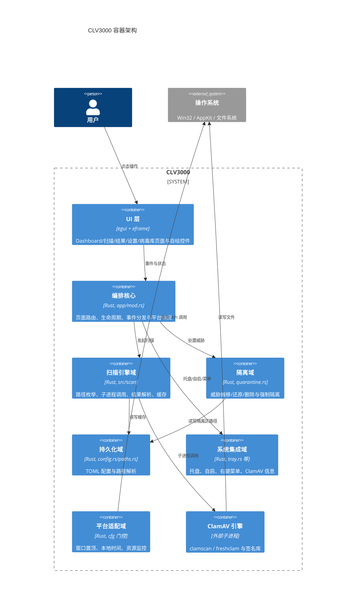
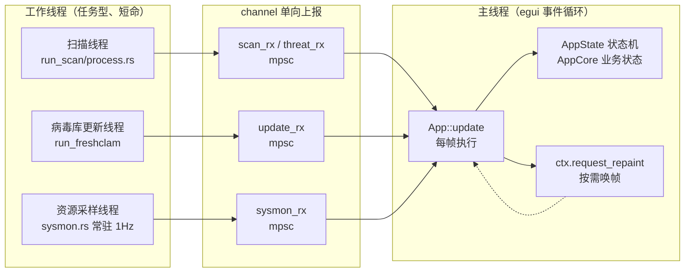
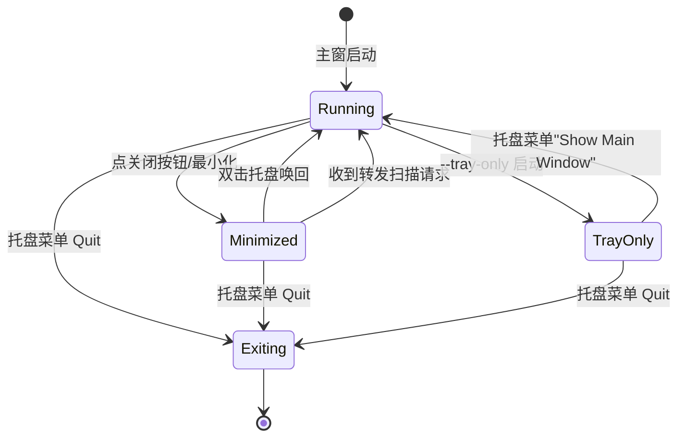
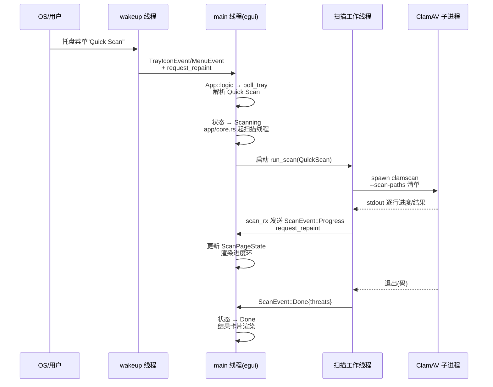

# CLV3000 架构设计

CLV3000 的架构可以用一句话概括：**一个不常驻重负载的单进程桌面应用，把重活全交给外部 ClamAV 子进程，自己在"事件驱动的事件循环 + 轻量后台线程"模型里把状态管理、平台集成与 UI 渲染串起来**。整份代码只有 35 个 Rust 源文件、约 6000 行，却承载了扫描、隔离、病毒库更新、托盘、自启、右键菜单、签名校验、缓存加速等完整闭环——能做到这个密度，靠的不是代码量，而是几条贯穿始终的架构纪律：状态集中、依赖单向、平台收敛、资源吝啬。

这份文档先讲设计理念，再用 C4Container 图给出容器级全景，然后逐层拆解模块职责、线程模型、生命周期状态机与关键架构决策，最后用一条端到端请求路径把所有零件串起来。

## 架构设计理念

CLV3000 的架构不是"模块划分"出来的，而是被四条设计纪律逼出来的。理解这四条纪律，就能理解代码里几乎所有看似反常的写法——为什么扫描要用子进程、为什么 UI 闲置时没有定时器、为什么同样的模块要按目标平台写三份实现。

**纪律一：引擎边界化（外部化）**。扫描引擎 ClamAV 以子进程方式调用，而不是链接进自身进程。这个决策把"引擎内存、引擎崩溃、引擎升级"全部隔离到自身进程之外——`clamscan` 崩了不会带走 GUI，病毒库升级只是替换文件目录，自身常驻内存因此被压到极低（release 约 15-20MB）。代价是进程间只能靠参数、stdin 清单与 stdout 输出通信，代码因此引入了 `cancel.rs` 的看门狗线程来应对"子进程卡死"的场景。

**纪律二：UI 数据驱动，状态与渲染一一对应**。egui 的 immediate-mode 让"每帧重新计算界面"成为天然行为，架构因此把业务状态做成显式的状态机（`ScanPhase`、`AppState`、`Page`），每次 `try_recv` 收到底层事件就更新状态并触发一帧重绘。闲置时事件循环用 `request_repaint_after` 睡得死沉，没有心跳定时器——省电、静默、对老机器友好。

**纪律三：平台差异收敛到模块边界**。同一个功能（进程枚举、签名校验、窗口置顶、数据库目录）在 Windows/macOS 上是不同实现，在其它平台上是 mock。架构的做法是把平台分支全部关进 `cfg` 门内，对外暴露统一的模块接口（如 `src/scan/process.rs` 的 `enum ProcessList`），上层业务代码永远只看到一种抽象。README 维护了一张"真实 vs 模拟"对照表，让平台差异可审计。

**纪律四：一切资源都可省，但扫描结果不可省**。UI 纹理在托盘化时释放（`chrome.rs` 的 `release_resources`）、子窗口在隐藏时销毁、进程工作集在托盘化时压缩——所有这些都是"可省"。唯一不可省的是扫描结果：基因缓存必须落盘、结果页状态必须完整保留、隔离操作必须可逆。架构在"节省"与"可靠"之间划了一条清晰的红线。

## C4Container 架构图

下面这张容器图把系统内部拆成九个容器。读图时注意三层结构：最内层是**状态核心**（UI 状态机与持久化），中层是**能力实现**（扫描/隔离/系统集成），外层是**平台适配**（把真实 OS 调用与 mock 隔离在边界内）。箭头方向代表依赖方向，依赖永远朝下、朝外，不存在业务模块反向依赖 UI 的情况。

这张容器图同时揭示了依赖的**单向性**：UI → 编排 → 能力域 → 平台/持久化，任何能力域都不反向依赖 UI。后续文档（`4.Deep-Exploration/`）会逐域拆到组件级，这里先给出容器层的全景与依赖契约。

## 模块职责一览

领域模块分析（`c2-domain-modules.md`）识别出八个领域域，覆盖率 100%（全部 35 个源文件）。下表是各域的一览——路径、核心职责、核心抽象与重要性。注意"模块"在本文中即"域"的颗粒度，`4.Deep-Exploration/` 下每个域各有一份深度文档。

| 领域域 | 源文件（核心） | 核心职责 | 核心抽象/类型 | 重要性 |
|-------|--------------|---------|--------------|-------|
| app 编排域 | `src/app/mod.rs`, `src/app/core.rs`, `src/app/pages.rs` | 页面路由、生命周期状态机、事件分发、平台唤回 | `App`, `AppCore`, `Page`, `AppState`, `ScanPageState` | ★★★ |
| scan 引擎域 | `src/scan/mod.rs`, `full_scan.rs`, `quick_scan.rs`, `engine.rs`, `cache.rs` | 三种扫描入口、子进程调用、结果解析、基因缓存 | `ScanKind`, `ScanEvent`, `Threat`, `PathSource`, `ScanOutput` | ★★★ |
| 生命周期与事件域 | `src/main.rs`, `lifecycle.rs`, `wakeup.rs`, `single_instance.rs` | 启动、单实例锁、托盘消息循环、事件唤醒 | `LifecycleAction`, `Waker`, `LifecycleFlow`, `SingleInstance` | ★★★ |
| 隔离域 | `src/quarantine.rs` | 威胁搬移/还原/删除、强制隔离、UAC 提权 | `QuarantineResult`, `QuarantineEntry` | ★★★ |
| 持久化域 | `src/config.rs`, `src/paths.rs` | TOML 配置读写、路径解析与 ClamAV 目录探测 | `Config`, `ScanSettings`, `ConfigError` | ★★ |
| 系统集成域 | `src/tray.rs`, `autostart.rs`, `context_menu.rs`, `clamav_info.rs` | 托盘、开机自启、Explorer 右键菜单、引擎探测 | `Tray`, `TrayMenuIds`, `ContextMenuHandle` | ★★ |
| 平台适配域 | `src/macos_reopen.rs`, `localtime.rs`, `sysmon.rs` | 窗口置顶/激活、本地时间、资源采样 | `ResourceSample`, `SysMon`, `Timestamp` | ★★ |
| UI 基建域 | `src/theme.rs`, `icons.rs`, `icon_data.rs`, `widgets.rs`, `about_dialog.rs` | 设计令牌、自绘图标、内置资源、通用控件 | `Theme`, `AppIcon`, `PainterIcon` | ★★ |

## 进程内线程模型与通信

CLV3000 的单进程内部并不是一个线程跑到底——扫描、病毒库更新、资源采样这类阻塞或高频工作都必须移出 UI 线程。线程模型可以概括为"**一个主线程 + 若干按需的短命工作线程，全部通过 channel 单向上报，取消靠共享原子布尔 + 看门狗**"。

主线程是 egui 的事件循环，负责渲染与一切 UI 状态变更，任何进入 UI 的状态都必须经由 channel `try_recv` 在这一帧完成。工作线程都是"跑完就退"的任务型线程（扫描、更新病毒库、枚举进程），不常驻，用 `std::thread::spawn` 直接创建，没有线程池——因为并发峰值也就一两个任务。

沟通的骨架如下：

这个模型的关键属性：**数据单向流**——工作线程只往 channel 里发事件，绝不直接改 UI 状态；**取消带看门狗**——`cancel.rs` 维护 `CancelFlag`（共享 `AtomicBool`）与 `watchdog` 线程，扫描时定期检查子进程存活与 `last_file` 是否推进，`CancelFlag` 置位后强制 `kill()` 子进程并向上抛 `ScanError::Cancelled`；**采样常驻但极轻**——`sysmon.rs` 的线程每 1 秒唤醒一次、用 `Condvar::wait_timeout` 睡眠，通过 `request_repaint` 驱动底部资源条更新。

## 应用生命周期状态机

CLV3000 的"窗口状态"不是一个布尔量，而是一个显式的生命周期状态机。这是因为在 Windows 上，主窗口、托盘、自启是三个独立存在——窗口可以隐藏、托盘可以常驻、进程可以 `--tray-only` 启动——它们之间的组合需要一套明确的迁移规则。

`src/app/mod.rs` 里的 `LifecycleFlow` 状态机（由 `lifecycle.rs` 的 `LifecycleAction` 事件驱动）定义了窗口可见性的迁移路径：

配合这套状态机有两个机制值得一提：一是 **macOS 特定窗口同步**——macOS 上窗口的"显示/隐藏"会触发系统级最小化事件，`logic()` 里每帧调用 `sync_macos_minimized_viewport` 把系统状态与自身 `AppWindowState` 对齐，避免"系统以为窗口没了、自身以为还在"的错位；二是 **激活唤回带退避重试**——`macos_reopen.rs` 处理"从后台/托盘把窗口带到前台"的平台差异（macOS 需切换 App Nap 政策、Windows 用 `SetForegroundWindow`），`logic()` 里用 `ACTIVATE_FRAMES`（macOS 12 帧 / 其它 2 帧）与 `ACTIVATE_RETRY_INTERVAL_MS`（60ms）做退避重试，因为前台窗口切换存在窗口系统层面的竞争窗口。

## 核心架构决策（ADR）

架构的价值不在"选了某样东西"，而在"放弃了什么、为什么放弃"。下表把 CLV3000 最关键的六个决策展开成"决定/放弃/理由"三段式，每条都对应源码中的具体证据。

**决策一：扫描引擎走外部子进程，不链接引擎。**

| 维度 | 内容 |
|------|------|
| 决定 | `src/scan/engine.rs` 用 `std::process::Command` 调用 `clamscan`，病毒库更新调用 `freshclam`，全部通过 `--scan-paths` / `--datadir` 参数与临时文件清单交互 |
| 放弃 | 放弃 libclamav 的进程内绑定（`libclamav_sys`/FFI），放弃把引擎编译进二进制 |
| 理由 | 自身进程常驻内存被压到极低；`clamscan` 崩溃不影响 GUI 存活；病毒库升级 = 替换目录文件而非重启；便携分发（引擎随 U 盘走）成为可能。代价是进程间只能靠 stdin/参数/退出码/stdout 通信，催生了 `cancel.rs` 看门狗线程处理"子进程卡死/僵死" |

**决策二：Immediate-mode GUI（egui），不要保留式 UI 框架。**

| 维度 | 内容 |
|------|------|
| 决定 | 全部 UI 用 egui 每帧声明式重建，业务状态（`ScanPageState`）与渲染直接映射 |
| 放弃 | 放弃保留式框架（Slint / egui 的另一种 `winit` 方案，以及系统原生控件） |
| 理由 | "状态即渲染"让扫描进度、结果页、病毒库状态这类**强状态型页面**的代码量大幅下降；无 widget 树就不存在控件内存泄漏；跨平台视觉完全自控（`theme.rs` 定义全部设计令牌）。代价是动画与复杂控件需手写（`icons.rs` 的矢量图标、`pages.rs` 的呼吸光圈） |

**决策三：平台差异用 `#[cfg]` 收敛到模块边界，不搞 trait 抽象。**

| 维度 | 内容 |
|------|------|
| 决定 | 同一能力（进程枚举 `scan/process.rs`、签名校验 `scan/authenticode.rs`、运行 freshclam `app/freshclam.rs`、窗口置顶 `macos_reopen.rs`、病毒库目录 `paths.rs`）在 `cfg(windows)` / `cfg(target_os="macos")` / `not(...)` 三支实现；非 Windows/macOS 编译为 mock |
| 放弃 | 放弃定义统一 `trait Engine` 并让三种实现实现它（`enum ProcessList` 等用 enum 而非 trait object） |
| 理由 | 平台差异是**穷尽的有限集合**（就三支），用 enum + cfg 比 trait object 更直接、零虚调用、编译器在每种平台只编译一支，天然杜绝"某平台编译不过"。README 的"真实 vs 模拟"对照表让 mock 分支可审计 |

**决策四：安全加速层（缓存 + 签名预筛）定位为启发式，不是安全保证。**

| 维度 | 内容 |
|------|------|
| 决定 | `src/scan/cache.rs` 用 BLAKE3 内容哈希做 30 天 TTL 的"文件基因 → 上次扫描结论"缓存；`src/scan/authenticode.rs` 在 Windows 用 WinVerifyTrust、macOS 用 `codesign` 做可信签名预筛 |
| 放弃 | 放弃把缓存命中当作"绝对安全"、放弃对缓存条目做逐字节比对后的降级（直接信任大小+哈希+时间的快速匹配） |
| 理由 | 缓存/签名预筛都是为了**减少引擎扫描量**（全盘扫描时跳过已签名且未变化的文件），它是性能层不是检测层。代码注释反复强调这两层"不做安全保证"，这正是杀毒软件应有的人设：宁可慢，不可错 |

**决策五：托盘与系统菜单事件走 channel + 转发线程，而不是回调。**

| 维度 | 内容 |
|------|------|
| 决定 | `src/tray.rs` 用 `TrayIconEvent::receiver()` / `MenuEvent::receiver()` 收事件，`wakeup.rs` 在独立线程 `recv` 后 `ctx.request_repaint()` 唤醒 UI，事件再进 `App::logic` 的 `poll_tray` |
| 放弃 | 放弃 tray-icon 的 `on_menu_event` 回调直接改 UI 状态（回调线程非 UI 线程，改状态有数据竞争风险） |
| 理由 | eframe 不暴露 winit 的 `EventLoopProxy`，回调无法安全唤醒事件循环；统一走 channel 让所有外部事件（托盘、单实例转发、IPC）共享一条"唤醒 + 下一帧处理"路径，线程安全由 mpsc 保证 |

**决策六：隔离 = 搬移（可逆），删除必须显式二次确认。**

| 维度 | 内容 |
|------|------|
| 决定 | `src/quarantine.rs` 隔离把文件**搬移**到隔离区目录（`quarantine_entries.json` 记账），还原即搬回；"永久删除"只在设置页提供入口 |
| 放弃 | 放弃"隔离即删除"，放弃隔离时复制留底（搬移省一半 IO） |
| 理由 | 杀毒软件误报率不为零，隔离必须可逆；搬移让"隔离-还原"在文件系统层面就是 mv，无需复制整文件。强制隔离（文件被占用）走杀进程 + UAC 提权子进程，是仅有的破坏性路径，因此必须弹确认框 |

## 端到端路径：一次扫描请求如何走完全程

把上面的线程模型、状态机与决策串起来看一次"托盘唤回 → 闪电扫描 → 结果显示"的完整旅程，能直观感受各部件如何协作。下面的时序图省略了 `request_repaint` 细节，聚焦数据流：

这条路径体现了架构的全部要点：外部事件经 channel 唤醒、UI 线程只在 `logic()` 里消费事件并更新状态机、重活全部在短命工作线程 + 子进程里、进度经 mpsc 单向回流。工作流文档（`3.工作流.md`）会对全盘扫描、威胁处置、病毒库更新等每条业务流程做更细的逐步拆解。

## 架构文档索引

CLV3000 的架构细节分散在多个文档中，按阅读顺序建议如下：

| 文档 | 内容 | 对应研究来源 |
|------|------|------------|
| `1.概述.md` | 系统定位、用户角色、系统边界 | C1 系统上下文报告 |
| `2.架构.md`（本文） | 容器图、线程模型、生命周期、ADR | C2 领域模块报告 |
| `3.工作流.md` | 六条端到端业务流程 | 工作流研究 |
| `4.Deep-Exploration/*.md` | 八域逐域深度拆解（组件级） | C2 模块报告 |
| `5.边界接口.md` | CLI/配置/右键菜单等对外接口 | 边界接口研究 |
| `6.数据库概览.md` | 持久化（配置 + TSV 缓存，无数据库） | 数据库研究 |
