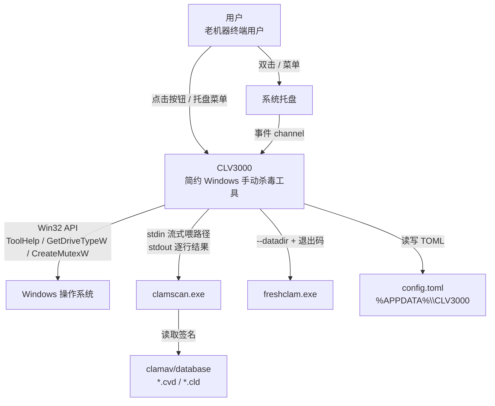
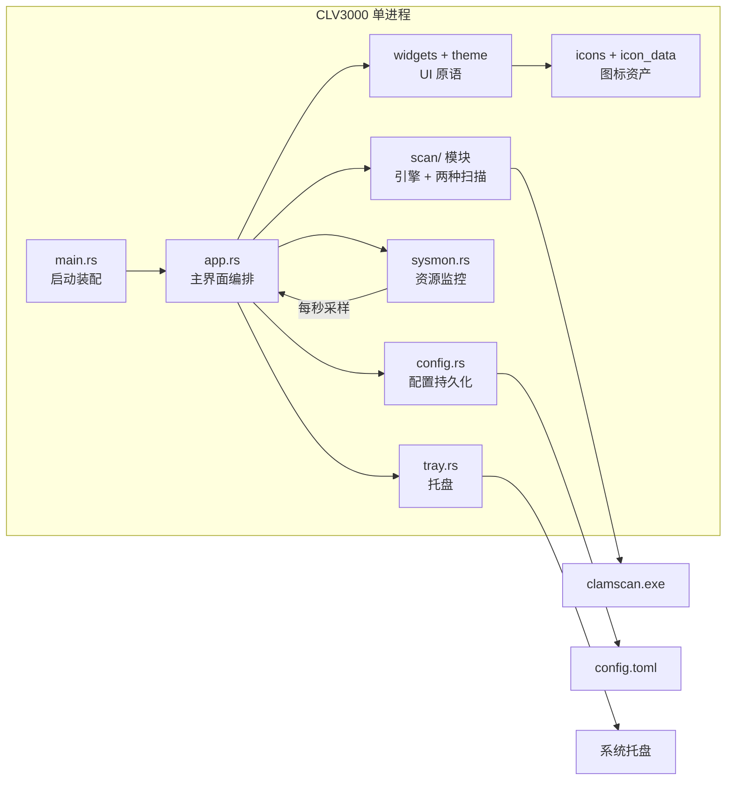
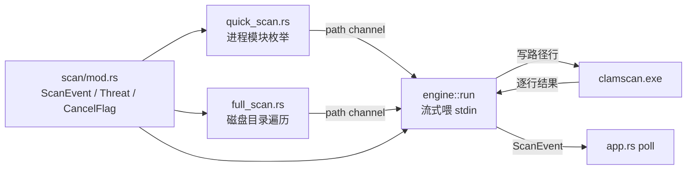
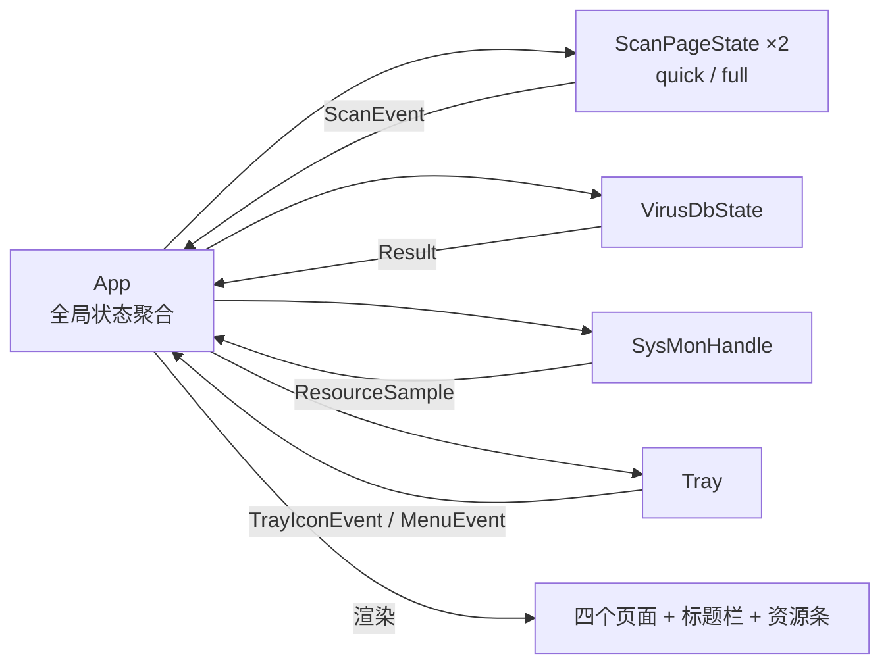
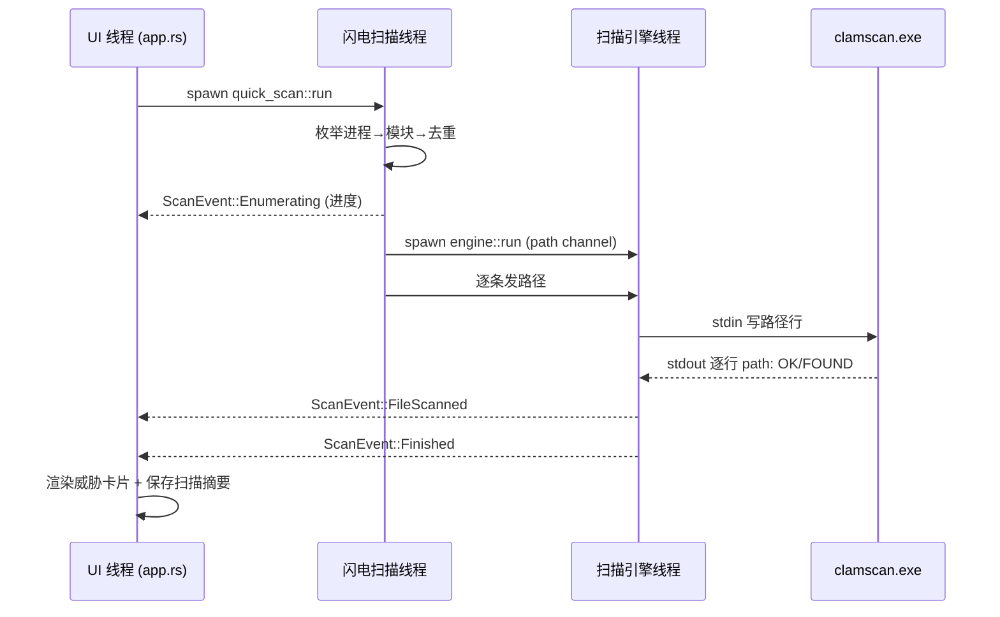
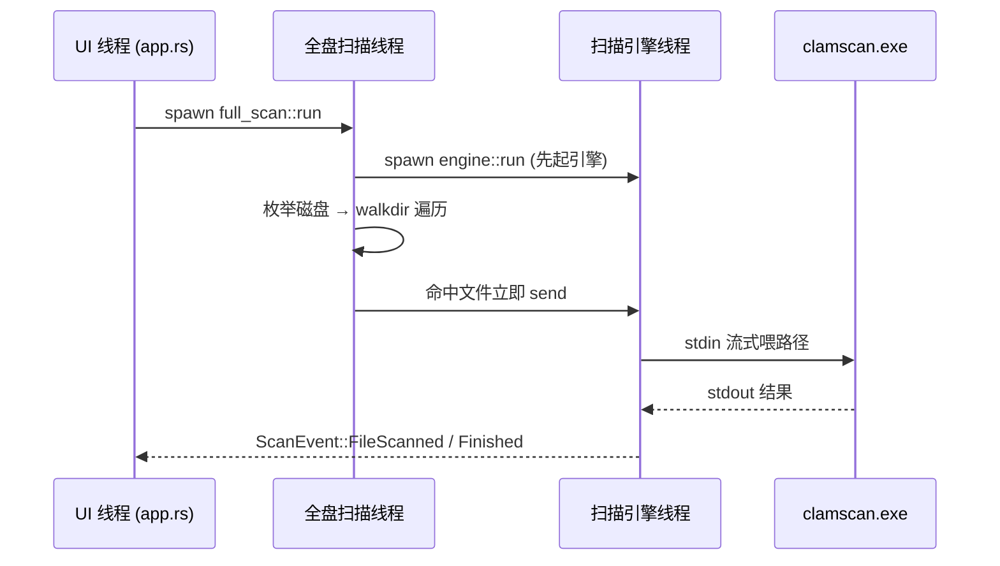
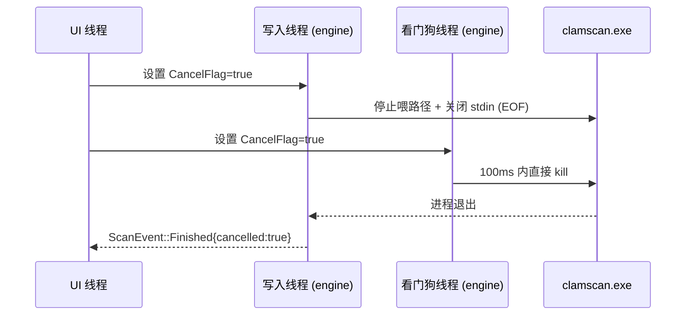

# 系统架构文档：CLV3000

**版本：** 1.0
**分类：** 内部架构文档
**生成日期：** 2026-08-09

---

## 1. 架构概述

### 1.1 设计理念

CLV3000 的架构可以用四个原则概括，它们几乎都是从"老机器 + 绿色分发"这个产品约束里长出来的，而不是为了"架构而架构"。

**1. 老机器优先：体积/内存 > 极限速度**
release 配置用 `opt-level = "s"`、`lto = true`、`codegen-units = 1`、`panic = "abort"`、`strip = true`（`Cargo.toml:19-24`）——目标是让二进制尽可能小、启动和换页开销尽可能低。这个取舍是有底气的：杀毒扫描的瓶颈在 ClamAV 引擎和磁盘 IO，而不在这段胶水代码，所以"省一点编译优化"换"体积显著变小"是划算的。同样的思路贯穿全文：时间不引 chrono 只调 `GetLocalTime`（`src/localtime.rs`），图标不依赖字体而手绘矢量（`src/icons.rs:1-2`）。

**2. 不在 UI 线程做任何重活**
所有扫描、枚举、病毒库更新、资源采样都 `std::thread::spawn` 到后台线程，通过 `std::sync::mpsc` channel 把事件推回 UI，UI 每帧 `try_recv` 轮询（`src/app.rs:113-171`）。这个"单帧轮询"模型看起来朴素，却同时解决了两个难题：后台阻塞不会卡界面，以及 Rust 借用规则在跨线程共享 UI 状态上的限制——因为事件是 `Send` 的值，跨线程天然安全。

**3. 优雅降级：每个外部依赖都是可选的**
ClamAV 缺失 → 扫描页提示"找不到扫描引擎"（`src/scan/engine.rs:31-42`）；托盘失败 → 无托盘模式运行（`src/main.rs:23-29`）；单实例 Mutex 失败 → 允许运行（`src/single_instance.rs:21-24`）；freshclam 失败 → 只弹 toast（`src/app.rs:334-339`）；进程模块枚举权限不足 → 跳过计入统计（`src/scan/quick_scan.rs:108-110`）。这让程序在"环境不全"的老机器上依然可用。

**4. 显式取消契约**
取消用共享的 `AtomicBool`（`CancelFlag`，`src/scan/mod.rs:48`）：写入线程看到取消就停止喂路径并关闭 stdin（软取消），同时一个看门狗线程 100ms 轮询并直接 `kill` 子进程（硬取消）（`src/scan/engine.rs:92-107`）。双重保证让用户点取消后子进程一定及时退出，不会残留。

### 1.2 核心架构模式

| 模式 | 实现方式 | 目的 |
|------|---------|------|
| 分层架构 | 表现层（app/widgets/theme）→ 服务层（scan/sysmon/config）→ 平台层（Win32/ClamAV 子进程） | 职责分离：UI 只编排展示，重活下沉线程 |
| 管道-过滤器 | 路径生产者（quick/full_scan）→ mpsc channel → `engine::run`（过滤器）→ clamscan | 一条流式管线，一次子进程启动、一次病毒库加载 |
| 生产者-消费者 | 闪电/全盘扫描生产路径，引擎线程消费；sysmon 生产采样，UI 消费 | 跨线程单向数据流，天然无竞争 |
| 状态机 | `ScanPhase`（Idle/枚举/扫描/完成）驱动扫描页渲染 | 把异步扫描收敛成确定性 UI 状态 |
| 事件驱动（轮询式） | 后台线程发 `ScanEvent`，UI 每帧 `try_recv` | 后台→前台唯一数据通道，界面永不阻塞 |

### 1.3 技术栈概述

一句话：**Rust 2024 + egui 桌面 GUI + Win32 直调 + 外部 ClamAV 子进程**，无异步运行时、无网络依赖、无数据库。

| 层次 | 选型 | 用途 |
|------|------|------|
| GUI | eframe 0.36 + egui 0.36（glow） | 四页面窗口、自绘标题栏、即时模式渲染 |
| 托盘 | tray-icon 0.24 + muda 0.19 | 常驻托盘图标与右键菜单 |
| 系统监控 | sysinfo 0.39 | CPU/内存采样 |
| Win32 | windows crate 0.62 | 进程/模块枚举、磁盘枚举、互斥锁、本地时间 |
| 配置 | serde + toml | `%APPDATA%\CLV3000\config.toml` 持久化 |
| 遍历 | walkdir 2.5 | 全盘扫描目录树遍历 |
| 扫描引擎 | 外部便携版 ClamAV（`clamscan.exe`/`freshclam.exe`） | 病毒签名比对与病毒库更新 |

---

## 2. 系统上下文（C4 Level 1）

系统与外部世界的边界非常薄：真正的恶意软件识别能力外包给 ClamAV（进程边界隔离），CLV3000 只负责"找到要扫的文件"和"把结果翻译给用户"。

---

## 3. 容器视图（C4 Level 2）

CLV3000 是单一进程、单一二进制，所以"容器"层面就是它内部的各个逻辑模块——它们以 crate 内 module 的形式存在，靠 Rust 的模块系统组织，运行时通过线程 + channel 协作。

### 3.1 领域模块职责

| 模块/领域 | 路径 | 职责 | 关键抽象 |
|---------|------|------|---------|
| 扫描引擎 | `src/scan/engine.rs` | 封装 clamscan 子进程：流式喂路径、逐行解析结果、取消看门狗 | `run()`、`CancelFlag` |
| 闪电扫描 | `src/scan/quick_scan.rs` | 枚举进程加载模块、去重、两阶段扫描 | `run()`、`snapshot_pids()` |
| 全盘扫描 | `src/scan/full_scan.rs` | 枚举磁盘可执行文件、边发现边喂 | `run()`、`EXECUTABLE_EXTENSIONS` |
| 主界面编排 | `src/app.rs` | 四页面、自绘标题栏、事件轮询、扫描状态机 | `App`、`ScanPageState`、`ScanPhase` |
| 配置持久化 | `src/config.rs` | 扫描摘要、忽略列表、开关（TOML） | `AppConfig`、`ScanRecord`、`IgnoredEntry` |
| 系统集成 | `src/tray.rs`+`sysmon.rs`+`single_instance.rs` | 托盘、资源监控、单实例锁 | `Tray`、`SysMonHandle`、`acquire()` |
| 路径定位 | `src/paths.rs` | exe 相对 clamav 目录、配置目录 | `paths::*` 函数族 |
| UI 基础组件 | `src/widgets.rs`+`theme.rs` | 圆环/胶囊/威胁卡/Toast、深色主题 | `progress_ring()`、`threat_card()` |
| 图标资产 | `src/icons.rs`+`icon_data.rs` | 矢量图标、RGBA 程序图标 | `shield_rgba()` |
| 时间工具 | `src/localtime.rs` | 极简时间戳 | `Timestamp` |

---

## 4. 组件视图（C4 Level 3）

### 4.1 扫描模块组件架构

扫描子系统是两条"路径生产者" + 一个"共享引擎"的结构：`quick_scan` 和 `full_scan` 各自实现"找文件"的策略，但都通过同一个 `engine::run` 与 ClamAV 交互，事件协议统一由 `scan/mod.rs` 定义。

### 4.2 主界面编排组件架构

`App` 是唯一持有全部状态的结构：四个页面的渲染函数都是自由函数（接受 `&mut App`），扫描/病毒库/资源的状态各自封装在 `ScanPageState`/`VirusDbState` 中，由 `App` 聚合。

---

## 5. 关键流程

### 5.1 闪电扫描（两阶段：先枚举拿总数，再扫描）

### 5.2 全盘扫描（边发现边喂）

### 5.3 取消扫描（软取消 + 硬取消双重保险）

---

## 6. 技术实现

### 6.1 关键架构模式

**流式子进程管线**（`src/scan/engine.rs`）是本项目最重要的实现模式。它用 `--file-list=-` 让 `clamscan.exe` 从 stdin 读路径、`-v` 让每个文件输出一行、`--no-summary` 关闭结尾摘要，然后用三线程协作：写入线程把 channel 的路径逐行写进 stdin；看门狗线程轮询取消标记、必要时 `kill` 子进程；主读取线程用 `BufReader::lines()` 逐行解析 `path: status`，翻译成 `ScanEvent`。`Arc<Mutex<Child>>` 在三个线程间共享子进程句柄，锁的持有时间极短。

**轮询式事件分发**（`src/app.rs`）：后台线程是"生产者"，UI 是"消费者"。`ScanPageState::poll()` 每帧 `while let Ok(event) = rx.try_recv()` 排空队列、推进 `ScanPhase` 状态机，`Finished` 事件返回 `(scanned, elapsed, cancelled)` 三元组触发扫描摘要保存。`request_repaint_after(250ms)` 保证窗口隐藏到托盘时事件依然被及时拾取。

### 6.2 并发和并行策略

- **每任务一线程**：闪电扫描、全盘扫描、病毒库更新、资源监控各自一个 `std::thread::spawn`，与 UI 通过 channel 单向通信。
- **线程内再拆子线程**：`engine::run` 内部三个线程（写/读/看门狗）协作处理子进程。
- **刻意不用 async**：扫描是阻塞 IO 等待（等子进程、等磁盘），无高并发网络场景；线程模型让取消（kill 子进程）和 Rust 借用约束都更简单（见 ADR 2）。
- **无数据竞争**：跨线程共享的只有 `Arc<AtomicBool>`（取消标记）和 `Arc<Mutex<Child>>`（子进程句柄），且持锁时间极短。

### 6.3 性能优化策略

- **单次子进程启动 + 单次病毒库加载**：整个扫描全程只 spawn 一次 `clamscan.exe`，路径流式喂入（`src/scan/engine.rs:3-8`）。
- **流式零缓冲**：全盘扫描路径不驻留内存，遍历器 → channel → stdin 是一条直通管道（`src/scan/full_scan.rs:3-5`）。
- **扩展名白名单前置过滤**：在路径进入 channel 前就滤掉 99% 的非可执行文件（`src/scan/full_scan.rs:15`）。
- **进程级快照**：闪电扫描先取 PID 列表再逐个开小快照，避免一次全系统模块快照的卡顿（`src/scan/quick_scan.rs:80-102`）。
- **`HashSet` 去重**：DLL 共享场景下减少重复扫描数十倍（`src/scan/quick_scan.rs:29-30`）。
- **后台资源采集独立线程**：sysmon 每秒采样一次，UI 只读最新值，不影响 UI 帧率（`src/sysmon.rs:39-70`）。

---

## 附录：架构决策记录（ADR）

**ADR 1：流式 stdin 管线，而不是"完整列表一次性传"**
- **决策**：用 `--file-list=-` + 逐行写 stdin 的方式把路径流式喂给 clamscan。
- **原因**：既避免"为了拿全列表而等待整个遍历结束"，也避免"每文件启动一次子进程、反复加载病毒库"的开销（`src/scan/engine.rs:3-8` 注释）。
- **后果**：全盘扫描"边发现边扫"，用户立刻看到进度；代价是实现上多了写入线程和 stdin EOF 契约。

**ADR 2：`std::thread` + mpsc，放弃 tokio/async**
- **决策**：并发全用标准库线程 + channel。
- **原因**：扫描/枚举是阻塞 IO 等待，异步化收益低、心智负担高；线程模型让"取消 → kill 子进程"的语义直白。
- **后果**：没有零开销异步的并发吞吐，但本场景无此需求；代码简单、错误路径直观。

**ADR 3：威胁只"报告 + 忽略"，放弃隔离/删除**
- **决策**：检出只展示，忽略记配置，隔离按钮占位。
- **原因**：产品承诺"绝不做任何文件系统写操作"，把误伤/误删风险降到零（`src/app.rs:790-792`）。
- **后果**：功能上缺失"清除"能力，换来绝对安全；隔离留给后续版本。

**ADR 4：托盘事件轮询，放弃 EventLoopProxy 事件驱动**
- **决策**：每帧从 `TrayIconEvent::receiver()` / `MenuEvent::receiver()` `try_recv`。
- **原因**：eframe 封装了 winit 的 EventLoop，拿不到 proxy；轮询配合 `request_repaint_after` 换几百毫秒延迟，换代码可维护性（`src/tray.rs:3-9` 注释详述）。
- **后果**：托盘响应最坏延迟几百毫秒，实测可接受；若后续延迟敏感可调小 250ms。

**ADR 5：闪电扫描先枚举拿总数、再扫描**
- **决策**：`quick_scan` 两阶段执行，`full_scan` 边发现边扫。
- **原因**：闪电扫描枚举通常一两秒完成，"知道总数"让 UI 能画确定的百分比进度环；全盘总量未知，只能流式（`src/scan/quick_scan.rs:22-25`）。
- **后果**：闪电扫描首结果延迟比流式略长，换来"确定进度"的用户体验。

**ADR 6：病毒库更新纯手动，放弃自动定时**
- **决策**：仅提供"手动更新病毒库"按钮。
- **原因**：老机器场景"按需更新"更可控，避免意外的网络/资源消耗（README 已知简化项）。
- **后果**：病毒库可能滞后，需用户记得手动更新。
