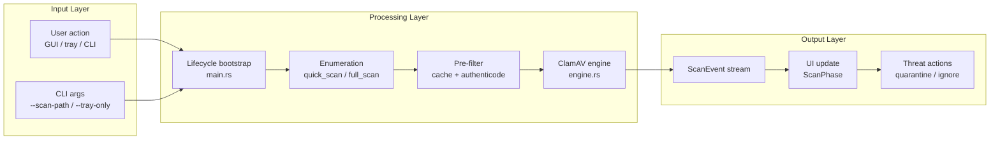
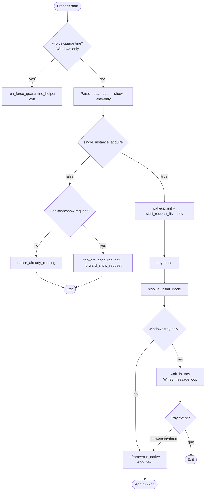
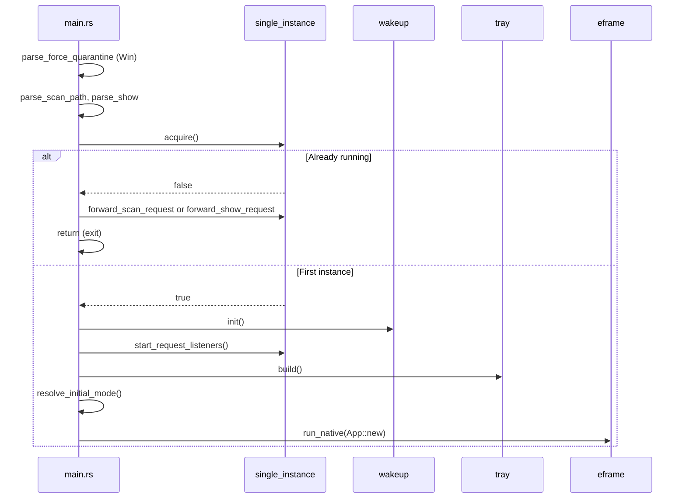
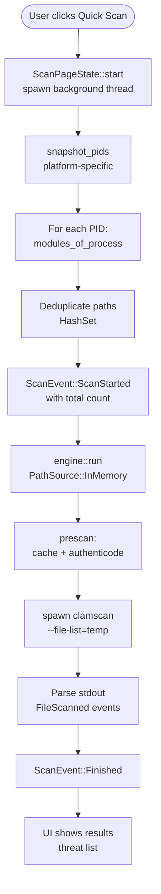
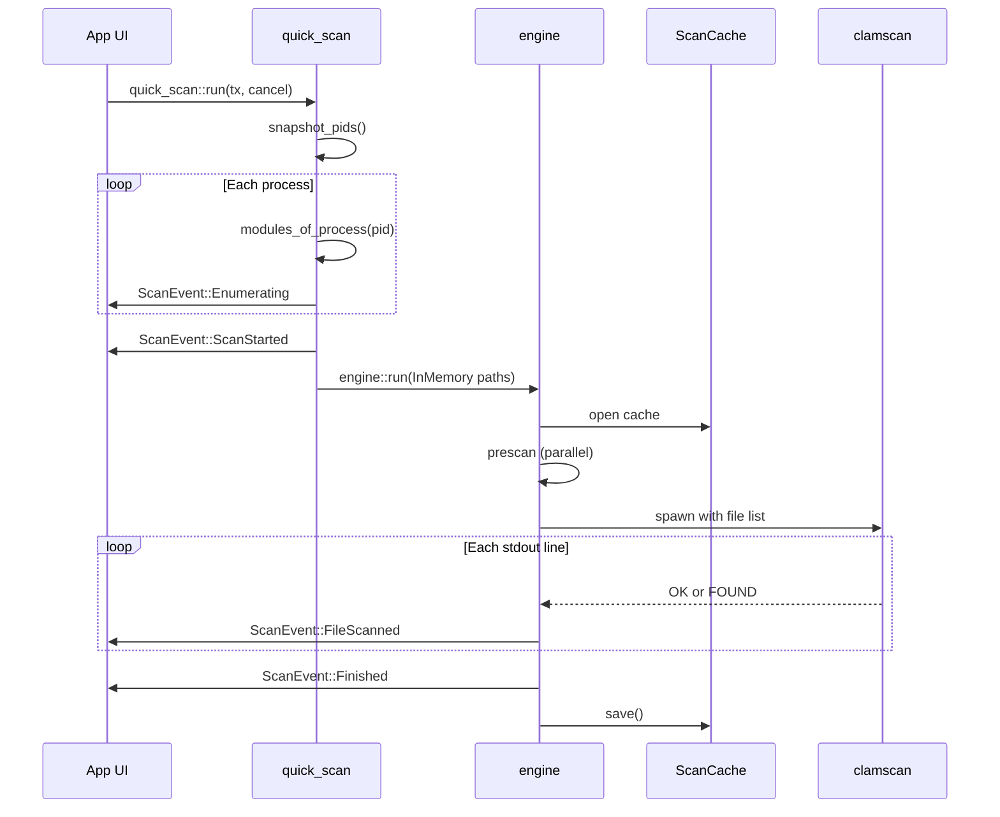
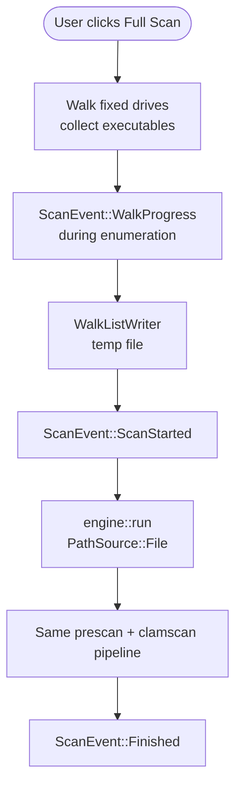
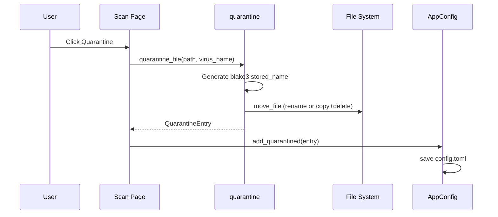
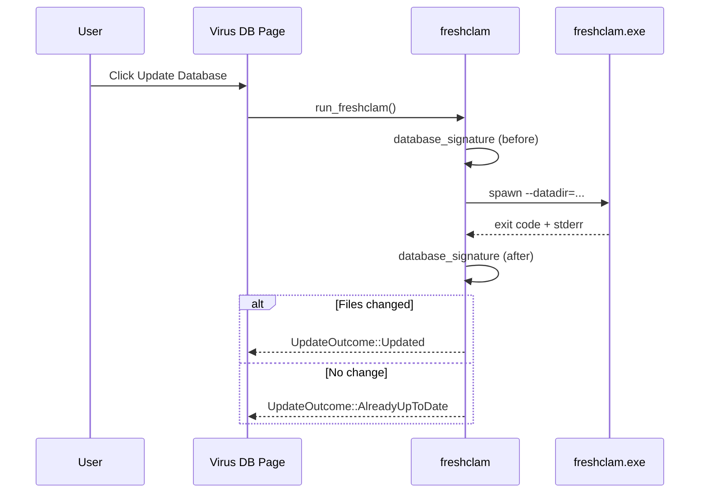

# Core Workflows

## 1. Workflow Overview

### 1.1 System Workflow Philosophy

CLV3000's workflows follow a simple mental model: **discover → filter → inspect → act**. Like an automotive assembly line, raw materials (file paths) enter through enumeration stations, pass quality gates (signature check, content cache), get inspected by the ClamAV engine, and finished products (scan results with optional quarantine actions) arrive at the UI.

The application never blocks the UI thread on I/O. Every long-running operation — process enumeration, disk walking, ClamAV scanning, freshclam updates — runs on background threads and communicates results through typed event channels.

### 1.2 Core Execution Path

---

## 2. Main Workflows

### 2.1 Application Startup

This workflow determines how CLV3000 presents itself on launch — visible window, hidden tray, or direct scan — based on CLI arguments and whether another instance is already running.

#### Flowchart

#### Sequence Diagram

#### Stage Reference

| Stage | Executor | Input | Output | Source |
|-------|----------|-------|--------|--------|
| CLI parsing | `lifecycle.rs` | `std::env::args()` | Flags and paths | `src/lifecycle.rs:68-97` |
| Single-instance check | `single_instance.rs` | — | bool (proceed or forward) | `src/main.rs:52-66` |
| Wakeup init | `wakeup.rs` | — | Channel forwarders started | `src/main.rs:70-74` |
| Mode resolution | `main.rs` | tray, flags | `InitialMode` | `src/main.rs:138-163` |
| eframe bootstrap | `app_shell.rs` | `InitialMode` | Running `App` | `src/main.rs:121-125` |

---

### 2.2 Quick Scan

Quick scan targets the most urgent threat surface: files currently loaded by running processes. It completes enumeration in seconds, then delegates to the shared scan engine.

#### Flowchart

#### Sequence Diagram

#### Stage Reference

| Stage | Executor | Input | Output | Source |
|-------|----------|-------|--------|--------|
| Process snapshot | `quick_scan` | — | PID list | `src/scan/quick_scan.rs:38` |
| Module enumeration | platform module | PID | PathBuf list | `src/scan/quick_scan.rs:59-63` |
| Engine prescan | `engine.rs` | paths, cache | filtered list + instant results | `src/scan/engine.rs:124` |
| ClamAV scan | `engine.rs` | temp file list | stdout lines | `src/scan/engine.rs:140` |
| UI state update | `apply_scan_event` | ScanEvent | ScanPhase | `src/app/core/scan_state.rs:75` |

---

### 2.3 Full Scan

Full scan systematically walks local drives collecting executable files. Unlike quick scan, the file count may reach tens of thousands, so paths stream to a temporary file rather than staying in memory.

#### Flowchart

Key difference from quick scan: `PathSource::File { path, count }` instead of `InMemory` (`src/scan/mod.rs:46-48`), enabling streaming enumeration without memory pressure.

---

### 2.4 Threat Quarantine

When a threat is detected, the user can quarantine it — moving the file to an app-private directory while preserving the ability to restore.

On Windows, if the file is locked by a running process, the user can choose force quarantine — killing blocking processes and optionally elevating via UAC (`src/quarantine.rs:9-17`, `src/main.rs:34-43`).

---

### 2.5 Virus Database Update

Source: `src/app/freshclam.rs:11-54`

---

## 3. Concurrency and Async Model

CLV3000 uses **blocking threads with message passing**, not async/await. This fits the workload: long-running subprocess I/O and filesystem walks don't benefit from async runtime overhead on a single-user desktop app.

| Concern | Approach | Rationale |
|---------|----------|-----------|
| Scan execution | Dedicated `std::thread` per scan | Simple cancellation via shared `AtomicBool` |
| UI updates | `mpsc` channel + `apply_scan_event` | Pure state transitions, testable without UI |
| Parallel prescan | Thread pool with `CacheSnapshot` | Avoid mutex deadlock documented in cache module |
| Tray wake-up | Blocking `recv()` forward threads | Zero CPU when idle; immediate wake on event |
| Cancel scan | `CancelFlag` + watchdog kills clamscan | Responsive cancel without waiting for engine |

---

## 4. Error Handling Strategy

CLV3000 follows a **"local failure, global continuation"** philosophy — one bad file or subprocess error should not crash the application.

| Scenario | Handling | User Experience |
|----------|----------|-------------------|
| ClamAV not found | `ScanEvent::Error` + `Finished` | Scan page shows engine missing message |
| Individual file unreadable | Skip during enumeration | Scan continues, file not counted |
| Quarantine move fails | `Result::Err` → toast | File stays in place, user can retry or force |
| Tray init fails | Log to stderr, continue | App runs without tray icon |
| Second instance, forward fails | `notice_already_running()` | Message box: already running |
| freshclam network error | Error string with stderr | Database page shows failure reason |

The cancel path is particularly important: a watchdog thread monitors the cancel flag and kills the clamscan subprocess, ensuring the UI resets promptly when the user clicks Cancel (`src/scan/engine.rs:7-8`).
