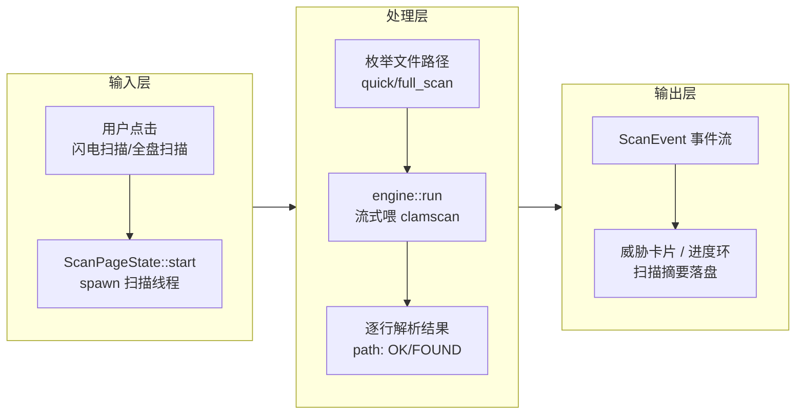
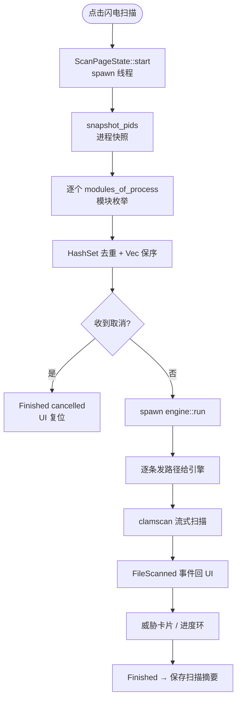
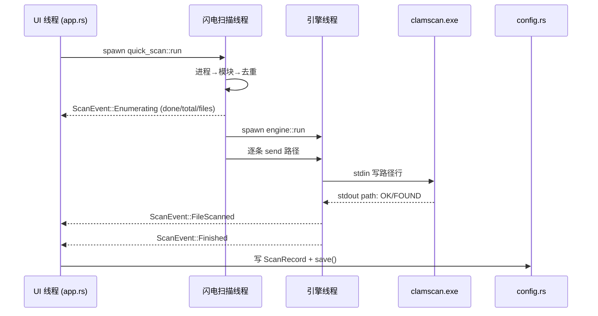
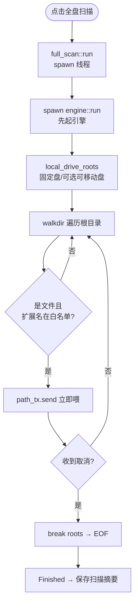
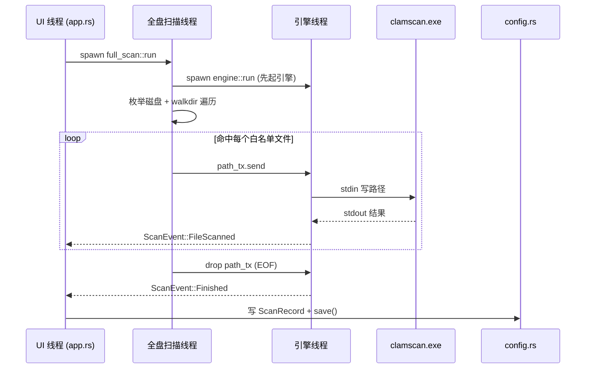
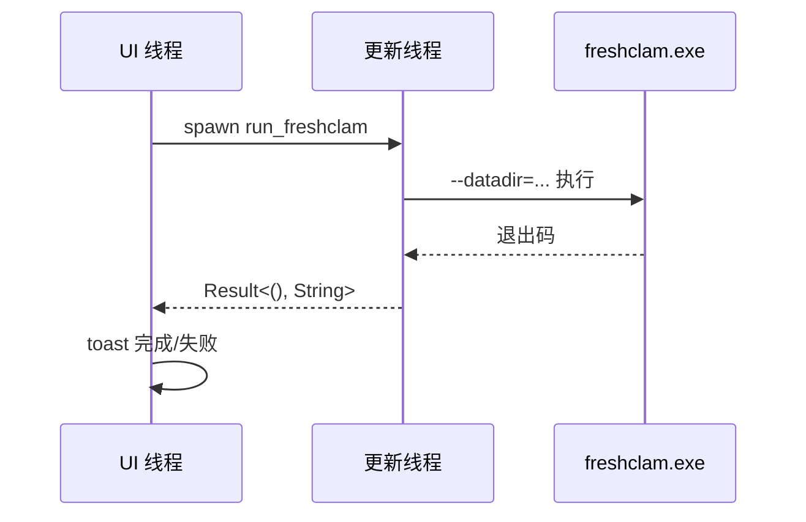
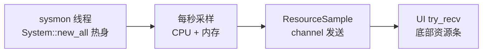
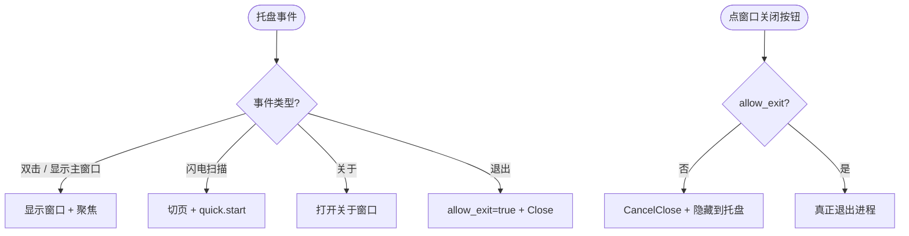

# 核心工作流

## 1. 工作流概述

### 1.1 系统架构与工作流理念

CLV3000 的工作流可以比喻成一条"**手动安检流水线**"：你不是让安检员全天站岗（那叫实时防护，本程序明确不做），而是自己走到闸机前按下按钮，选"快速安检"（闪电扫描，只查正在运行的进程模块）或"大件托运安检"（全盘扫描，翻遍磁盘上所有可执行文件）。安检机（ClamAV）只有一台，流水线两端的搬运工（闪电/全盘扫描线程）负责把"货物"（文件路径）搬到传送带上，安检机一件件过，每过一件出一行结果，末端有人（UI）把结果登记成册（威胁卡片）并归档（写配置摘要）。

这条流水线的核心特征是"**事件流驱动**"：所有后台任务（扫描、病毒库更新、资源监控）都是独立线程，它们不直接操作界面，而是把事件投进 channel；UI 每帧 `try_recv` 一次，像流水线终点的质检员，一件件接下并更新页面。无论后台多忙，界面永不被阻塞。

### 1.2 核心执行路径

---

## 2. 主要工作流

### 2.1 闪电扫描

闪电扫描解决的是"怀疑机器被装了东西，想立刻看看**正在运行**的进程有没有猫腻"。它只扫活跃进程加载的 exe/DLL，枚举通常一两秒完成，是全系统响应最快的路径。

**触发方式**：仪表盘"闪电扫描"按钮 / 闪电扫描页"开始闪电扫描" / 托盘右键"闪电扫描"
**入口**：`ScanPageState::start`（`src/app.rs:74`）→ `quick_scan::run`（`src/scan/quick_scan.rs:26`）

**执行步骤**：
1. 拍进程快照（`snapshot_pids`，`src/scan/quick_scan.rs:80`）——`CreateToolhelp32Snapshot(TH32CS_SNAPPROCESS)` 拿全部 PID。
2. 逐个进程枚举模块（`modules_of_process`，`src/scan/quick_scan.rs:105`）——`TH32CS_SNAPMODULE|TH32CS_SNAPMODULE32` 快照 DLL 路径；权限不足的进程跳过但计入统计，不阻塞整体。
3. `HashSet` 去重 + `Vec` 保序（`src/scan/quick_scan.rs:29-30`）——同一个 DLL 被多进程加载只需扫一次。
4. 枚举完成、知道总数后 spawn 引擎线程（`engine::run`，`src/scan/quick_scan.rs:63-65`）——UI 现在能画确定的百分比进度环。
5. 逐条把路径发进 channel（`src/scan/quick_scan.rs:67-75`），取消或管道断开即停。
6. UI `poll` 消费 `ScanEvent`（`src/app.rs:113-171`），非忽略威胁进入 `Threat` 列表，页面渲染威胁卡片；完成后写 `last_quick_scan` 摘要并 `config.save()`（`src/app.rs:311-322`）。

**流程图**

**时序图**

**阶段说明**

| 阶段 | 执行者 | 输入 | 输出 | 说明 |
|------|-------|------|------|------|
| 进程/模块枚举 | `quick_scan` 线程 | 无（Win32 快照） | 去重路径列表 + `Enumerating` 事件 | 一两秒完成，提供"总数" |
| 扫描 | `engine::run` + clamscan | 路径 channel | `FileScanned` 事件流 | 流式 stdin 喂路径 |
| 结果归集 | UI `poll` | `ScanEvent` | `ScanPhase::Done` + 威胁列表 | 写扫描摘要到配置 |

### 2.2 全盘扫描

全盘扫描解决"彻底放心"的需求：翻遍所有固定磁盘上的可执行文件。因为总量未知，它采用"**边发现边喂**"——遍历器每命中一个文件就立刻交给引擎，用户能看到"已扫描 N 个"持续跳动。

**触发方式**：仪表盘"全盘扫描"按钮 / 全盘扫描页"开始全盘扫描"（可先勾选"包含可移动磁盘"）
**入口**：`ScanPageState::start`（`src/app.rs:74`）→ `full_scan::run`（`src/scan/full_scan.rs:22`）

**执行步骤**：
1. 枚举磁盘根（`local_drive_roots`，`src/scan/full_scan.rs:70`）——`GetLogicalDrives` 拿盘符位图，`GetDriveTypeW` 区分固定盘(3)/可移动盘(2)，按配置决定是否包含可移动盘。
2. 先 spawn 引擎线程（`src/scan/full_scan.rs:27-29`）——和闪电扫描**相反**的顺序：因为全盘没有总数，先让引擎就位，路径边走边喂。
3. `walkdir` 遍历根目录（`src/scan/full_scan.rs:34-51`），`follow_links(false)` 防链接循环，`filter_map(|e| e.ok())` 容忍读取错误。
4. 扩展名白名单过滤（`EXECUTABLE_EXTENSIONS`，`src/scan/full_scan.rs:15`）——`exe/dll/sys/scr/com/cpl/ocx/drv`，大小写不敏感。
5. 命中文件立即 `path_tx.send()`，每步检查取消标记；channel 断开则 `break 'roots`。
6. 遍历完 drop `path_tx`（EOF 信号），`engine_thread.join()` 等引擎收尾，UI 收到 `Finished`。

**流程图**

**时序图**

**阶段说明**

| 阶段 | 执行者 | 输入 | 输出 | 说明 |
|------|-------|------|------|------|
| 磁盘/目录枚举 | `full_scan` 线程 | 磁盘信息 | 命中路径流 | walkdir + 白名单过滤 |
| 扫描 | `engine::run` + clamscan | 路径 channel | `FileScanned` 事件流 | 与闪电扫描共用引擎 |
| 结果归集 | UI `poll` | `ScanEvent` | `ScanPhase::Done` + 威胁列表 | 未知总数，显示"已扫描 N 个" |

### 2.3 病毒库更新

**触发方式**：病毒库页"手动更新病毒库"按钮
**入口**：`VirusDbState::start_update`（`src/app.rs:187`）→ `run_freshclam`（`src/app.rs:213`）

**执行步骤**：
1. 检查 `freshclam_path().is_file()`，不存在直接 return。
2. spawn 线程执行 `freshclam.exe --datadir=<database 目录>`，`creation_flags(0x0800_0000)` 隐藏窗口，stdout/stderr 重定向 null。
3. 退出码 0 → 成功，非 0 → 失败（`src/app.rs:228-232`）。
4. UI `poll` 到结果后 toast"病毒库更新完成/失败"（`src/app.rs:334-339`）。

### 2.4 资源监控

**触发方式**：程序启动即 `sysmon::spawn()`（`src/app.rs:258`）
**执行步骤**：后台线程 `System::new_all()` → 热身一次 CPU 采样（sysinfo 要求两次采样间隔 `MINIMUM_CPU_UPDATE_INTERVAL`）→ 循环"refresh_cpu_usage + refresh_memory → send(ResourceSample) → 100ms 步进检查停止标记"，约每秒一发（`src/sysmon.rs:44-70`）。UI 每帧 `try_recv` 更新 `last_sample`，渲染到底部资源条（`src/app.rs:359-361`）。

### 2.5 托盘交互与关闭行为

**触发方式**：托盘双击 / 右键菜单（显示主窗口 / 闪电扫描 / 关于 / 退出）
**入口**：`poll_tray`（`src/app.rs:277`）

**执行步骤**：每帧从 `TrayIconEvent::receiver()` / `MenuEvent::receiver()` `try_recv`：双击/显示 → 显示并聚焦窗口；闪电扫描 → 切页 + 启动扫描；关于 → 打开窗口；退出 → 置 `allow_exit=true` 再发关闭命令。窗口关闭按钮被拦截：`close_requested && !allow_exit` → 取消关闭 + 隐藏到托盘（`src/app.rs:352-355`）。

---

## 3. 并发与异步模型

CLV3000 的并发模型是一套"**线程 + channel**"的组合拳，并且刻意追求"稳"而非"快"：

- **每条后台任务一个专属线程**：闪电扫描、全盘扫描、病毒库更新、资源监控各自 `std::thread::spawn`，与 UI 线程通过 `std::sync::mpsc` 单向通信。UI 从不直接触碰后台线程的状态——所有状态变化都通过"事件回传 → 每帧轮询"完成。
- **引擎线程内部再拆子线程**：`engine::run` 里还有写入线程（喂 stdin）、看门狗线程（取消时 kill 子进程）、主读取线程（解析 stdout），三者用 `Arc<Mutex<Child>>` 共享子进程句柄（`src/scan/engine.rs:90-107`）。
- **轮询式 UI**：`request_repaint_after(250ms)` 保证每帧重绘，窗口隐藏到托盘时事件也能在几百毫秒内被拾取（`src/app.rs:364-365`）。
- **为什么这样选**：系统里没有高吞吐网络请求，只有"等待子进程 / 等待磁盘 IO"的阻塞场景。用 async 只会增加心智负担；线程 + channel 的错误路径直观（谁持有 channel 谁收事件），配合 Rust 所有权规则天然避免数据竞争。

| 维度 | 实现 | 说明 |
|------|------|------|
| 后台任务隔离 | `std::thread::spawn` × 5 | 每任务一线程，互不阻塞 |
| 跨线程通信 | `std::sync::mpsc` channel × N | 路径、事件、采样值单向流动 |
| 共享状态 | `Arc<AtomicBool>` / `Arc<Mutex<Child>>` | 取消标记、子进程句柄；持锁时间极短 |
| UI 轮询 | 每帧 `try_recv` + `request_repaint_after` | 界面永不阻塞，托盘可响应 |

## 4. 错误处理策略

核心理念是"**局部失败不应导致全局中断**"——每个环节都给失败留了后路，程序在任何外部环境不完整时依然能打开、能提示、能复位：

| 失败场景 | 处理方式 | 代码位置 |
|---------|---------|---------|
| `clamscan.exe` 不存在 | 发 `Error` 事件（带路径提示）+ `Finished{scanned:0}`，UI 显示"找不到扫描引擎" | `src/scan/engine.rs:31-42` |
| 子进程启动/管道失败 | 发 `Error` + `child.kill()` + `Finished` | `src/scan/engine.rs:60-88` |
| 输出行解析失败 | 该行跳过；非 `OK` 状态一律按检出处理（容错不漏报） | `src/scan/engine.rs:162-173` |
| 进程模块枚举权限不足 | 返回空列表跳过，计入统计（注释：不是 bug） | `src/scan/quick_scan.rs:108-110` |
| 目录遍历错误 | `filter_map(\|e\| e.ok())` 静默跳过坏条目 | `src/scan/full_scan.rs:35-37` |
| 配置文件损坏 | `toml::from_str(...).unwrap_or_default()` 回退默认 | `src/config.rs:36-39` |
| 托盘初始化失败 | 以无托盘模式继续运行 | `src/main.rs:23-29` |
| 单实例 Mutex 失败 | 允许继续运行 | `src/single_instance.rs:21-24` |
| freshclam 失败 | 非零退出码 → 返回 Err → toast 展示 | `src/app.rs:228-232` |

**取消（取消扫描）**是一个特殊的"错误"场景，它的处理尤其值得注意：UI 置 `CancelFlag` 后，写入线程停止喂路径并关闭 stdin（软取消，等 clamscan 读完 EOF 自然退出），同时看门狗线程 100ms 内 `kill` 子进程（硬取消，立刻结束）——两条路径并行，任何一条先成功都算取消完成。扫描线程收到取消后发 `Finished{cancelled:true}`，UI 状态正常复位、不写扫描摘要（`src/app.rs:311-333`）。
