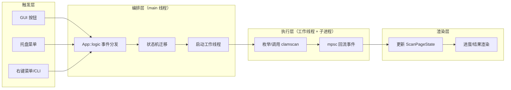
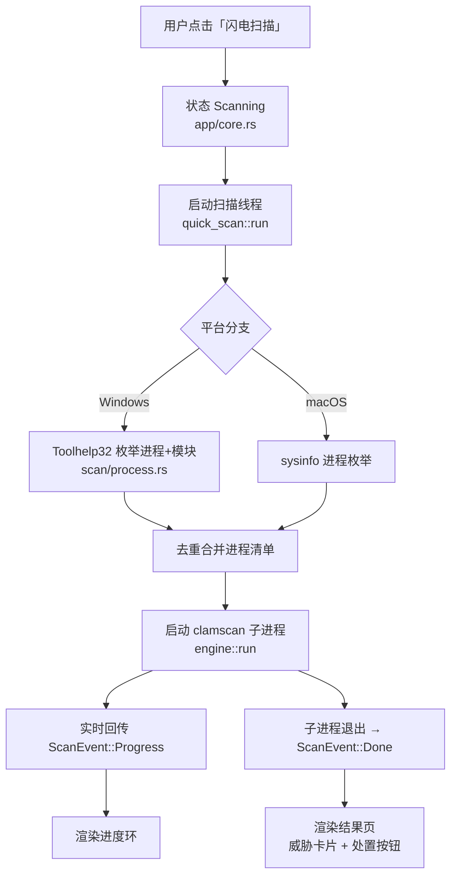
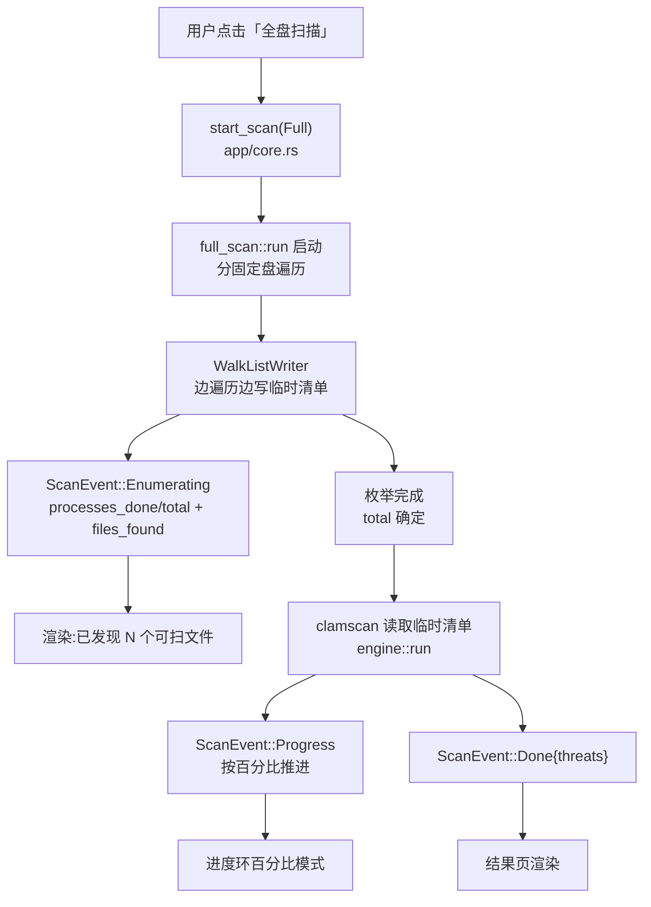
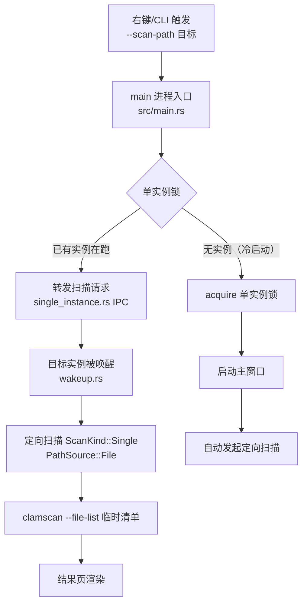
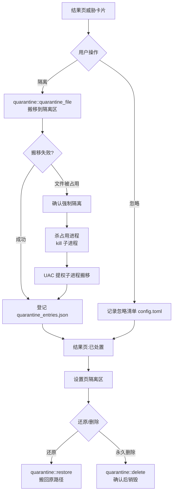
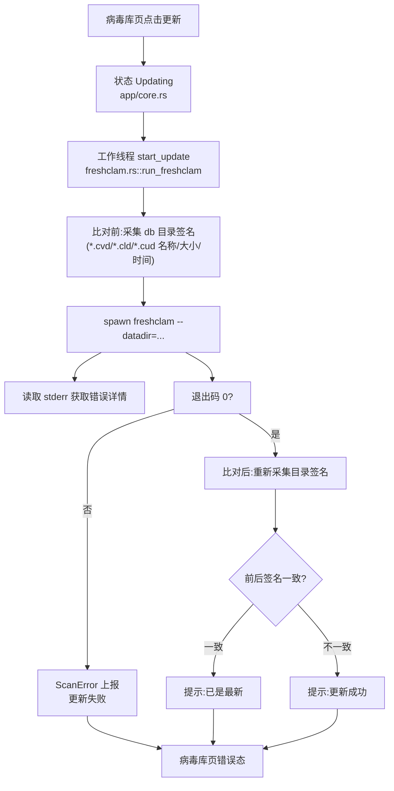
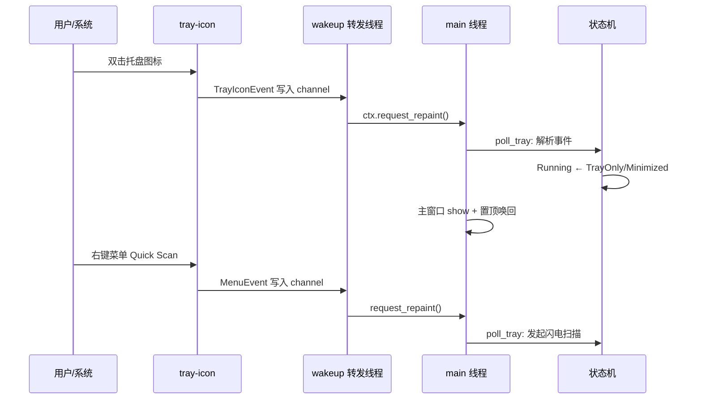

# CLV3000 工作流

如果把 CLV3000 比作一台体检仪，那么"工作流"就是这台仪器上的每一套检查流程：闪电扫描像量血压（几十秒出结果）、全盘扫描像做全身 CT（时间长但全面）、威胁处置像病理切片（针对单个可疑样本做判断）、病毒库更新像校准仪器（保证检测能力是最新的）。理解这些工作流，比理解任何单一模块都更能把握这个软件实际"怎么被使用"。

本文拆解六条端到端业务流程：闪电扫描、全盘扫描、定向（右键/命令行）扫描、威胁处置闭环、病毒库更新、托盘唤回与请求转发。每条流程都遵循同一套架构骨架——**外部触发 → channel 唤醒 UI → 状态机迁移 → 后台线程执行 → mpsc 回流 → 界面渲染**，区别只在于触发源、扫描目标和处置动作不同。所有流程中的函数名都对应 `src/` 下的真实实现。

## 流程概览

六条流程可以按"用户视角的触达频率"分三档。**高频日常**：闪电扫描（随手扫一下）、托盘唤回（日常切换）；**中频**：全盘扫描（定期安检）、定向扫描（右键/PE 救援）；**低频关键**：威胁处置（发现问题后）、病毒库更新（需要时手动触发）。它们共享的骨架如下，后续每节展开各自的细节。

下面逐一展开。每节包含：一段叙述建立整体认知、一张端到端流程图、一个关键细节表格，以及对应到真实函数的调用链。

## 工作流一：闪电扫描（快速体检）

闪电扫描针对"当前正在运行的进程"——这通常是最危险的检查对象，因为活着的进程可能正在执行恶意代码。Windows 上通过 Toolhelp32 API 枚举所有进程及其加载的模块（DLL），构成待扫描清单；macOS 退化为 sysinfo 进程枚举。它的卖点是"快"：无需遍历磁盘，几十秒内完成对活动代码的体检。

闪电扫描的调用链：`src/app/pages.rs` 的按钮回调 → `src/app/core.rs::AppCore::start_scan(ScanKind::Quick)` → `src/scan/quick_scan.rs::run` → `src/scan/process.rs::collect_processes`（Windows Toolhelp32）→ `src/scan/engine.rs::run`（`clamscan` 子进程）。进度通过 `ScanEvent::Progress{processed, total}` 回流，进度环在 `total=None` 时先旋转、拿到总数后按百分比推进。

| 关键环节 | 实现位置 | 行为说明 |
|---------|---------|---------|
| 进程+模块枚举 | `src/scan/process.rs` | Windows 用 `CreateToolhelp32Snapshot` 两次快照（进程表 + 模块表），跨进程读取模块路径需 `OpenProcess` |
| 去重 | `src/scan/quick_scan.rs` | 进程与其加载的 DLL 可能重复，用集合去重后再落清单 |
| 结果映射 | `src/scan/mod.rs` `PathSource::InMemory` | 不落盘临时文件，直接把内存中的路径清单传给子进程 |
| 取消 | `src/scan/cancel.rs` | `CancelFlag` 置位后看门狗线程 kill 子进程 |

## 工作流二：全盘扫描（全身 CT）

全盘扫描遍历所有**固定磁盘**上的可执行文件，是三条扫描入口中范围最大、耗时最长的一条。它有两处专门的设计：一是"流式清单"——用 `WalkListWriter` 边发现边写入临时文件，避免数十万条路径撑爆内存；二是"进度分两段"——枚举阶段先报告"已发现 N 个可扫文件"（总数为零时进度环旋转），枚举完成后才进入有分母的扫描阶段。

全盘扫描的调用链：`src/app/pages.rs` → `src/app/core.rs::start_scan(ScanKind::Full)` → `src/scan/full_scan.rs::run` → `src/scan/walk.rs`（目录遍历、按扩展名白名单筛可执行文件）→ `engine::run`。macOS 上扩展名白名单不适用，改用 Mach-O 魔数识别。Windows 上全盘 = 枚举所有非移动磁盘，逐个 `WalkDir` 遍历。

| 关键环节 | 实现位置 | 行为说明 |
|---------|---------|---------|
| 磁盘枚举 | `src/scan/full_scan.rs` | Windows 按 `GetLogicalDrives` + 盘型判断固定盘；macOS 从挂载点列表筛选 |
| 可执行文件筛选 | `src/scan/walk.rs` | Windows 白名单 `.exe/.dll/.sys/.scr/.com/.cpl/.ocx/.drv`；macOS 读文件头 Mach-O 魔数 |
| 流式写清单 | `full_scan.rs` 的 `WalkListWriter` | 分批写临时文件，内存占用与文件数解耦 |
| 进度双段 | `ScanEvent::Enumerating` / `Progress` | 枚举阶段无分母 → 进度环旋转；扫描阶段有分母 → 百分比 |
| 缓存加速 | `src/scan/cache.rs` | 基因缓存 + 路径缓存跳过未变化的文件（详见 `4.Deep-Exploration/scan.md`） |

## 工作流三：定向扫描（右键 / 命令行）

定向扫描面向单个文件或文件夹，有两种触发途径：资源管理器右键菜单"用 CLV3000 扫描"（Windows，`context_menu.rs` 注册的 verb），或命令行 `clv3000.exe --scan-path <path>`。后者的价值在 WinPE 救援场景——脚本化地对 U 盘、恢复分区做批量扫描。

定向扫描是三条入口里"流程组合"最复杂的一条，因为 `--scan-path` 进程可能是一个全新实例，也可能是转发给已在后台运行的实例。关键在 `src/main.rs`：启动早期（开窗口之前）就 `parse_scan_path()` 解析参数、`acquire()` 拿单实例锁；拿不到锁说明已有实例，则通过 `single_instance.rs` 的命名管道把目标路径转发过去，自身退出；拿到锁则正常启动并在窗口就绪后自动发起扫描。

| 关键环节 | 实现位置 | 行为说明 |
|---------|---------|---------|
| 参数解析时机 | `src/main.rs::parse_scan_path` | 在 `acquire()` 之前解析，保证冷/热启动路径一致 |
| 单实例锁 | `src/single_instance.rs` | Windows 命名互斥 + 命名管道；已有实例则转发目标 |
| 请求转发 | `single_instance.rs` IPC | 目标实例经 `wakeup.rs` 唤醒后消费请求 |
| 定向清单 | `PathSource::File` | 单文件直接入临时清单，文件夹走 walk 展开 |

## 工作流四：威胁处置闭环

处置是扫描的"下半场"——发现威胁只是第一步，用户需要选择如何处理。CLV3000 提供**隔离 / 忽略 / 还原 / 删除**四种动作，前两者针对"扫描结果卡片"，后两者针对"隔离区清单"。核心设计是**隔离 = 搬移（可逆）**，任何破坏性操作都必须显式确认。

处置链路的核心在 `src/quarantine.rs`。隔离时文件被搬移到隔离区目录并写入 `quarantine_entries.json`（含原路径、原始文件名、时间、病毒名），保证"还原"能精确找回。Windows 上如果目标文件正被进程占用（`MoveFile` 失败），走强制隔离路径：先尝试杀占用进程，再由一个 UAC 提权子进程完成搬移——这是全应用唯一的破坏性路径，因此必须有确认弹窗。忽略动作把威胁路径记入 `config.toml` 的忽略清单，后续扫描到该路径直接跳过。

| 处置动作 | 函数入口 | 副作用 |
|---------|---------|-------|
| 隔离 | `quarantine_file(path)` | 文件搬移 + 记账 |
| 忽略 | `AppCore::ignore_threat` | 写入 `config.toml` 忽略清单 |
| 还原 | `quarantine::restore(entry)` | 文件搬回原路径 + 销账 |
| 永久删除 | `quarantine::delete(entry)` | 销毁文件 + 销账 |
| 强制隔离 | `quarantine::force_quarantine` | 杀进程 + UAC 提权搬移 |

## 工作流五：病毒库更新

病毒库决定了检测能力，但 CLV3000 不设自动更新——更新是**显式触发**的。流程是：病毒库页点击"手动更新病毒库" → 后台线程跑 `freshclam --datadir=<数据库目录>` → 通过"更新前后数据库目录签名比对"判断是"真的更新了"还是"已是最新"（因为 freshclam 两种情况都返回退出码 0）。

病毒库更新的调用链：`src/app/pages.rs` 病毒库页 → `src/app/core.rs::start_update`（`catch_unwind` 包裹防 panic）→ `src/app/freshclam.rs::run_freshclam`（`#[cfg]` 三支实现：Windows / macOS / mock）。更新期间 UI 进入 `Updating` 状态禁用按钮，完成后刷新病毒库版本信息（`refresh_db_version` 异步探测引擎与版本）。

| 关键环节 | 实现位置 | 行为说明 |
|---------|---------|---------|
| 引擎探测 | `src/clamav_info.rs` | 定位 `clamav` 目录、探测引擎与病毒库版本 |
| 数据库目录 | `src/paths.rs::resolved_clamav_database_dir` | 多候选路径解析（便携目录 / bundle 资源目录） |
| 签名比对 | `src/app/freshclam.rs` | 更新前后采集 `.cvd/.cld/.cud` 元数据，一致则"已是最新" |
| 防崩溃 | `src/app/core.rs::start_update` | `catch_unwind` 保证子进程异常不影响 UI |

## 工作流六：托盘唤回与请求转发

托盘是 CLV3000 的"常驻哨兵"。窗口可以隐藏，但托盘图标一直在，负责两件事：**唤回主窗口**（双击或菜单"Show Main Window"）和 **接收外部扫描请求**（转发给后台实例）。这条工作流本质是"外部事件如何唤醒沉睡的事件循环"。

实现上，`src/tray.rs` 持有 `Tray`（含图标句柄，不能 drop 否则图标消失），事件经 `TrayIconEvent::receiver()` / `MenuEvent::receiver()` 进入 channel；`src/wakeup.rs` 的转发线程 `recv()` 到事件后调用 `ctx.request_repaint()` 唤醒 UI，`App::logic` 每帧调用 `poll_tray` 消费事件并执行对应动作。`--tray-only` 启动的实例同样走这条路径唤回。

| 事件源 | 事件类型 | 对应动作 |
|--------|---------|---------|
| 双击图标 | `TrayIconEvent::Click` | 显示主窗口 + 激活 |
| 菜单 Show Main Window | `MenuEvent` | 显示主窗口 + 激活 |
| 菜单 Quick Scan | `MenuEvent` | 发起闪电扫描 |
| 菜单 About | `MenuEvent` | 打开 About 弹窗 |
| 菜单 Quit | `MenuEvent` | 退出应用 |
| 外部扫描请求 | 命名管道 IPC | 唤醒 + 自动定向扫描 |

## 工作流与模块的对应关系

最后把六条工作流与 `4.Deep-Exploration/` 的模块文档对应起来，方便按流程追溯实现：闪电/全盘/定向扫描共享 `app` 编排域（`src/app/core.rs`）与 `scan` 引擎域（`src/scan/`）的大部；威胁处置落在 `quarantine` 隔离域；病毒库更新跨 `scan`（freshclam 调用）、`persist`（路径解析）、`sys`（引擎探测）；托盘唤回主要落在 `lifecycle`（`main.rs`）与 `sys`（tray.rs）。每条流程在对应模块文档中都有组件级的数据流图。
