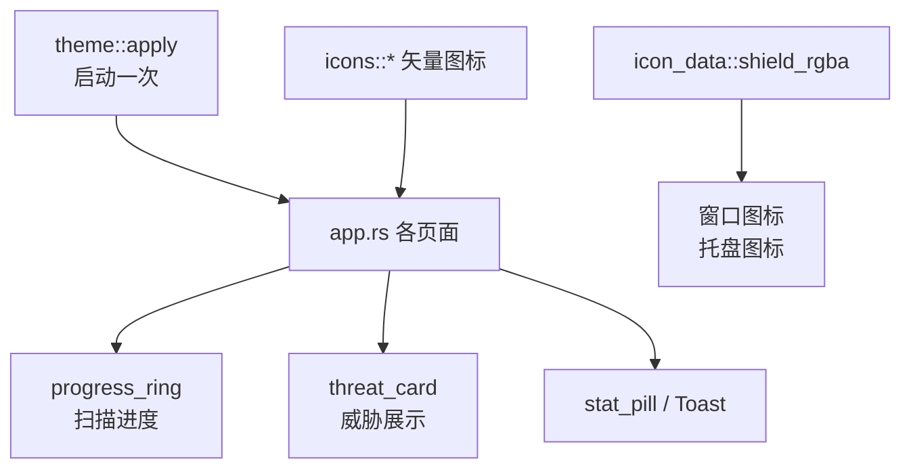

# UI 基础领域

**模块路径**：`src/theme.rs` + `src/widgets.rs` + `src/icons.rs` + `src/icon_data.rs`
**生成日期**：2026-08-09

---

## 概述

UI 基础模块是 CLV3000 的"门面工程"——它包含深色主题（`theme.rs`）、可复用 UI 原语（`widgets.rs`）、手绘矢量图标（`icons.rs`）和程序图标（`icon_data.rs`）。这四个文件不参与任何业务逻辑，但它们决定了这个杀毒工具"看起来专不专业"：统一的深色配色、圆角卡片、圆点科技感底纹、手绘的盾牌/闪电图标——一套完整的小型设计系统。

它存在的意义有两层。第一层是**一致性**：所有页面共享同一套 `colors` 调色板和 `card_frame`/`progress_ring` 等原语，任何页面都长得一样、交互一致。第二层是**零外部资产依赖**：图标不依赖任何图标字体或 emoji 渲染（`icons.rs:1-2` 明说），程序图标没有 `.ico` 美术资源就用像素光栅化生成（`icon_data.rs:1-3`）——对"绿色分发、体积敏感"的工具来说，少一个依赖文件就是少一份打包麻烦。

---

## 核心功能点

1. **深色主题与全局样式**：`theme::apply()` 设置 `Visuals::dark()` 的整套覆盖：文本色、面板/窗口填充、控件交互色（hover/active 用品牌蓝）、窗口与菜单圆角、spacing 间距（`src/theme.rs:32-55`）。`colors` 子模块集中定义全部配色常量（`src/theme.rs:5-29`）。

2. **圆点网格背景**：`paint_dotted_background()` 在中央面板画一层极淡的圆点底纹，营造"科技感"（`src/theme.rs:58-76`），从 `rect.left/top` 的 floor 对齐保证滚动/移动时不闪烁。

3. **圆环进度指示器**：`progress_ring()` 是扫描页的核心视觉：`percent: Option<f32>` 为 `Some` 画确定弧、为 `None` 画跟随时间旋转的不定长弧（表示"总量未知，进行中"），圆心画主标题+副标题（`src/widgets.rs:8-69`）。

4. **统计胶囊 / 威胁卡片 / Toast**：`stat_pill()` 渲染"128 / 342 进程"这类数值胶囊；`threat_card()` 是红色警示卡片（病毒名 + 高危徽标 + 中段截断路径 + 忽略/隔离按钮），返回 `ThreatAction` 枚举让调用方处理；`Toast` 右下角浮层 2.6 秒过期（`src/widgets.rs:92-236`）。

5. **手绘矢量图标**：`icons.rs` 用 `Painter` 基础图元按归一化坐标画盾牌/盾牌勾/警告三角/闪电/数据库/汉堡/最小化/关闭，保证任意机器渲染一致（`src/icons.rs:24-158`）。

6. **程序图标光栅化**：`icon_data::shield_rgba(size, fg, bg)` 把盾牌轮廓逐像素做点在多边形内判断（ray-casting 算法，`point_in_polygon`），生成 RGBA8 位图，用作窗口图标（64×64）和托盘图标（32×32）（`src/icon_data.rs:16-47`）。

---

## 关键组件

| 组件/类型 | 文件路径 | 核心职责 |
|---------|---------|---------|
| `theme::colors` 调色板 | `src/theme.rs:5` | 全部配色常量集中定义 |
| `theme::apply()` | `src/theme.rs:32` | 一次性全局视觉样式设置 |
| `progress_ring()` | `src/widgets.rs:8` | 确定/不确定两种模式的进度圆环 |
| `threat_card()` + `ThreatAction` | `src/widgets.rs:106-179` | 威胁展示卡片与动作回传 |
| `Toast` + `show_toasts()` | `src/widgets.rs:194-236` | 右下角通知浮层 |
| `icons::*` 图标函数族 | `src/icons.rs:24-158` | 8 个手绘矢量图标 |
| `shield_rgba()` | `src/icon_data.rs:16` | 程序/托盘图标 RGBA 生成 |

这套组件的分工是一层套一层的：`theme` 定"底色"，`widgets` 提供"零件"（圆环、卡片、Toast），`icons` 提供"贴纸"（各种图标），`icon_data` 负责"门面招牌"（程序图标）。业务代码只用 `widgets` 暴露的少数几个函数，很少直接碰 `theme` 细节。

---

## 内部数据流

**关键步骤说明**：
1. `App::new` 里 `theme::apply` 一次性设置全局样式（`src/app.rs:251`）。
2. 各页面函数直接消费 `colors` 常量 + 复用组件函数，无状态传递。
3. `shield_rgba` 在 `main.rs`（窗口图标，`src/main.rs:31-38`）与 `tray.rs`（托盘图标，`src/tray.rs:51-52`）各调用一次生成位图。

---

## 关键接口与扩展点

UI 基础模块的扩展点藏在几个返回"语义值"的函数里：`progress_ring` 的 `percent: Option<f32>` 参数让调用方决定画确定还是不确定的进度；`threat_card` 返回 `ThreatAction` 枚举（`src/widgets.rs:106-110`），把"用户点了忽略还是隔离"的决策权留给 `app.rs`——组件不碰业务逻辑，这是它们能被任意页面复用的前提。

`theme::apply` 是全局的一次性设置，任何想改整体观感的地方（换主题色、改圆角、调间距）都从 `src/theme.rs:32-55` 入手。新增一种 UI 原语只需在 `widgets.rs` 写一个新函数并在 `app.rs` 里调用即可。

---

## 与其他模块的交互

| 交互模块 | 方向 | 接口/协议 | 说明 |
|---------|------|---------|------|
| `app.rs` | 被依赖 | `progress_ring`/`threat_card`/`Toast`/`action_button`/`stat_pill` | 页面渲染主力 |
| `main.rs` | 被依赖 | `theme::apply`、`shield_rgba` | 启动装配 |
| `tray.rs` | 被依赖 | `shield_rgba` | 托盘图标 |
| `icons.rs` | 依赖 | 被 `app.rs`/`widgets.rs` 复用 | 矢量图标绘制 |

---

## 跨模块协作场景

> 本模块在核心业务流程中的角色（引用领域模块报告中的 business_flows）

**在"闪电扫描/全盘扫描"流程中**：`progress_ring`（`src/widgets.rs:8`）渲染扫描进度——闪电扫描传入确定的百分比（因为有总数）、全盘扫描传入 `None` 显示旋转弧（`src/app.rs:113-171` 的状态机驱动）；`threat_card`（`src/widgets.rs:106-179`）把每个检出的威胁渲染成红色警示卡片，忽略/隔离按钮通过 `ThreatAction` 回传给 `app.rs`（`src/app.rs:779-803`）。

**在"托盘交互"流程中**：`shield_rgba`（`src/icon_data.rs:16`）生成托盘图标位图，让托盘里显示同一个盾牌形象（`src/tray.rs:51-52`）；主窗口图标（`src/main.rs:31-38`）也来自同一份盾牌轮廓——保证"界面图标、窗口图标、托盘图标长得一样"。

**在"病毒库更新"流程中**：`Toast` 浮层（`src/widgets.rs:194-236`）展示"更新完成/失败"结果（`src/app.rs:334-339`），让后台任务的结果以不打断操作的方式告知用户。

---

## 性能考量

- **图标零运行时开销**：矢量图标是 `Painter` 指令（线段/多边形），每帧重绘成本极低；`shield_rgba` 是启动期一次性生成（64×64=4096 像素），不占运行时间。
- **圆点背景用 floor 对齐**：起始坐标按 SPACING 取 floor，窗口 resize 时点阵不闪跳（`src/theme.rs:64-65`）。
- **不确定进度弧用 UI 时间驱动**：`ui.input(|i| i.time)` 让弧线匀速旋转，视觉流畅且无额外线程。

---

## 实现亮点

- **`point_in_polygon` 手写 ray-casting**：`icon_data.rs:31-47` 是一个标准的点在多边形内判断（交点计数法），不到 20 行替代了引入图像库，且能直接复用 `icons::shield` 的同一组顶点坐标，保证窗口图标和界面图标"长得一样"。
- **`ThreatAction` 枚举回传**：`threat_card` 不直接调配置，而是返回"用户点了什么"，把决策权留给 `app.rs`——组件与业务解耦（`src/widgets.rs:106-110`）。
- **`truncate_middle` 三段式截断**：路径太长时保留头尾（3:2 比例）中间省略号，让用户既能看文件位置又能看文件名（`src/widgets.rs:181-191`）。
- **归一化坐标 + `map()`**：所有图标函数都按 `rect` 归一化作画（`src/icons.rs:8-13`），图标可任意缩放而无需重新设计。
