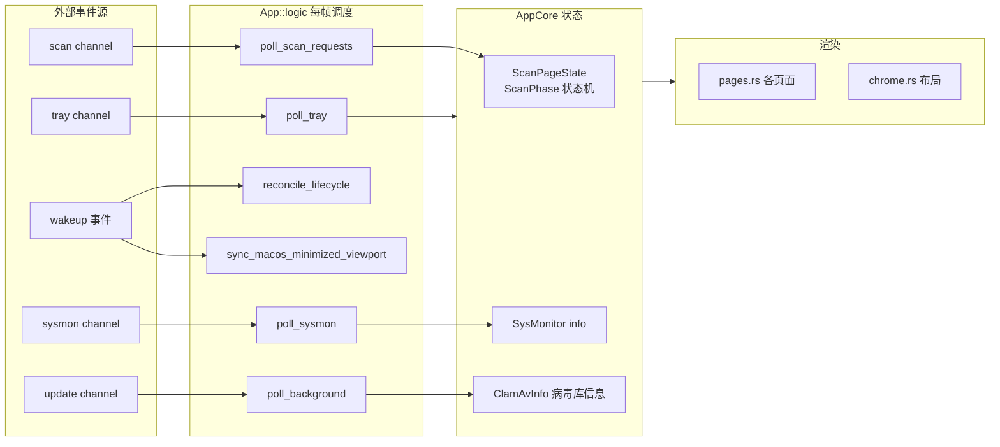

# 深度探索：app 编排域

app 编排域是整个 CLV3000 的"大脑皮层"——它不直接做扫描、不直接碰文件，但所有业务流程的**状态机迁移**、**页面路由**和**事件分发**都由它驱动。你可以把它想象成体检仪的中控台：体检仪器（扫描引擎域）在后台工作，但"现在处于哪个检查项目、进度多少、出了什么报告、下一步做什么"这些判断，都集中在中控台。这个域也是代码量最集中的地方，`src/app/` 目录下 9 个源文件承载了 UI 状态的全部逻辑。

## 这个模块在做什么

模块的职责可以拆成四件事：**（1）持有并维护应用状态**——`App` 结构体持有一切 UI 状态，`AppCore` 持有与具体页面解耦的业务状态（扫描状态机、隔离信息、病毒库信息、系统资源、配置）；**（2）页面路由**——`Page` 枚举定义主界面有哪些页面（`Dashboard`/`Scan`/`Settings`/`Virus`），`chrome.rs` 负责左侧导航栏的渲染与切换；**（3）生命周期事件分发**——`App::logic` 每帧轮询托盘事件、扫描请求、生命周期动作、系统资源，把外部事件映射成状态迁移；**（4）平台唤回协调**——窗口从托盘/后台唤回、macOS 窗口状态同步、激活退避重试。

## 模块组成与组件职责

| 组件 | 源文件 | 职责 |
|------|--------|------|
| `App` 主结构 | `src/app/mod.rs` | 顶层 UI 状态：当前 `Page`、`AppWindowState`、托盘、生命周期状态、`AppCore`、共享字体 |
| `AppCore` | `src/app/core.rs` | 业务状态机：扫描页状态、隔离信息、病毒库信息、系统资源、配置、分片状态 |
| `Page` 枚举 | `src/app/mod.rs` | 页面路由定义：Dashboard / Scan / Settings / Virus |
| `AppState` / `ScanPageState` | `src/app/core.rs` | 主界面状态机；扫描页状态（`ScanPhase` 含 Idle/Enumerating/Scanning/Done） |
| `AppWindowState` | `src/app/core.rs` | 窗口生命周期状态（与 `lifecycle.rs` 的 `LifecycleFlow` 联动） |
| 导航栏与布局 | `src/app/chrome.rs` | 自绘标题栏（非 Windows）、左侧导航、底部资源条、Toast |
| Dashboard 页 | `src/app/pages.rs` | 扫描按钮区（全盘/闪电/定向）+ 大号进度环（`DIAMETER 180.0`）+ 呼吸光晕 |
| 扫描结果页 | `src/app/pages.rs` | 威胁卡片列表、处置按钮、上次扫描概览 |
| 设置页 | `src/app/settings.rs` | 隔离区管理、忽略清单、配置选项卡（`CONTENT_INSET 24.0`、`CARD_WIDTH 560.0`） |
| 病毒库页 | `src/app/pages.rs` | 引擎/病毒库版本展示 + 手动更新入口 |
| 通用工具 | `src/app/util.rs` | `truncate` 文本截断、`format_duration` 时长格式化 |

`App` 与 `AppCore` 的分工是本域最核心的设计：`App` 负责"这帧该渲染哪个页面"，`AppCore` 负责"业务上现在处于什么状态"。这个分离让页面切换（纯 UI 关注点）与扫描进度（业务关注点）互不干扰——例如从扫描页切到设置页再切回来，扫描线程照常推进，`ScanPageState` 完好无损。

## 内部数据流

app 编排域内部与外部（工作线程、托盘、生命周期域）的数据流如下。注意所有"进"的状态都走同一扇门：`App::update` 每帧调用 `logic()`，`logic()` 内部 `try_recv` 排空各 channel，再驱动状态迁移与重绘。

## 关键组件拆解

**`App::logic`（`src/app/mod.rs`）**是每帧的调度中枢，按固定顺序执行：`poll_tray()`（托盘事件）→ `poll_scan_requests()`（IPC 转发请求）→ `reconcile_lifecycle()`（生命周期状态同步）→ macOS 的 `sync_macos_minimized_viewport()` → `activate_countdown`/`bring_to_front`（平台唤回退避重试）→ `poll_background()`（更新线程结果）→ `poll_sysmon()`（资源条数据）→ 扫描进行时 `macos_reopen::ScanActivity::begin`。这个顺序不是随意的：先处理外部事件再同步窗口状态，保证"用户点了托盘"总在"窗口显示"之前被消费。

**`ScanPageState` 与 `ScanPhase`（`src/app/core.rs`）**是扫描流程的状态机核心。`ScanPhase` 四态：`Idle`（未扫描）、`Enumerating{done,total,files_found}`（枚举阶段，无分母）、`Scanning{total,scanned,current_path}`（扫描阶段，有分母）、`Done{scanned,elapsed,cancelled}`（完成/取消）。进度环的"旋转 or 百分比"两种模式就由是否拿到 `total` 决定；`started_at`、`content_height` 等字段支撑结果页的动画与滚动定位。

**`App::drop`（`src/app/mod.rs`）**做资源回收：调用 `wakeup::unregister_ctx` 注销唤醒回调。这是关键细节——主窗口关闭时若忘了注销，wakeup 转发线程持有的 `egui::Context` 悬空，下一帧 `request_repaint` 就是悬垂调用。

**`AppCore::start_scan`（`src/app/core.rs`）**是扫描入口的公共服务：接收 `ScanKind`（Quick/Full/Single），创建扫描线程、channel、`CancelFlag`，把 `rx` 存入 `ScanPageState`，并驱动页面路由到扫描页。它同时负责 `refresh_db_version`（后台探测引擎与病毒库版本）与 `start_update`（`catch_unwind` 包裹 `run_freshclam` 防 panic 带崩 UI）。

## 依赖关系与边界

本域依赖：`scan` 引擎域（发起扫描、消费事件）、`scan/cache.rs`（缓存失效）、`quarantine` 隔离域（处置动作）、`config`（读取上次扫描配置）、`lifecycle`（窗口状态）、`tray`（托盘交互）、`sysmon`（资源数据）、`macos_reopen`（唤回）、`freshclam`（病毒库更新）、UI 基建域（theme/widgets/icons）。它**不**依赖任何 UI 基建的对外接口以外的抽象，是全项目依赖最集中的汇合点——这也是为什么它被定位为"编排"而非"实现"。

相关的关联文档：`2.架构.md`（线程模型与生命周期状态机）、`3.工作流.md`（六条流程均经由本域编排）、`4.Deep-Exploration/scan.md`（扫描线程与事件定义）。
