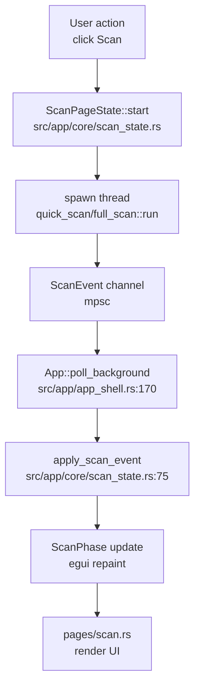

# App Domain

**Module path:** `src/app/`  
**Generated:** 2026-08-25

---

## What This Module Does

The `app` module is CLV3000's control room — the bridge between what the user sees and what the scan engine does behind the scenes. When you click "Quick Scan," browse settings, or respond to a tray notification, this module decides which page to show, when to spawn background scan threads, how to render progress rings and threat lists, and when to hide the window back to the tray.

Without this module, CLV3000 would be a headless scanner with no way to act on results or manage quarantined files.

---

## Core Features

1. **Page routing** — The `Page` enum (`Dashboard`, `QuickScan`, `FullScan`, `VirusDb`, `Settings`) drives sidebar navigation. `AppCore.page` holds the current page, updated via `App::navigate()` (`src/app/mod.rs:15-21`, `src/app/app_shell.rs:120-122`).

2. **Scan state machines** — `ScanPageState` tracks per-scan-type progress through `ScanPhase` (Idle → Enumerating → Scanning → Done). Background `ScanEvent`s are applied via the pure function `apply_scan_event()` (`src/app/core/scan_state.rs:11-30`, `75-148`).

3. **Lifecycle reconciliation** — `lifecycle_view.rs` synchronizes window visibility, size, and about-overlay state with `RunMode` (ShowWindow / TrayOnly / Quit). When the user closes the window, it minimizes to tray rather than exiting (`src/app/lifecycle_view.rs`).

4. **Background event polling** — Each frame, `App::poll_background()` drains the scan event channel and converts engine messages into UI state updates and toast notifications (`src/app/app_shell.rs:170-175`).

5. **Resource management** — Textures and the system monitor are loaded when the window becomes visible and released when hidden to tray, conserving memory on long-running tray-only instances (`src/app/app_shell.rs:124-168`).

---

## Key Components

These components form the application's presentation and orchestration layer:

| Component | File Path | Core Responsibility |
|-----------|-----------|---------------------|
| `App` | `src/app/app_shell.rs:17` | Top-level `eframe::App`; owns tray, sysmon, lifecycle, textures |
| `AppCore` | `src/app/core/mod.rs` | Central state: current page, scan controllers, config reference |
| `ScanPageState` | `src/app/core/scan_state.rs:32` | Per-scan-type state machine with cancel flag and event receiver |
| `apply_scan_event` | `src/app/core/scan_state.rs:75` | Pure function mapping `ScanEvent` → `ScanPhase` updates |
| `Page` | `src/app/mod.rs:15` | Navigation enum for sidebar routing |
| Scan page UI | `src/app/pages/scan.rs` | Renders progress rings, threat list, quarantine/ignore buttons |
| Dashboard | `src/app/pages/dashboard.rs` | Home page with scan shortcuts and last-scan summary |
| Settings | `src/app/settings.rs` | Autostart, context menu, quarantine/ignore list management |
| `chrome.rs` | `src/app/chrome.rs` | Custom title bar rendering for borderless window |

---

## Internal Data Flow

```mermaid
flowchart TD
    A["User action<br/>click Scan"] --> B["ScanPageState::start<br/>src/app/core/scan_state.rs"]
    B --> C["spawn thread<br/>quick_scan/full_scan::run"]
    C --> D["ScanEvent channel<br/>mpsc"]
    D --> E["App::poll_background<br/>src/app/app_shell.rs:170"]
    E --> F["apply_scan_event<br/>src/app/core/scan_state.rs:75"]
    F --> G["ScanPhase update<br/>egui repaint"]
    G --> H["pages/scan.rs<br/>render UI"]
```

**Key steps:**
1. User triggers scan → `ScanPageState::start()` spawns a background thread (`src/app/core/scan_state.rs`)
2. Background thread calls `quick_scan::run` or `full_scan::run`, sending `ScanEvent`s via channel
3. UI thread polls channel each frame, applies events through `apply_scan_event()`
4. Scan page reads `ScanPhase` to render progress ring, current file path, and threat list

---

## Key Interfaces and Extension Points

- **`eframe::App` trait** — `App` implements `logic()` and `ui()` for frame-by-frame update/render (`src/app/app_shell.rs:184+`)
- **`InitialMode` integration** — `App::new()` accepts startup mode to begin in QuickScan, ScanPath, About, or hidden tray (`src/app/app_shell.rs:64-80`)
- **Toast system** — `App::toast()` pushes messages consumed by `widgets::Toast` rendering

---

## Interactions with Other Modules

| Module | Direction | Interface | Description |
|--------|-----------|-----------|-------------|
| scan | depends | `quick_scan::run`, `full_scan::run`, `ScanEvent` | Spawns scan threads, consumes events |
| config | depends | `AppConfig` | Loads/saves ignore list, quarantine records, settings |
| quarantine | depends | `quarantine_file`, `restore_file` | Triggered from scan results page |
| lifecycle | depends | `Lifecycle`, `RunMode` | Window visibility management |
| tray | depends | `Tray`, menu IDs | Polls tray events each frame |
| wakeup | depends | `scan_requests()`, `show_requests()` | IPC scan/show request handling |
| theme | depends | `theme::apply`, `colors` | Visual styling |
| sysmon | depends | `sysmon::spawn` | CPU/memory status bar |

---

## Role in Core Business Flows

**In Quick Scan flow:** `App` navigates to `Page::QuickScan`, calls `ScanPageState::start()`, and renders real-time progress as `ScanEvent::Enumerating` and `FileScanned` events arrive. On completion, threat actions invoke `quarantine` or `config.add_ignored`.

**In Context Menu Scan flow:** `App::poll_scan_requests()` receives forwarded paths from `wakeup::scan_requests()`, sets `Page::FullScan`, and calls `ScanPageState::start_path()` (`src/app/app_shell.rs:197` area).

**In Tray-Only flow:** `reconcile_lifecycle()` hides the window and releases UI resources when `RunMode::TrayOnly` is active, keeping only the tray icon and background listeners alive.

---

## Performance Considerations

- UI resources (textures, sysmon) are lazily loaded on first visible frame and released when hidden — important for Windows `--tray-only` long-running instances
- Scan events are processed via `try_recv` (non-blocking) each frame, avoiding UI stalls
- `apply_scan_event` is a pure function enabling unit testing without constructing full `App`

---

## Implementation Highlights

- **Borderless window with custom chrome** — All platforms use egui-drawn title bars (`src/app/chrome.rs`) with platform-specific resize behavior (fixed on Windows, resizable on macOS)
- **About standalone mode** — Tray "About" opens a dedicated window size without showing the main dashboard (`InitialMode::About` at `src/lifecycle.rs:23-24`)
- **Force quarantine UI** — Windows-only pending state tracks UAC elevation flow for locked files (`PendingForceQuarantine` at `src/app/core/scan_state.rs:54-57`)
