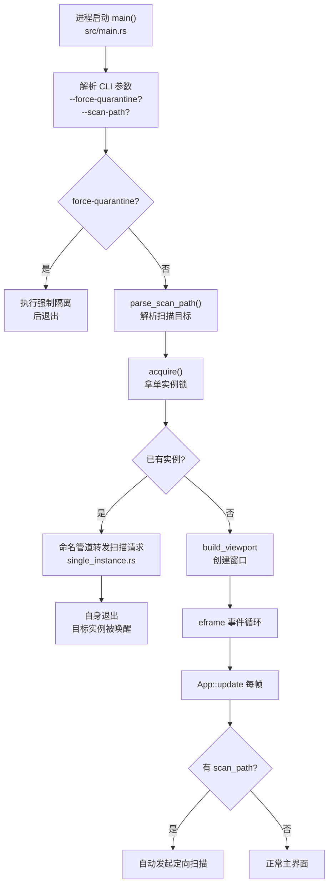
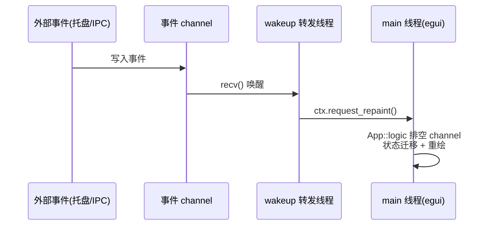

# 深度探索：生命周期与事件域

生命周期与事件域是 CLV3000 的"神经系统"——它负责程序从哪里开始、如何保证只有一个实例、如何被外部事件唤醒、以及窗口生命周期如何迁移。你可以把它想成酒店的接待台：客人（用户或系统）从哪个门进来、进来后该领到哪把钥匙、有急事时怎么喊到负责人，都由接待台统一处理。这个域横跨 4 个源文件（`src/main.rs`、`src/lifecycle.rs`、`src/wakeup.rs`、`src/single_instance.rs`），但它们合在一起解决同一个问题：**进程级的进入、唤醒与退出**。

## 这个模块在做什么

四条职责，覆盖进程从生到死的全程：**（1）启动编排**——`src/main.rs` 处理命令行参数（`--scan-path`、`--force-quarantine`、`--tray-only`），在开窗口之前完成单实例锁获取与扫描参数解析；**（2）单实例锁与请求转发**——`single_instance.rs` 保证同时只有一个实例，并让新进程把扫描目标转发给已在运行的实例；**（3）事件唤醒**——`wakeup.rs` 让外部事件（托盘点击、IPC 请求）能唤醒沉睡的事件循环；**（4）窗口生命周期**——`lifecycle.rs` 定义窗口可见性的迁移规则（`LifecycleFlow`/`LifecycleAction`）。

## 模块组成与组件职责

| 组件 | 源文件 | 职责 |
|------|--------|------|
| 程序入口 `main()` | `src/main.rs` | 参数解析、单实例、创建 viewport、运行 eframe 事件循环 |
| `LifecycleFlow` / `LifecycleAction` | `src/lifecycle.rs` | 窗口生命周期状态机与迁移动作定义 |
| `Waker` / 转发线程 | `src/wakeup.rs` | 把 channel 事件转发为 `ctx.request_repaint()` 唤醒 |
| `SingleInstance` | `src/single_instance.rs` | 命名互斥/命名管道：单实例锁 + 扫描请求转发 |
| Windows 托盘消息循环 | `src/main.rs` | `--tray-only` 时的 `PeekMessageW` 消息泵 |
| `build_viewport` | `src/main.rs` | 窗口构建：平台化标题栏/尺寸/最小尺寸 |

## 内部数据流

进程从"双击 exe"到"进入主界面"的路径如下。注意 `--scan-path` 的解析发生在 `acquire()`（拿单实例锁）**之前**——这是为了让"冷启动扫描"与"热转发扫描"走完全一致的代码路径。

唤醒路径是另一条关键数据流：外部事件（托盘点击、菜单、IPC 请求）进入各自的 channel，`wakeup.rs` 的转发线程阻塞在 `recv()` 上，收到事件后调用 `ctx.request_repaint()`。这个调用让 eframe 立刻重绘一帧，而那一帧里 `App::logic` 会去 `try_recv` 排空这些 channel——于是"外部事件"被翻译成"UI 状态变化"。

## 关键组件拆解

**`main()` 的启动顺序（`src/main.rs`）**是精心设计的：先处理 `--force-quarantine <original> <dest>`（这是一个"执行完即退"的子命令，用于强制隔离的 UAC 提权阶段），再 `parse_scan_path()` 解析 `--scan-path`，最后才 `acquire()`。这个顺序保证了：冷启动扫描（无实例）时新实例拿到锁后能带参数启动；热转发（有实例）时旧实例收到的是**已解析好的目标路径**。`--tray-only` 则绕过窗口直接进入托盘模式。

**Windows 托盘消息循环（`src/main.rs`）**是 `--tray-only` 模式的核心：不用 eframe 的窗口循环，而用 `PeekMessageW` 非阻塞排空消息队列 → `DispatchMessageW` → `MsgWaitForMultipleObjectsEx`（30ms 超时）等待新消息。这套循环保证：无窗口也能保持托盘事件响应、进程唤醒无延迟（`wakeup.rs` 的 `request_repaint` 就是跨线程唤醒的通道），同时 CPU 占用接近零。

**`build_viewport` 的窗口参数（`src/main.rs`）**按平台分化：Windows 用系统标题栏（`decorations: true`）、macOS 用自绘标题栏；最小尺寸 `MIN_INNER_SIZE` 在非 Windows 为 `[440,472]`、Windows 为 `[440,428]`——这个差异是为了与 `ABOUT_WINDOW_SIZE` 一致（`src/app/mod.rs` 中声明的 `[480,472]` 非 Windows / `[480,428]` Windows），保证 About 弹窗在不同平台都能完整容纳。

**`SingleInstance`（`src/single_instance.rs`）**在 Windows 上使用命名互斥对象 + 命名管道：`acquire()` 尝试创建互斥，失败则说明已有实例，打开命名管道把扫描目标序列化发给对方，然后退出。管道服务端在已有实例里通过 `wakeup.rs` 的 `poll_scan_requests` 机制被消费——这就是"单实例 + 扫描请求转发"的完整链路。

**`LifecycleFlow` / `LifecycleAction`（`src/lifecycle.rs`）**定义窗口可见性状态机：`Running` / `Minimized`（关闭按钮/最小化）/ `TrayOnly`（`--tray-only`）/ `Exiting`。动作 `LifecycleAction` 由 app 编排域的 `reconcile_lifecycle()` 消费，驱动托盘/窗口的显示隐藏。macOS 上还需 `sync_macos_minimized_viewport` 把系统的最小化事件与自身状态对齐（详见 `2.架构.md` 生命周期状态机一节）。

## 依赖关系与边界

本域依赖：`windows` crate（`PeekMessageW`、命名互斥/管道，仅 Windows cfg）、`tray-icon`/`muda`（托盘事件源，`src/tray.rs`）、`egui::Context`（`request_repaint`）、`app` 编排域（`App::logic` 消费事件）。它对外提供的是"进程入口 + 唤醒通道 + 生命周期规则"，是唯一直接与 OS 消息泵交互的域。

关联文档：`2.架构.md`（生命周期状态机、线程模型）、`3.工作流.md`（工作流六：托盘唤回与请求转发）、`4.Deep-Exploration/system-integration.md`（托盘事件如何进入本域的 channel）。
