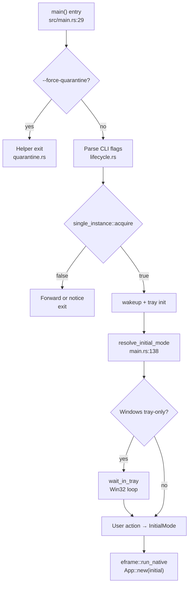

# Lifecycle Domain

**Module path:** `src/lifecycle.rs`, `src/main.rs`  
**Generated:** 2026-08-25

---

## What This Module Does

CLV3000 can start in many different ways — a normal window, silently in the system tray, directly into a scan from Explorer's right-click menu, or as a hidden UAC helper process for force quarantine. The lifecycle domain defines these modes, parses the command-line flags that select them, and coordinates the bootstrap sequence that decides whether eframe even gets created.

On Windows, the most intricate path is `--tray-only` startup: the app runs a Win32 message loop *before* eframe starts, avoiding the flash-window problem that occurs when eframe forces first-frame visibility.

---

## Core Features

1. **CLI argument parsing** — Recognizes `--tray-only`, `--show`, `--scan-path`, and `--force-quarantine` with both `=` and space-separated syntax (`src/lifecycle.rs:68-111`).

2. **Initial mode selection** — `InitialMode` enum (ShowWindow, TrayOnly, QuickScan, About, ScanPath) drives first-run behavior in `App::new()` (`src/lifecycle.rs:12-29`, `src/app/app_shell.rs:64-80`).

3. **Runtime mode management** — `RunMode` (ShowWindow, TrayOnly, Quit) controls window visibility during the session, managed by `Lifecycle` struct (`src/lifecycle.rs:32-65`).

4. **Windows pre-eframe tray loop** — `wait_in_tray()` in `main.rs` runs a Win32 message pump handling tray clicks, menu commands, and forwarded scan requests without creating any window (`src/main.rs:173-251`).

5. **Force quarantine interception** — `--force-quarantine` is handled before single-instance check in `main.rs`, spawning a minimal child process that kills blocking processes and moves files (`src/main.rs:34-43`).

---

## Key Components

| Component | File Path | Core Responsibility |
|-----------|-----------|---------------------|
| `InitialMode` | `src/lifecycle.rs:12` | Startup behavior enum with optional ScanPath data |
| `RunMode` | `src/lifecycle.rs:32` | Runtime visibility mode during session |
| `Lifecycle` | `src/lifecycle.rs:41` | About overlay state + current RunMode |
| `parse_start_tray_only` | `src/lifecycle.rs:68` | Detect `--tray-only` / `--tray` flags |
| `parse_scan_path` | `src/lifecycle.rs:83` | Extract scan target from CLI |
| `parse_show` | `src/lifecycle.rs:75` | Detect `--show` flag |
| `resolve_initial_mode` | `src/main.rs:138` | Combine flags + tray state → InitialMode |
| `wait_in_tray` | `src/main.rs:173` | Windows pre-eframe message loop |
| `build_viewport` | `src/main.rs:256` | Platform-specific window configuration |

---

## Internal Data Flow

```mermaid
flowchart TD
    A["main() entry<br/>src/main.rs:29"] --> B{"--force-quarantine?"}
    B -->|yes| C["Helper exit<br/>quarantine.rs"]
    B -->|no| D["Parse CLI flags<br/>lifecycle.rs"]
    D --> E{"single_instance::acquire"}
    E -->|false| F["Forward or notice<br/>exit"]
    E -->|true| G["wakeup + tray init"]
    G --> H["resolve_initial_mode<br/>main.rs:138"]
    H --> I{"Windows tray-only?"}
    I -->|yes| J["wait_in_tray<br/>Win32 loop"]
    J --> K["User action → InitialMode"]
    I -->|no| K
    K --> L["eframe::run_native<br/>App::new(initial)"]
```

**Priority rules in `resolve_initial_mode`:**
1. `--scan-path` always wins → `InitialMode::ScanPath` (even over `--tray-only`)
2. `--show` or no `--tray-only` → `InitialMode::ShowWindow`
3. `--tray-only` on Windows → `wait_in_tray()` loop
4. `--tray-only` on macOS → `InitialMode::TrayOnly` (eframe hidden, needs NSApplication loop)

---

## Key Interfaces and Extension Points

- **`InitialMode`** — Passed to `App::new()` to configure startup page and visibility
- **`Lifecycle::new(start_tray_only)`** — Creates runtime lifecycle state
- **`parse_*` functions** — Pure CLI parsers, testable independently

---

## Interactions with Other Modules

| Module | Direction | Interface | Description |
|--------|-----------|-----------|-------------|
| single_instance | coordinated | `acquire`, forwarding | Second instance handling before lifecycle proceeds |
| tray | depends | `Tray`, menu IDs | Tray-only loop consumes tray events |
| wakeup | depends | `scan_requests`, `show_requests` | IPC during tray-only wait |
| app | provides to | `InitialMode` → `App::new` | Startup configuration |
| quarantine | intercepts | `--force-quarantine` | UAC helper before normal bootstrap |

---

## Role in Core Business Flows

**Normal launch:** `main()` → acquire lock → build tray → `InitialMode::ShowWindow` → eframe starts with visible window.

**Autostart (tray-only):** Registry/LaunchAgent launches with `--tray-only` → Windows enters `wait_in_tray()` with zero windows until user interacts with tray.

**Explorer scan (cold start):** `--scan-path` → `InitialMode::ScanPath(path)` → eframe starts directly on Full Scan page with path scan running.

**Explorer scan (warm):** Second instance fails acquire → forwards path → primary instance's listener pushes to wakeup channel → existing App starts path scan.

---

## Performance Considerations

- Windows `wait_in_tray` uses 100ms `MsgWaitForMultipleObjectsEx` timeout instead of 30ms — reducing idle wake-ups from ~33Hz to ~10Hz while maintaining responsive tray clicks (`src/main.rs:234-238`)
- Pre-eframe tray loop avoids creating OpenGL context until actually needed — saving memory during long tray-only sessions

---

## Implementation Highlights

- **Scan-path overrides tray-only** — Explicit user scan intent takes priority over silent startup (`src/main.rs:129-131`)
- **Platform divergence for tray-only** — Windows pre-eframe loop vs macOS hidden eframe reflects different event delivery requirements (`src/main.rs:100-101`, `158-162`)
- **About standalone mode** — Tray "About" opens dedicated window size without showing main dashboard (`InitialMode::About`)
