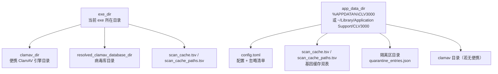

# 深度探索：持久化域

持久化域是 CLV3000 的"档案室"——它回答"程序该在哪里找文件、配置文件长什么样"这两个问题。这个域只有两个源文件（`src/config.rs` 与 `src/paths.rs`），却是全项目被依赖最多的基础域之一：几乎所有域都要问它"配置在哪""ClamAV 在哪""缓存在哪"。它的设计原则是"**一切路径可推导、一切配置人类可读**"——不依赖注册表存业务数据（注册表只用于自启与右键菜单），配置与缓存都是明文文件，紧急时可以用记事本手工救援。

## 这个模块在做什么

三个职责：**（1）路径解析**——`paths.rs` 计算 exe 目录、应用数据目录、ClamAV 便携目录、数据库目录、缓存文件、隔离区目录等所有关键路径，并处理"便携分发"这一特殊需求（ClamAV 引擎随 exe 同目录携带）；**（2）配置读写**——`config.rs` 定义并读写 `config.toml`（扫描设置、忽略清单、上次扫描信息）；**（3）ClamAV 目录探测**——在便携目录与 macOS bundle 资源目录之间做出正确选择。

## 模块组成与组件职责

| 组件 | 源文件 | 职责 |
|------|--------|------|
| `Config` / `ScanSettings` | `src/config.rs` | 配置结构：扫描项、忽略清单、上次扫描信息 |
| `ConfigError` | `src/config.rs` | 配置解析错误分类 |
| `config::load` / `save` | `src/config.rs` | TOML 读写与默认值填充 |
| `paths::exe_dir` | `src/paths.rs` | 当前 exe 所在目录（便携分发基准） |
| `paths::app_data_dir` | `src/paths.rs` | 应用数据目录（`%APPDATA%\CLV3000` / `~/Library/Application Support/CLV3000`） |
| `paths::clamav_dir` | `src/paths.rs` | 便携 ClamAV 目录（macOS 有 bundle 资源目录回退） |
| `paths::bundle_resources_clamav_dir` | `src/paths.rs` | macOS `Contents/Resources/clamav` 路径反推 |
| `resolved_clamav_database_dir` | `src/paths.rs` | 多候选解析出的病毒库目录 |

## 路径拓扑与数据流

CLV3000 的路径以 `exe_dir` 为便携分发基准，以 `app_data_dir` 为应用私有数据基准，两条线各有用途，互不混淆：

关键点：缓存文件（TSV）与配置（TOML）都放在 `app_data_dir`，隔离区与记账也在 `app_data_dir`；`exe_dir` 只承载**可再分发的组件**（ClamAV 引擎）。macOS 上 `clamav_dir` 的解析顺序是：bundle 资源目录 `Contents/Resources/clamav` → exe 同目录，这是为了兼容"开发期 cargo run（exe 在 target/）与发布期 .app bundle（exe 在 Contents/MacOS/）"两种形态——前者的引擎无法放到 bundle 里，所以回退到 exe 同目录。

## 关键组件拆解

**`Config`（`src/config.rs`）**包含三组数据：扫描设置（`ScanSettings`：是否含系统文件、是否记录上次扫描等）、忽略清单（`ignored_threats`，威胁处置"忽略"动作的落点）、上次扫描信息（`last_scans`，Dashboard 页展示）。`load()` 读 TOML 并在缺省时用默认值填充（`Default` 实现），`save()` 写回——全项目没有"配置中心"，任何域拿到 `Config` 的引用即可用。

**`resolved_clamav_database_dir`（`src/paths.rs`）**是病毒库更新的关键依赖：它把"便携目录下的数据库目录""bundle 资源目录下的数据库目录"等候选按序探测，返回第一个存在的。`src/app/freshclam.rs` 的 `--datadir=` 与 `src/clamav_info.rs` 的版本探测都基于这个返回值——保证 UI 显示的病毒库版本与实际更新的数据库是**同一个目录**。

**`ConfigError`（`src/config.rs`）**区分"文件不存在（首次运行，用默认值）"与"文件存在但解析失败（应提示用户）"两类错误。这个区分很重要：首次运行不该报错，但配置损坏时必须明确告知，否则用户会莫名丢忽略清单。

## 依赖关系与边界

本域依赖：`std::env`、`dirs`/`windows` crate（应用数据目录解析）、`toml` + `serde`（配置序列化）。它不依赖任何业务域，是全项目依赖树的**叶节点**之一；几乎所有域（scan/app/quarantine/freshclam/clamav_info）都依赖它。对外抽象：`Config`、`ScanSettings`、`ConfigError`、`paths` 模块的路径函数。

关联文档：`6.数据库概览.md`（配置与 TSV 缓存的"准持久化"说明）、`4.Deep-Exploration/scan.md`（缓存文件落点）、`4.Deep-Exploration/system-integration.md`（引擎探测依赖 `resolved_clamav_database_dir`）。
