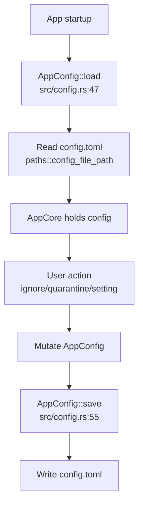

# Persistence Domain

**Module path:** `src/config.rs`, `src/paths.rs`  
**Generated:** 2026-08-25

---

## What This Module Does

CLV3000 needs to remember things between sessions — which threats you ignored, what's in quarantine, your last scan results, and where to find ClamAV on disk. The persistence layer handles all of this through simple, human-readable files rather than a database, keeping the application portable and lightweight enough for USB-stick deployment on older hardware.

---

## Core Features

1. **Configuration persistence** — `AppConfig` loads from and saves to TOML via serde. Missing or corrupt files gracefully default to empty config (`src/config.rs:47-61`).

2. **Portable path resolution** — All paths derive from `exe_dir()` (executable location) and platform-standard app data directories, never from installation registry keys (`src/paths.rs:7-12`).

3. **ClamAV discovery** — Resolves clamscan/freshclam locations with fallback chain: bundled directory → system install → PATH (`src/paths.rs:60-85`).

4. **Ignore list management** — `is_ignored`, `add_ignored`, `remove_ignored` maintain the set of suppressed threat alerts (`src/config.rs:63-83`).

5. **Quarantine record tracking** — `add_quarantined`, `remove_quarantined` persist isolation metadata alongside actual quarantined files (`src/config.rs:85-100`).

---

## Key Components

| Component | File Path | Core Responsibility |
|-----------|-----------|---------------------|
| `AppConfig` | `src/config.rs:33` | Root configuration struct with scan history and lists |
| `ScanRecord` | `src/config.rs:9` | Last scan timestamp, threat count, scanned count |
| `IgnoredEntry` | `src/config.rs:17` | Path + virus name pair for suppressed alerts |
| `QuarantineEntry` | `src/config.rs:25` | Quarantine metadata with stored filename |
| `exe_dir` | `src/paths.rs:7` | Executable directory for portable-relative paths |
| `app_data_dir` | `src/paths.rs` | Per-user persistent data location |
| `clamav_dir` | `src/paths.rs:19` | Bundled ClamAV directory (with macOS .app bundle support) |
| `config_file_path` | `src/paths.rs` | Full path to config.toml |
| `quarantine_dir` | `src/paths.rs` | App-private quarantine storage |
| `resolved_clamav_database_dir` | `src/paths.rs` | Active virus signature directory |

---

## Internal Data Flow

```mermaid
flowchart TD
    A["App startup"] --> B["AppConfig::load<br/>src/config.rs:47"]
    B --> C["Read config.toml<br/>paths::config_file_path"]
    C --> D["AppCore holds config"]
    D --> E["User action<br/>ignore/quarantine/setting"]
    E --> F["Mutate AppConfig"]
    F --> G["AppConfig::save<br/>src/config.rs:55"]
    G --> H["Write config.toml"]
```

**Path resolution flow:**
1. `exe_dir()` → base for bundled `clamav/` directory
2. `app_data_dir()` → base for config, cache, quarantine, IPC files
3. Platform-specific: macOS checks `Contents/Resources/clamav` in .app bundles first

---

## Key Interfaces and Extension Points

- **`AppConfig::load() -> Self`** — Load or default on missing/corrupt file
- **`AppConfig::save()`** — Atomic write of current state
- **`paths::ensure_dir(path)`** — Create directory if missing before writes
- **`paths::clamscan_available() -> bool`** — Pre-flight check before scan start

---

## Interactions with Other Modules

| Module | Direction | Interface | Description |
|--------|-----------|-----------|-------------|
| app | depended | `AppConfig` | UI reads/writes config for all settings |
| scan | depends | `app_data_dir`, clamav paths | Cache location, engine binary discovery |
| quarantine | depends | `quarantine_dir`, `QuarantineEntry` | Storage location and metadata |
| single_instance | depends | `app_data_dir` | IPC file and socket location |
| scan/cache | depends | `app_data_dir/scan_cache.tsv` | Content hash cache file |

---

## Role in Core Business Flows

**On startup:** `AppCore::new()` calls `AppConfig::load()` to restore ignore list, quarantine records, and settings.

**During scan:** `apply_scan_event` checks `config.is_ignored()` before adding threats to the UI list.

**After quarantine:** Scan page calls `config.add_quarantined(entry)` which persists immediately via `save()`.

---

## Data Locations by Platform

| Data | Windows | macOS |
|------|---------|-------|
| Config | `%APPDATA%\CLV3000\config.toml` | `~/Library/Application Support/CLV3000/config.toml` |
| Scan cache | Same dir / `scan_cache.tsv` | Same |
| Quarantine files | Same dir / `quarantine/` | Same |
| Bundled ClamAV | `<exe_dir>\clamav\` | `<exe_dir>/clamav/` or `.app/Contents/Resources/clamav/` |

---

## Implementation Highlights

- **Graceful degradation** — `toml::from_str().unwrap_or_default()` ensures corrupt config never crashes the app
- **Immediate persistence** — Every mutation (ignore, quarantine, setting change) calls `save()` synchronously — no deferred writes that could lose data on crash
- **Portable exe-relative paths** — `exe_dir()` enables USB-stick deployment where the install location changes every session
