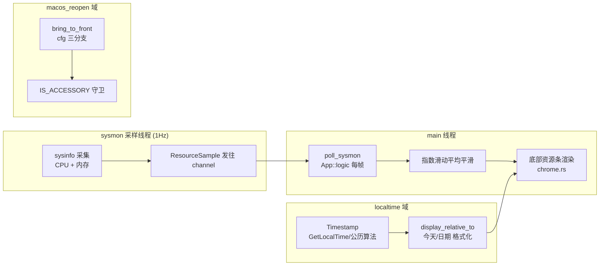

# 深度探索：平台适配域

平台适配域是 CLV3000 的"翻译官"——它负责把三个平台特有的能力（窗口置顶、本地时间、系统资源）翻译成统一接口，让上层业务代码只看到一种抽象。这个域只有 3 个源文件，但它揭示了一个贯穿全项目的思想：**平台差异不是 bug，是需求；正确做法不是回避，而是把它们关进 cfg 门内**。`src/macos_reopen.rs` 管"把窗口带回前台"，`src/localtime.rs` 管"人类可读的时间"，`src/sysmon.rs` 管"CPU/内存采样"——三者看似无关，实际共享同一条设计准则：Windows 走真实 Win32，macOS 走 AppKit，其它平台给一个安全的降级实现。

## 这个模块在做什么

三个职责：**（1）窗口激活/置顶**——`macos_reopen.rs` 处理"从托盘或后台把窗口带到前台"的平台差异：macOS 需要在 App Nap 政策（`NSApplicationActivationPolicy`）的 Accessory/Regular 之间切换并激活应用，Windows 用 `SetForegroundWindow`，其它平台 no-op；**（2）本地时间**——`localtime.rs` 生成 `Timestamp{year,month,day,hour,minute}`：Windows 用 `GetLocalTime`，非 Windows 用 `SystemTime` + 纯公历算法（注意：不解析时区，UTC）；**（3）资源采样**——`sysmon.rs` 用后台线程每 1 秒采样 CPU 与内存，经 channel 送 UI 渲染底部资源条。

## 模块组成与组件职责

| 组件 | 源文件 | 职责 |
|------|--------|------|
| `macos_reopen::bring_to_front` | `src/macos_reopen.rs` | 平台化窗口激活（macOS objc2 / Windows SetForegroundWindow / 其它 no-op） |
| `IS_ACCESSORY` 守卫 | `src/macos_reopen.rs` | `AtomicBool` 记录当前 App Nap 政策，避免重复切换 |
| `ScanActivity` | `src/macos_reopen.rs` | 扫描期间保持激活状态的辅助标记 |
| `Timestamp` / `local_now` | `src/localtime.rs` | 本地时间结构与获取（Windows `GetLocalTime` / 其它公历算法） |
| `Timestamp::display_relative_to` | `src/localtime.rs` | 渲染"今天 HH:MM" / "MM/DD HH:MM" |
| `ResourceSample` | `src/sysmon.rs` | `cpu_percent`、`mem_used_bytes`、`mem_total_bytes` + `mem_percent()` |
| `SysMon` / `spawn` | `src/sysmon.rs` | 常驻采样线程（1Hz、Condvar 睡眠、Drop 停发） |

## 内部数据流

三条互不相干的数据流，但都遵循"工作线程 → channel → UI 每帧消费"的模式。资源采样线程是唯一**常驻**的后台线程（其它工作线程都是任务型短命线程），它每 1 秒通过 `request_repaint` 唤一帧，驱动底部资源条。

## 关键组件拆解

**`macos_reopen::bring_to_front`（`src/macos_reopen.rs`）**是三个平台三种写法的代表。macOS 分支：应用若处于 `.Accessory`（无 Dock 图标的"附件"模式，`--tray-only` 启动时就是这种），先把应用切换为 `.Regular`（否则窗口无法获得焦点），再用 objc2 消息激活应用；Windows 分支：`SetForegroundWindow`（受窗口系统前台锁定规则约束，失败可重试）；其它平台：no-op 桩。`IS_ACCESSORY` 这个 `AtomicBool` 记录当前是否处于 Accessory 模式，避免每次唤回都做无谓的 App Nap 切换。调用方是 `App::logic` 的 `activate_countdown`/`bring_to_front`，带 `ACTIVATE_FRAMES`（macOS 12 帧 / 其它 2 帧）退避重试（`2.架构.md` 生命周期一节）。

**`Timestamp::display_relative_to`（`src/localtime.rs`）**做"今天/昨天/更早"的相对时间渲染：今天 → `今天 HH:MM`，更早 → `MM/DD HH:MM`。这个格式化器服务于扫描结果页"上次扫描时间"与威胁卡片时间戳，让用户一眼判断"这是刚才扫的还是昨天的"。注意非 Windows 分支用的是纯公历算法（无时区解析，按 UTC 计算）——这是刻意保留的已知简化，因为主要目标平台 Windows 走 `GetLocalTime` 是准确的。

**`SysMon` 与采样线程（`src/sysmon.rs`）**：`spawn(ctx)` 创建 1Hz 采样线程，用 `Condvar::wait_timeout` 睡眠（省电、可被 `Drop` 中断）。每次采样用 sysinfo 的 `refresh_cpu_usage()`（带 `MINIMUM_CPU_UPDATE_INTERVAL` 冷却，因为 CPU 使用率是差值计算，采样过密无意义）与内存数据组装 `ResourceSample`，发 channel 并 `request_repaint`。`SysMonHandle` 的 `Drop` 置停止标志 + `notify_one` 唤醒线程退出——保证托盘隐藏时不泄漏常驻线程。UI 侧对瞬时值做指数滑动平均平滑，避免资源条抖动。

## 依赖关系与边界

本域依赖：`sysinfo`（资源采样）、objc2 系列（macOS 激活，仅 macOS cfg）、`windows` crate（`GetLocalTime`、`SetForegroundWindow`，仅 Windows cfg）。它对外提供 `bring_to_front`、`Timestamp`、`ResourceSample`/`SysMon` 三个抽象，消费方是 app 编排域（`App::logic`）与 chrome 布局（资源条）。注意它的"其它平台 no-op"分支不是偷懒——是让项目在 Linux 等目标也能编译通过的刻意设计（配合 `scan` 域的 mock 引擎实现 UI 预览）。

关联文档：`2.架构.md`（激活退避重试、线程模型）、`4.Deep-Exploration/app.md`（`App::logic` 调用点）、`4.Deep-Exploration/ui-infra.md`（资源条渲染）。
