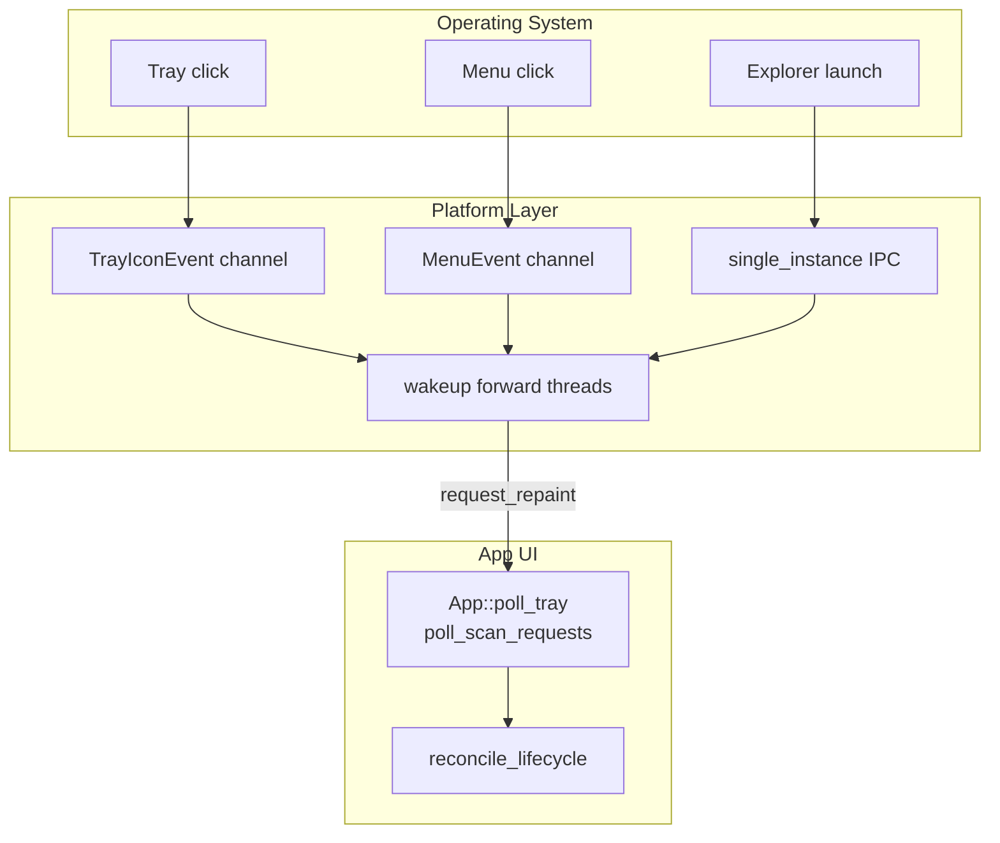

# Platform Domain

**Module path:** `src/tray.rs`, `src/single_instance.rs`, `src/wakeup.rs`, `src/autostart.rs`, `src/context_menu.rs`, `src/macos_reopen.rs`, `src/windows_chrome.rs`  
**Generated:** 2026-08-25

---

## What This Module Does

CLV3000 doesn't exist in a vacuum — it lives inside the operating system through a system tray icon, single-instance enforcement, boot autostart, Explorer context menus, and platform-specific window behavior. The platform domain wraps all these OS integrations behind consistent Rust APIs, with mock implementations for Linux development builds.

Think of it as the application's "diplomatic corps" — handling all negotiations with the operating system so the core scanning logic stays platform-agnostic.

---

## Core Features

1. **System tray** — Creates tray icon with menu items (Show, Quick Scan, Optimize PC, About, Quit) using tray-icon and muda crates (`src/tray.rs:32-66`).

2. **Single-instance lock** — Windows uses a named Mutex; macOS uses a Unix domain socket with zombie cleanup; Linux mock always succeeds (`src/single_instance.rs:1-39`).

3. **Scan request forwarding** — Second instances write path to `scan_request.txt` and signal a named Event (Windows) rather than failing silently (`src/single_instance.rs:99-111`).

4. **Event-driven UI wake-up** — Forward threads block on tray/menu/IPC channels and call `request_repaint()` — replacing 100ms polling loops (`src/wakeup.rs:1-18`, `46-57`).

5. **Autostart registration** — Windows writes to HKCU Run key; macOS creates LaunchAgent plist; both use `--tray-only` argument (`src/autostart.rs:1-8`, `35-42`).

6. **Explorer context menu (Windows)** — Registers shell keys under HKCU for files and directories (`src/context_menu.rs:1-11`, `44-45`).

7. **macOS dock reopen** — Handles dock icon click when window is hidden to tray (`src/macos_reopen.rs`).

8. **Windows DWM chrome tuning** — Aligns borderless window client area after viewport commands (`src/windows_chrome.rs`).

---

## Key Components

| Component | File Path | Core Responsibility |
|-----------|-----------|---------------------|
| `Tray` | `src/tray.rs:23` | Tray icon handle + menu item IDs |
| `tray::build` | `src/tray.rs:32` | Create icon and context menu |
| `single_instance::acquire` | `src/single_instance.rs:57` | Attempt exclusive instance lock |
| `forward_scan_request` | `src/single_instance.rs:102` | IPC: write path + signal event |
| `forward_show_request` | `src/single_instance.rs:114` | IPC: signal show window |
| `start_request_listeners` | `src/single_instance.rs` | Background threads for IPC |
| `wakeup::init` | `src/wakeup.rs:46` | Setup forward channels + threads |
| `wakeup::push_scan_request` | `src/wakeup.rs:36-40` | Queue forwarded scan path |
| `autostart::set_enabled` | `src/autostart.rs:16` | Toggle boot registration |
| `context_menu::set_enabled` | `src/context_menu.rs:25` | Toggle Explorer menu registration |
| `macos_reopen::install_reopen_handler` | `src/macos_reopen.rs` | Dock click handler |
| `windows_chrome::poll_chrome_tune` | `src/windows_chrome.rs` | Post-viewport DWM alignment |

---

## Internal Data Flow

```mermaid
flowchart TD
    subgraph os ["Operating System"]
        T["Tray click"]
        M["Menu click"]
        E["Explorer launch"]
    end
    subgraph platform ["Platform Layer"]
        TE["TrayIconEvent channel"]
        ME["MenuEvent channel"]
        SI["single_instance IPC"]
        FW["wakeup forward threads"]
    end
    subgraph app ["App UI"]
        POLL["App::poll_tray<br/>poll_scan_requests"]
        LC["reconcile_lifecycle"]
    end

    T --> TE
    M --> ME
    E --> SI
    TE --> FW
    ME --> FW
    SI --> FW
    FW -->|"request_repaint"| POLL
    POLL --> LC
```

**Event forwarding architecture:**
1. OS delivers events to tray-icon/muda global channels
2. `wakeup` forward threads block on `recv()`, copy to private channels, call `ping()` → `request_repaint()`
3. App frame loop `try_recv`s from private channels — zero CPU when idle

---

## Key Interfaces and Extension Points

- **Platform dispatch via `#[cfg]`** — Each platform module (real/mock) exports same function signatures
- **`TrayMenuIds`** — Stable menu item identifiers for event matching (`src/tray.rs:15-21`)
- **`CLV3000_ALLOW_MULTIPLE_INSTANCES`** — Environment variable to bypass lock for development

---

## Interactions with Other Modules

| Module | Direction | Interface | Description |
|--------|-----------|-----------|-------------|
| app | provides to | tray events, scan requests | App polls and reacts each frame |
| lifecycle | coordinated | RunMode changes | Tray actions trigger mode transitions |
| paths | depends | `app_data_dir` | IPC file and socket locations |
| main | coordinated | `wait_in_tray`, listeners | Bootstrap before/during eframe |

---

## Role in Core Business Flows

**Tray Quick Scan:** Menu click → wakeup forward → App::poll_tray → navigate to QuickScan + start scan.

**Explorer right-click (instance running):** New process → acquire fails → forward_scan_request → listener → wakeup channel → App starts path scan.

**Autostart on boot:** Registry/LaunchAgent runs `clv3000 --tray-only` → lifecycle resolves to tray-only mode → silent background presence.

---

## Performance Considerations

- Event-driven wake-up eliminates ~10-33Hz idle polling — critical for battery life on laptops running tray-only
- IPC uses file + event (Windows) rather than named pipes — simpler, sufficient for single-path forwarding
- Forward threads are long-lived, started once in `main()` before eframe

---

## Implementation Highlights

- **Windows foreground on double-click only** — Avoids stealing focus from tray context menu on single click (`src/wakeup.rs:64-71`)
- **Zombie socket cleanup (macOS)** — Attempts connection before bind; removes stale socket from crashed previous instance (`src/single_instance.rs:7-8`)
- **HKCU-only registry writes** — Autostart and context menu require no admin privileges (`src/autostart.rs:5-6`, `src/context_menu.rs:6-8`)
