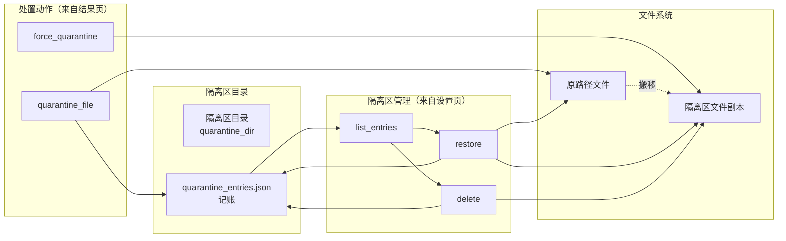

# 深度探索：隔离域

隔离域是 CLV3000 的"病理切片室"——扫描发现问题之后，对单个可疑样本的处置都在这里完成。它的核心设计哲学是**"隔离必须可逆"**：隔离不是删除，而是把文件**搬移**到隔离区并记账，这样误报时可以精确还原；任何破坏性操作（永久删除、强制隔离）都必须显式确认。这个域只有一个源文件 `src/quarantine.rs`，但承载了五种处置动作，是可靠性要求最高的域之一——它直接操作不可信文件系统的原路径与目标路径。

## 这个模块在做什么

四个职责：**（1）隔离**——把威胁文件搬移到隔离区目录，写入记账文件 `quarantine_entries.json`；**（2）还原**——依据记账条目把文件搬回原路径并销账；**（3）删除**——永久销毁隔离区文件；**（4）强制隔离**——文件被占用时，杀占用进程 + UAC 提权子进程完成搬移。此外它还负责向设置页提供隔离区条目列表，供用户管理。

## 模块组成与组件职责

| 组件 | 源文件 | 职责 |
|------|--------|------|
| `quarantine_file(path)` | `src/quarantine.rs` | 标准隔离：搬移到隔离区 + 写记账 |
| `force_quarantine` | `src/quarantine.rs` | 强制隔离：杀进程 + UAC 提权子进程 |
| `restore(entry)` | `src/quarantine.rs` | 还原：搬回原路径 + 销账 |
| `delete(entry)` | `src/quarantine.rs` | 永久删除隔离区文件 |
| `list_entries()` | `src/quarantine.rs` | 枚举隔离区条目（设置页展示） |
| `QuarantineEntry` | `src/quarantine.rs` | 记账条目：原路径、原始文件名、隔离时间、病毒名 |
| `QuarantineResult` | `src/quarantine.rs` | 操作结果（成功/错误分类） |

## 内部数据流

一次"隔离 → 查看隔离区 → 还原"的完整生命周期如下。注意记账文件 `quarantine_entries.json` 是隔离域的可信数据源——还原与删除都依赖它，因此每次操作都要"读记账 → 操作文件 → 写回记账"三态一致。

## 关键组件拆解

**`quarantine_file(path)`（`src/quarantine.rs`）**的步骤：把目标文件搬移到隔离区（保存原路径与原始文件名），写入 `QuarantineEntry` 到记账文件。搬移而非复制——省一半 IO，且保证"隔离后原位置立即消失"。病毒名随记账保存，设置页可以看到"这个隔离项当初是什么病毒"。

**`force_quarantine`（`src/quarantine.rs`）**解决 Windows 上最常见的失败场景：目标文件被正在运行的进程占用，`MoveFile` 失败。它先尝试杀占用进程，再由一个 UAC 提权子进程完成搬移——这是全应用唯一的破坏性路径，因此调用方（`src/main.rs` 的 `--force-quarantine <original> <dest>` 子命令）必须经过用户确认。这也是为什么 `src/main.rs` 里 `--force-quarantine` 在单实例锁之前解析：提权子进程是独立的新进程，不该受"已有实例"约束。

**`QuarantineResult` 的错误分类（`src/quarantine.rs`）**让 UI 能精确反馈：区分"文件不存在""文件被占用""写入记账失败"等不同错误，结果页据此决定是否弹出强制隔离确认框。错误分类是处置流程可靠性的基石——模糊的"失败"会让用户无法判断该不该重试。

## 依赖关系与边界

本域依赖：`src/paths.rs`（隔离区目录解析）、`std::fs`（搬移/删除）、`serde`（`QuarantineEntry` 序列化）、`windows` crate（UAC 提权、进程占用检测，仅 Windows cfg）。它对外提供 `quarantine_file`/`force_quarantine`/`restore`/`delete`/`list_entries` 五个公共入口，消费方是 app 编排域的结果页与设置页。

关联文档：`3.工作流.md`（工作流四：威胁处置闭环）、`4.Deep-Exploration/app.md`（处置动作的 UI 入口）、`4.Deep-Exploration/persistence.md`（隔离区目录解析依赖）。
