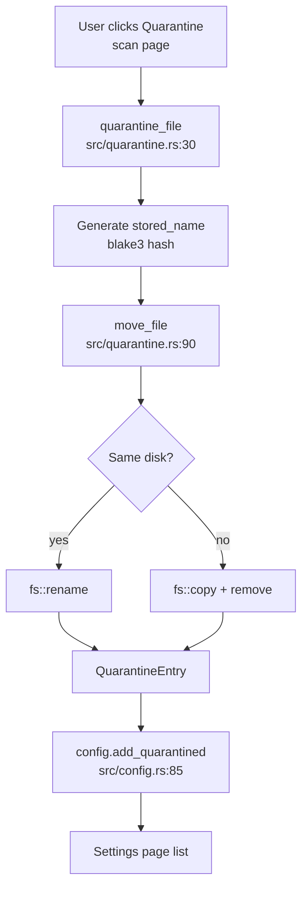

# Quarantine Domain

**Module path:** `src/quarantine.rs`  
**Generated:** 2026-08-25

---

## What This Module Does

When CLV3000 detects a threat, deleting it outright is risky — it might be a false positive, or the user may need the file later. The quarantine module acts as a secure holding cell: it moves suspicious files out of their original location into an app-private directory, records metadata for restoration, and on Windows can escalate privileges to kill processes blocking the move.

This is the first module in CLV3000 that performs destructive write operations on user files, so every step returns `Result` with user-facing error messages rather than panicking.

---

## Core Features

1. **Standard quarantine** — `quarantine_file()` generates a blake3-derived stored name (deliberately without original extension to prevent accidental execution), moves the file to `paths::quarantine_dir()`, and returns a `QuarantineEntry` (`src/quarantine.rs:30-52`).

2. **Restore** — `restore_file()` moves the quarantined copy back to the original path, but only if the parent directory still exists and the original path is unoccupied — refusing to overwrite existing files (`src/quarantine.rs:57-78`).

3. **Permanent delete** — `delete_permanently()` removes the quarantined copy from disk. The caller must also remove the config record (`src/quarantine.rs:82-85`).

4. **Cross-disk move fallback** — `move_file()` tries `fs::rename` first (same-volume, near-instant), falling back to copy+delete for cross-disk moves like D: → APPDATA on C: (`src/quarantine.rs:90-100`).

5. **Force quarantine (Windows)** — When normal quarantine fails due to file locks, the user can trigger force quarantine: kill blocking processes via Toolhelp32 snapshot, and if needed, relaunch via UAC with `--force-quarantine` (`src/quarantine.rs:102+`, `src/main.rs:34-43`).

---

## Key Components

| Component | File Path | Core Responsibility |
|-----------|-----------|---------------------|
| `quarantine_file` | `src/quarantine.rs:30` | Move threat to quarantine directory with hashed name |
| `restore_file` | `src/quarantine.rs:57` | Return file to original location with safety checks |
| `delete_permanently` | `src/quarantine.rs:82` | Irreversible removal of quarantined copy |
| `move_file` | `src/quarantine.rs:90` | rename with copy+delete fallback; rollback on partial failure |
| `run_force_quarantine_helper` | `src/quarantine.rs` (force mod) | UAC child: kill processes + move file |
| `QuarantineEntry` | `src/config.rs:25` | Persistent metadata: original path, virus name, timestamp, stored name |
| `paths::quarantine_dir` | `src/paths.rs` | App-private quarantine directory location |

---

## Internal Data Flow

```mermaid
flowchart TD
    A["User clicks Quarantine<br/>scan page"] --> B["quarantine_file<br/>src/quarantine.rs:30"]
    B --> C["Generate stored_name<br/>blake3 hash"]
    C --> D["move_file<br/>src/quarantine.rs:90"]
    D --> E{"Same disk?"}
    E -->|yes| F["fs::rename"]
    E -->|no| G["fs::copy + remove"]
    F --> H["QuarantineEntry"]
    G --> H
    H --> I["config.add_quarantined<br/>src/config.rs:85"]
    I --> J["Settings page list"]
```

**Force quarantine path (Windows):**
1. Normal `quarantine_file` fails (file locked)
2. UI offers "Force Quarantine"
3. App identifies blocking PIDs via Toolhelp32
4. If elevation needed: `ShellExecuteExW("runas")` with `--force-quarantine`
5. Child process kills PIDs and calls `move_file`

---

## Key Interfaces and Extension Points

- **`quarantine_file(original, virus_name) -> Result<QuarantineEntry, String>`** — Primary quarantine API
- **`restore_file(entry) -> Result<(), String>`** — Restore with overwrite protection
- **`delete_permanently(entry) -> Result<(), String>`** — Permanent removal
- **Windows-only force module** — Compiled under `#[cfg(windows)]` with process termination logic

---

## Interactions with Other Modules

| Module | Direction | Interface | Description |
|--------|-----------|-----------|-------------|
| config | depends | `QuarantineEntry`, `add_quarantined`, `remove_quarantined` | Persistent record management |
| paths | depends | `quarantine_dir`, `ensure_dir` | Directory location and creation |
| app | depended | Called from scan results and settings pages | UI triggers quarantine/restore/delete |
| lifecycle | depends | `--force-quarantine` CLI parsing | UAC child process entry |

---

## Role in Core Business Flows

**After threat detection:** Scan page displays detected threats with Quarantine / Ignore buttons. Quarantine calls `quarantine_file()`, adds the returned entry to config, and removes the threat from the active list.

**In Settings → Quarantine tab:** Lists all `QuarantineEntry` records with Restore and Delete Permanently actions, calling `restore_file()` or `delete_permanently()` respectively.

---

## Performance Considerations

- Same-disk `rename` is O(1) metadata operation — critical for large files
- Copy fallback only triggers on cross-volume moves (common when quarantining from D: drive)
- Force quarantine process enumeration is bounded by running process count

---

## Implementation Highlights

- **`.quarantined` extension** — Stored files use a non-executable extension to prevent accidental double-click execution in the quarantine folder (`src/quarantine.rs:26-29`)
- **Timestamp in hash seed** — Same path quarantined multiple times gets unique stored names, preventing overwrite (`src/quarantine.rs:34-40`)
- **Copy rollback** — If copy succeeds but original deletion fails, the copied file is also removed to avoid false "quarantined" state (`src/quarantine.rs:95-99`)
