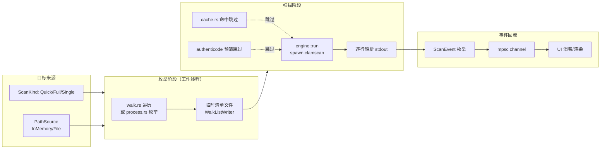

# 深度探索：scan 引擎域

scan 引擎域是 CLV3000 的"体检仪器本体"——如果说 app 编排域是告诉用户"现在在做什么"，那么 scan 引擎域负责回答"**到底有没有病毒**"。它不产生任何 UI，只做一件事：把用户选定的目标（进程、磁盘、单文件）翻译成 ClamAV 能理解的形式，驱动 `clamscan` 子进程完成扫描，再把引擎的输出解析回结构化的进度与结果。这是全项目最"重"的域——`src/scan/` 下 10 个源文件、约 3000 行，覆盖枚举、调用、解析、取消、缓存、签名预筛全部环节。

## 这个模块在做什么

模块的核心是**三条扫描入口共用的一套管线**：`PathSource`（扫什么）→ `ScanKind`（怎么扫）→ 枚举（整理待扫清单）→ `engine::run`（驱动子进程）→ `ScanEvent` 回流（UI 消费）。管线之上叠了三层"加速/预筛"能力：文件基因缓存（`cache.rs`）、路径变更缓存、代码签名预筛（`authenticode.rs`）。管线的执行者不是 UI 线程——`engine::run`、`full_scan::run`、`quick_scan::run` 都是**阻塞函数**，由 app 编排域在工作线程里调用，这是 `src/scan/mod.rs` 明确声明的约定。

## 模块组成与组件职责

| 组件 | 源文件 | 职责 |
|------|--------|------|
| `ScanKind` / `Threat` / `PathSource` / `ScanEvent` | `src/scan/mod.rs` | 领域类型与事件枚举定义（管线契约） |
| `engine::run` / `ScanOutput` | `src/scan/engine.rs` | `clamscan` 子进程的启动、参数组装、stdout 逐行解析 |
| `full_scan::run` | `src/scan/full_scan.rs` | 全盘扫描：磁盘枚举 + `WalkListWriter` 流式清单 |
| `quick_scan::run` | `src/scan/quick_scan.rs` | 闪电扫描：进程/模块枚举 + 去重 |
| `walk` 模块 | `src/scan/walk.rs` | 目录遍历与可执行文件筛选（白名单 / Mach-O 魔数） |
| `scan::process` | `src/scan/process.rs` | 进程与模块枚举（Windows Toolhelp32 / macOS sysinfo） |
| `scan::authenticode` | `src/scan/authenticode.rs` | 代码签名预筛（WinVerifyTrust / codesign） |
| `cache` 模块 | `src/scan/cache.rs` | 文件基因缓存 + 路径缓存（TSV 双表落盘） |
| `CancelFlag` / watchdog | `src/scan/cancel.rs` | 取消协作：共享原子布尔 + 看门狗强杀 |
| `engine::is_clean` 等 | `src/scan/engine.rs` | 输出解析辅助（逐行匹配 `FOUND`/`OK` 结果标记） |

`src/scan/mod.rs` 是管线的**契约定义者**：`ScanEvent` 枚举定义了 UI 能看到的所有事件形态——`Enumerating{processes_done,processes_total,files_found}`（枚举阶段）、`Progress{processed,total,current_path}`（扫描阶段）、`Threat`（命中）、`Done{...}`（结束）。UI 不需要知道 `clamscan` 的任何细节，它只消费 `ScanEvent`，这是本域对外的唯一接口面。

## 内部数据流

扫描管线的数据流分成"枚举"与"扫描"两段，中间用临时文件清单衔接（闪电扫描用内存清单 `PathSource::InMemory`）。子进程的 stdout 在 `engine.rs` 内逐行解析，转换为 `ScanEvent` 后经 mpsc 流向 UI 线程。

## 关键组件拆解

**`engine::run`（`src/scan/engine.rs`）**是本域的"发动机"。它组装 `clamscan` 参数（`--file-list=<清单>`、`--verbose --stdout`、Windows 额外 `--scan-pe`、`creation_flags` 含 `0x0800_0000` 隐藏控制台窗口），spawn 子进程，然后阻塞读取 stdout，逐行解析：`FOUND` 行解析出病毒名、`OK` 行确认干净、特殊行解析为 `ScanEvent::Progress`。它的返回值 `ScanOutput` 携带扫描统计与威胁列表。代码里的 `is_clean`/`is_found`/`is_progress` 等解析辅助函数把"clamscan 的文本格式"隔离在 engine.rs 内部。

**`CancelFlag` 与看门狗（`src/scan/cancel.rs`）**是取消机制的实现。`CancelFlag` 是对共享 `AtomicBool` 的封装；看门狗线程在扫描期间周期性检查（子进程存活 + `last_file` 进度推进），用户点"取消"置位 flag，看门狗发现后 `kill()` 子进程，`engine::run` 读到子进程被杀的退出状态后抛 `ScanError::Cancelled`——这个错误最终变成 `ScanPhase::Done{cancelled:true}`，而不是让 UI 卡死在"扫描中"。

**`cache` 模块（`src/scan/cache.rs`）**做两件事。基因缓存：BLAKE3 哈希文件内容 → 查/写"内容→上次结论"表（`MAX_ENTRIES 200_000`、`TARGET_ENTRIES 160_000`、TTL 30 天）；路径缓存：路径 → 大小+修改时间+哈希 快速匹配，未变化的文件直接跳过重算。两张表都是 TSV 格式落盘到 `%APPDATA%\CLV3000\scan_cache.tsv` 与 `scan_cache_paths.tsv`（macOS 在 `~/Library/Application Support/CLV3000`）。注意：缓存命中只代表"上次扫过是干净的"，不代表"现在安全"——代码注释明确声明缓存是**启发式加速，不是安全保证**。

**`authenticode` 预筛（`src/scan/authenticode.rs`）**在缓存之后、引擎扫描之前：Windows 用 WinVerifyTrust 校验文件签名，macOS 用 `codesign --verify`，签名来自受信任发布者则跳过引擎扫描。它也是加速层，且仅 `cfg(any(windows, target_os="macos"))` 编译——Linux 等平台直接不参与。

**`full_scan.rs` 与 `walk.rs` 的协作**：`full_scan::run` 先枚举固定磁盘（Windows `GetLogicalDrives` + 盘型判断；macOS 从挂载点筛选），对每块盘调用 `walk` 遍历。`walk` 的筛选规则是平台相关的：Windows 按扩展名白名单 `.exe/.dll/.sys/.scr/.com/.cpl/.ocx/.drv`，macOS 读文件头判断 Mach-O 魔数。遍历结果经 `WalkListWriter` 边发现边写临时文件（`WALK_PROGRESS_STEP` 每 100 个文件上报一次 `Enumerating` 事件），内存占用与文件数完全解耦。

## 依赖关系与边界

本域依赖：`std::process`（子进程）、`blake3`（基因哈希）、`winreg`/windows crate（进程枚举、签名校验，仅 Windows cfg）、`sysinfo`（macOS 进程枚举）、`paths`（缓存与临时文件目录）、`serde`（`ScanOutput`/`Threat` 的 `Deserialize`）。它对外暴露的抽象是 `ScanEvent`、`ScanOutput`、`Threat`、`PathSource`，消费方是 app 编排域。

关联文档：`2.架构.md`（线程模型中的扫描线程与看门狗）、`3.工作流.md`（工作流一/二/三的调用链）、`4.Deep-Exploration/app.md`（`AppCore::start_scan` 如何驱动本域）。
