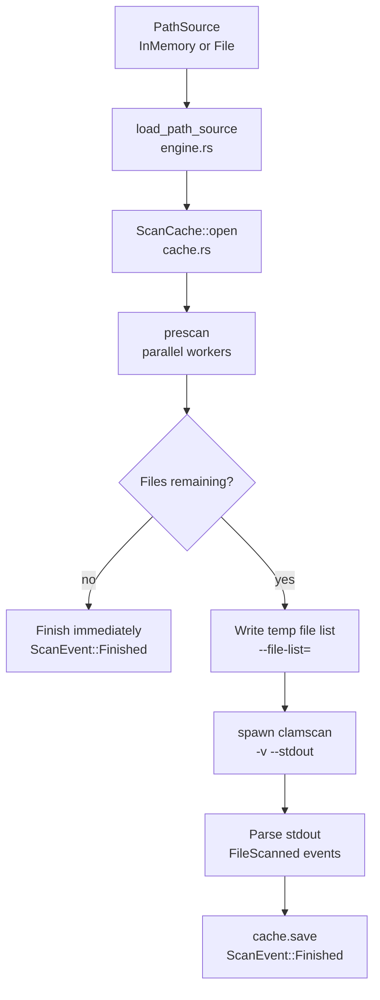

# Scan Domain

**Module path:** `src/scan/`  
**Generated:** 2026-08-25

---

## What This Module Does

The `scan` module is CLV3000's inspection floor — it answers two fundamental questions: "what should we scan?" and "is it infected?" Quick scan and full scan handle the first question through platform-specific enumeration; the engine module handles the second by orchestrating ClamAV with smart pre-filters that skip files already known to be clean or signed by trusted publishers.

Think of it as a quality control pipeline: raw file paths enter, pass through cache and signature gates, and only unknown or changed files reach the expensive ClamAV inspection station.

---

## Core Features

1. **Quick scan enumeration** — Snapshots all running PIDs, collects each process's loaded modules (including DLLs on Windows), deduplicates paths, and delivers an in-memory list to the engine (`src/scan/quick_scan.rs:36-92`).

2. **Full scan walk** — Traverses fixed local drives collecting executable extensions (`.exe`, `.dll`, `.sys` on Windows; Mach-O binaries on macOS). Uses streaming `WalkListWriter` to avoid holding tens of thousands of paths in memory (`src/scan/full_scan.rs`).

3. **Unified scan engine** — `engine::run` accepts either `PathSource::InMemory` or `PathSource::File`, runs parallel prescan, spawns a single clamscan subprocess with `--file-list`, and parses verbose stdout for per-file results (`src/scan/engine.rs:25`, `src/scan/mod.rs:46-48`).

4. **Content hash cache** — `ScanCache` stores blake3 hash → scan result with virus DB revision tracking. Cache entries invalidate when freshclam updates signatures or after 30-day TTL (`src/scan/cache.rs:29-33`, `45-47`).

5. **Code signature pre-filter** — `authenticode` module verifies PE signatures (Windows via WinVerifyTrust) or Mach-O signatures (macOS via codesign), skipping files from trusted publishers before ClamAV (`src/scan/authenticode.rs`).

---

## Key Components

| Component | File Path | Core Responsibility |
|-----------|-----------|---------------------|
| `ScanEvent` | `src/scan/mod.rs:53` | Typed messages from scan thread to UI (Enumerating, FileScanned, Finished, etc.) |
| `PathSource` | `src/scan/mod.rs:46` | InMemory vector or File-based streaming path list |
| `Threat` | `src/scan/mod.rs:32` | Detected threat with path and virus name |
| `engine::run` | `src/scan/engine.rs:25` | Main engine entry with platform dispatch (real/mock) |
| `prescan` | `src/scan/engine.rs:124` | Parallel cache lookup + authenticode filtering |
| `run_clamscan_batch` | `src/scan/engine.rs:140` | Temp file list creation, subprocess spawn, stdout parsing |
| `ScanCache` | `src/scan/cache.rs:89` | Disk-backed content hash cache with LRU eviction |
| `CacheSnapshot` | `src/scan/cache.rs:89` | Immutable read-only cache for parallel prescan workers |
| `quick_scan::run` | `src/scan/quick_scan.rs:36` | Process/module enumeration pipeline |
| `CancelFlag` | `src/scan/mod.rs:88` | Shared atomic bool for scan cancellation |

---

## Internal Data Flow

```mermaid
flowchart TD
    A["PathSource<br/>InMemory or File"] --> B["load_path_source<br/>engine.rs"]
    B --> C["ScanCache::open<br/>cache.rs"]
    C --> D["prescan<br/>parallel workers"]
    D --> E{"Files remaining?"}
    E -->|no| F["Finish immediately<br/>ScanEvent::Finished"]
    E -->|yes| G["Write temp file list<br/>--file-list="]
    G --> H["spawn clamscan<br/>-v --stdout"]
    H --> I["Parse stdout<br/>FileScanned events"]
    I --> J["cache.save<br/>ScanEvent::Finished"]
```

**Key steps:**
1. `engine::run` loads paths from `PathSource` and opens the content cache (`src/scan/engine.rs:96-116`)
2. `prescan` runs parallel workers with immutable `CacheSnapshot` — cache hits and trusted signatures emit instant `FileScanned` events (`src/scan/engine.rs:118-125`)
3. Remaining paths are written to a temp file; clamscan is spawned once with `--file-list` (`src/scan/engine.rs:140-150`)
4. Each stdout line produces a `ScanEvent::FileScanned`; completion sends `Finished` and saves cache

---

## Key Interfaces and Extension Points

- **`engine::run(source, tx, cancel)`** — Unified entry point; platform selected via `#[cfg]` (`src/scan/engine.rs:25-29`)
- **`ScanEvent` enum** — Extensible event protocol between scan thread and UI (`src/scan/mod.rs:53-85`)
- **`new_cancel_flag()`** — Factory for shared cancellation handle (`src/scan/mod.rs:90-92`)
- **Platform enumeration** — `real_windows`, `real_macos`, `mock` modules behind cfg gates in quick_scan and full_scan

---

## Interactions with Other Modules

| Module | Direction | Interface | Description |
|--------|-----------|-----------|-------------|
| paths | depends | `clamscan_path`, `resolved_clamav_database_dir` | Locates ClamAV binary and signature DB |
| app | depended | `ScanEvent`, `ScanKind`, `Threat` | UI consumes events, displays results |
| config | depended | `AppConfig::is_ignored` | Filters ignored threats during event processing |
| persistence | depends | `paths::app_data_dir` | Cache file location |

---

## Role in Core Business Flows

**In Quick Scan:** `quick_scan::run` enumerates processes → sends `ScanStarted` with known total → calls `engine::run(InMemory(...))`.

**In Full Scan:** `full_scan::run` walks drives with streaming writer → sends `WalkProgress` during enumeration → calls `engine::run(File { path, count })`.

**In Rescan:** Cache hits in prescan emit instant clean results; only changed or new files reach ClamAV — making repeat scans of the same paths nearly instant.

---

## Performance Considerations

- **Parallel prescan** with immutable `CacheSnapshot` avoids mutex deadlocks that occurred with shared `Mutex<ScanCache>` (`src/scan/cache.rs:77-88`)
- **Single clamscan spawn** per batch avoids per-file process startup overhead
- **64MB cache skip threshold** — files larger than `CACHE_SKIP_SIZE` skip content hashing but still get scanned (`src/scan/engine.rs:67`)
- **Streaming full scan** — `PathSource::File` prevents memory exhaustion on large drives
- **macOS Mach-O filtering** — `is_collectable_macho` excludes `.o` object files to avoid scanning millions of build artifacts (`src/scan/mod.rs:140-168`)

---

## Implementation Highlights

- **Watchdog cancel thread** — Monitors `CancelFlag` and kills clamscan subprocess on user cancel (`src/scan/engine.rs:7-8`)
- **Invalid UTF-8 tolerance** — `for_each_line_skip_invalid_utf8` skips bad lines without aborting the scan (`src/scan/mod.rs:177-186`)
- **DB revision invalidation** — Cache entries tied to virus DB version ensure new signatures catch previously cached-clean files (`src/scan/cache.rs:45-47`)
