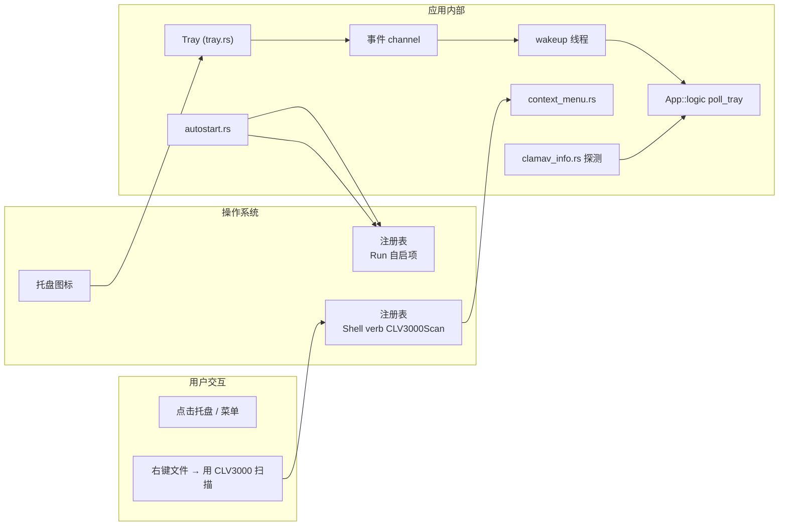

# 深度探索：系统集成域

系统集成域是 CLV3000 与操作系统的"接口人"——托盘、开机自启、Explorer 右键菜单、ClamAV 引擎探测，这些"把应用嵌入用户日常使用习惯"的能力都由它负责。你可以把它想成药店门口的取药窗：用户不直接看到药房内部（核心扫描逻辑），但所有"递东西进来、取东西出去"的交互（点托盘、右键菜单、开机自动到位）都经过这扇窗。这个域有 4 个源文件，核心职责是四块：托盘常驻、自启、右键菜单、引擎探测。

## 这个模块在做什么

四个职责：**（1）系统托盘**——`tray.rs` 创建托盘图标与菜单，接收点击与菜单事件并送入 channel（供 lifecycle 域转发给 UI）；**（2）开机自启**——`autostart.rs` 通过 Windows 注册表 `HKCU\...\Run` 写入自启项（`--tray-only` 静默启动）；**（3）Explorer 右键菜单**——`context_menu.rs` 注册"用 CLV3000 扫描"verb（`VERB_KEY="CLV3000Scan"`，`MENU_LABEL="Scan with CLV3000"`），并在卸载时清理；**（4）ClamAV 信息**——`clamav_info.rs` 探测便携引擎、病毒库版本与数据库目录，供病毒库页展示与更新逻辑使用。

## 模块组成与组件职责

| 组件 | 源文件 | 职责 |
|------|--------|------|
| `Tray` / `TrayMenuIds` | `src/tray.rs` | 托盘图标持有、菜单定义（Show Main Window/Quick Scan/About/Quit）、事件 channel 路由 |
| `AutostartHandle` | `src/autostart.rs` | 注册表自启项读写（enable/disable/is_enabled） |
| `ContextMenuHandle` | `src/context_menu.rs` | Explorer 右键 verb 注册与清理 |
| `ClamAvInfo` | `src/clamav_info.rs` | 引擎/病毒库版本探测、数据库目录探测、引擎可用性 |
| `cached_info` / `refresh` | `src/clamav_info.rs` | 信息缓存与刷新（病毒库页展示） |

## 内部数据流

托盘事件是系统集成域最主要的对外数据流：tray-icon 的回调线程把事件写入 channel，wakeup 线程 `recv` 后 `request_repaint`，UI 线程在 `App::logic` 里 `poll_tray` 消费。自启与右键菜单则是"写操作系统"的数据流——配置写入注册表，系统在开机/右键时读取。

## 关键组件拆解

**`Tray` 与 `TrayMenuIds`（`src/tray.rs`）**：`Tray` 持有 `tray-icon` 的 `TrayIcon` 句柄（**不能 drop**——drop 后托盘图标立即消失，这是 tray-icon 库的已知行为），菜单用 muda 构建四个条目并记录到 `TrayMenuIds`（后续据此判断菜单点击）。事件不走回调，而是通过 `TrayIconEvent::receiver()` / `MenuEvent::receiver()` 拿到 receiver，交给 `wakeup.rs` 的转发线程——原因在 `2.架构.md` 的 ADR 五已详述（eframe 不暴露 `EventLoopProxy`，回调改状态有竞态）。

**`AutostartHandle`（`src/autostart.rs`）**：Windows 通过注册表 `HKCU\Software\Microsoft\Windows\CurrentVersion\Run` 写入启动命令（`exe` 路径 + `--tray-only`），`is_enabled` 读取判断当前是否已自启，设置页据此显示开关状态。`--tray-only` 保证自启后不弹窗口、以托盘静默驻留——这是"开机自动就位但不打扰"的关键设计。

**`ContextMenuHandle`（`src/context_menu.rs`）**：注册 explorer 的 shell verb，让"用 CLV3000 扫描"出现在文件/文件夹右键菜单。verb 的命令是 `clv3000.exe --scan-path "%1"`，命中 `src/main.rs` 的 `--scan-path` 分支——右键扫描因此与 CLI 扫描、热转发走完全同一条链路（详见 `3.工作流.md` 工作流三）。设置页提供注册/卸载开关，`ContextMenuHandle` 负责创建与清理注册表项。

**`ClamAvInfo`（`src/clamav_info.rs`）**：探测三件事——便携引擎是否存在（`paths::clamav_dir`）、病毒库版本（读取数据库目录内的 `.cvd` 版本文件）、数据库目录位置（`paths::resolved_clamav_database_dir`）。病毒库页的"引擎可用性""病毒库版本""更新"按钮都基于 `cached_info`（`OnceLock` 缓存）与 `refresh`（手动刷新）。更新完成后 `refresh_db_version`（`src/app/core.rs`）调用它重新探测，让页面显示新版本。

## 依赖关系与边界

本域依赖：`tray-icon`、`muda`（托盘）、`windows` crate（注册表，仅 Windows cfg）、`src/paths.rs`（引擎与数据库目录）、`src/wakeup.rs`（事件转发）。它对外提供 `Tray`、`AutostartHandle`、`ContextMenuHandle`、`ClamAvInfo` 四个抽象，消费方是 lifecycle 域（托盘事件路由）与 app 编排域（设置页开关、病毒库页展示）。

关联文档：`2.架构.md`（ADR 五：托盘 channel 设计）、`3.工作流.md`（工作流六：托盘唤回）、`4.Deep-Exploration/lifecycle.md`（消息循环如何消费托盘事件）、`4.Deep-Exploration/persistence.md`（`resolved_clamav_database_dir` 依赖）。
