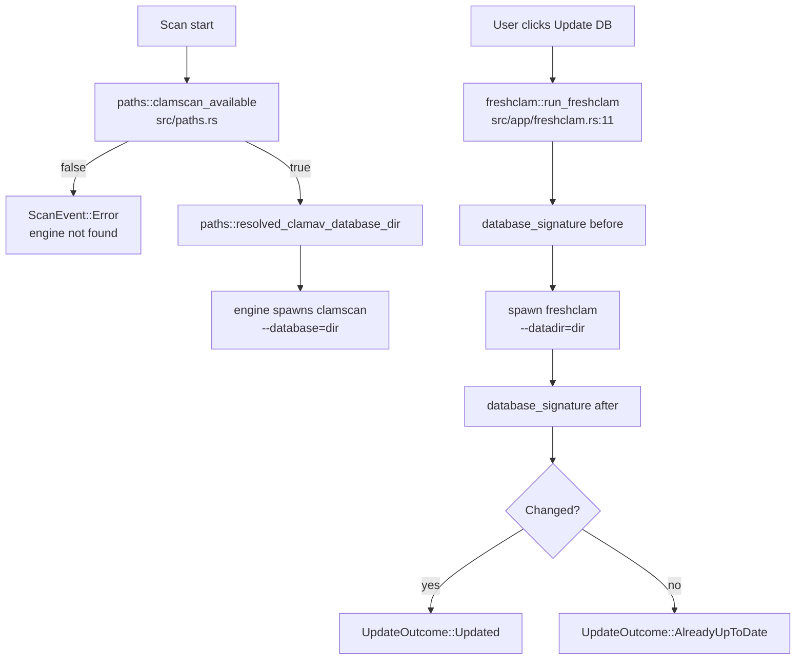

# System Integration Domain

**Module path:** `src/clamav_info.rs`, `src/app/freshclam.rs`, `src/paths.rs` (ClamAV sections)  
**Generated:** 2026-08-25

---

## What This Module Does

CLV3000 doesn't embed an antivirus engine — it delegates to ClamAV, an external open-source project. The system integration domain discovers where ClamAV lives on the machine (bundled portable copy, system install, or PATH), verifies the signature database is ready, reports status to the UI, and runs `freshclam` when the user requests a manual update.

This separation means CLV3000 can ship as a small executable while users bring their own (or bundled) ClamAV installation — keeping signature updates independent of application updates.

---

## Core Features

1. **ClamAV binary discovery** — `paths::clamscan_path()` and `freshclam_path()` resolve with platform-specific fallback chains: bundled `<exe_dir>/clamav/` → system install → PATH (`src/paths.rs:60-110`).

2. **Database directory resolution** — `resolved_clamav_database_dir()` finds the active signature directory, used by both scanning and caching (`src/paths.rs`).

3. **Engine availability check** — `clamscan_available()` verifies the binary exists before starting a scan, producing a user-friendly error if missing (`src/scan/engine.rs:74-84`).

4. **Manual database update** — `freshclam::run_freshclam()` spawns freshclam subprocess, compares database directory signatures before/after to distinguish "updated" from "already up-to-date" (`src/app/freshclam.rs:11-54`).

5. **Status reporting** — `clamav_info.rs` provides engine and database readiness information for the Virus Database page UI.

---

## Key Components

| Component | File Path | Core Responsibility |
|-----------|-----------|---------------------|
| `clamscan_path` | `src/paths.rs:60` | Locate clamscan executable with fallback chain |
| `freshclam_path` | `src/paths.rs:89` | Locate freshclam executable |
| `clamav_dir` | `src/paths.rs:19` | Bundled ClamAV root directory |
| `bundle_resources_clamav_dir` | `src/paths.rs:33` | macOS .app bundle Resources path |
| `resolved_clamav_database_dir` | `src/paths.rs` | Active signature DB directory |
| `clamscan_available` | `src/paths.rs` | Binary existence check |
| `run_freshclam` | `src/app/freshclam.rs:11` | Execute database update subprocess |
| `database_signature` | `src/app/freshclam.rs:59` | Fingerprint DB directory for change detection |
| `UpdateOutcome` | `src/app/core/virus_db.rs` | Updated vs AlreadyUpToDate result |

---

## Internal Data Flow


```mermaid
flowchart TD
    A["Scan start"] --> B["paths::clamscan_available<br/>src/paths.rs"]
    B -->|false| C["ScanEvent::Error<br/>engine not found"]
    B -->|true| D["paths::resolved_clamav_database_dir"]
    D --> E["engine spawns clamscan<br/>--database=dir"]
    
    F["User clicks Update DB"] --> G["freshclam::run_freshclam<br/>src/app/freshclam.rs:11"]
    G --> H["database_signature before"]
    H --> I["spawn freshclam<br/>--datadir=dir"]
    I --> J["database_signature after"]
    J --> K{"Changed?"}
    K -->|yes| L["UpdateOutcome::Updated"]
    K -->|no| M["UpdateOutcome::AlreadyUpToDate"]
```

**macOS path resolution priority:**
1. `Contents/Resources/clamav/clamscan` (bundled in .app)
2. `<exe_dir>/clamav/clamscan` (portable layout)
3. `/usr/local/clamav/bin/clamscan` (manual install)
4. `clamscan` on PATH (Homebrew)

---

## Key Interfaces and Extension Points

- **`run_freshclam() -> Result<UpdateOutcome, String>`** — Platform-dispatched (Windows/macOS real, Linux mock)
- **`database_signature(dir) -> String`** — Deterministic fingerprint of `.cvd/.cld/.cud` files
- **Mock mode (Linux)** — Returns success after 1.2s sleep for UI preview

---

## Interactions with Other Modules

| Module | Direction | Interface | Description |
|--------|-----------|-----------|-------------|
| scan/engine | depended | clamscan path, DB dir | Engine subprocess configuration |
| scan/cache | depended | DB revision from resolved dir | Cache invalidation on DB update |
| app/pages/virus_db | depended | Status display, update button | UI for DB management |
| paths | part of | All path resolution functions | Shared infrastructure |

---

## Role in Core Business Flows

**Before any scan:** Engine checks `clamscan_available()`. If false, sends error event and finishes without scanning — the UI shows "scan engine not found" guidance.

**Database page update:** User clicks Update → `run_freshclam()` → UI shows progress → outcome displayed (updated / already current / error with stderr).

**Cache invalidation:** When freshclam updates signatures, `db_revision` changes → all cache entries with old revision become misses → files get rescanned with new signatures.

---

## Bundled Deployment Layout

```
<exe_directory>/
  clv3000.exe
  clamav/
    clamscan.exe          # or clamscan on macOS
    freshclam.exe         # or freshclam on macOS
    libclamav.dll + deps  # Windows dependencies
    database/
      main.cvd            # Primary signature database
      daily.cld             # Daily updates
```

First-run recommendation: `freshclam.exe --datadir=clamav\database` before scanning.

---

## Implementation Highlights

- **Change detection over exit code** — freshclam returns 0 even when "already up-to-date"; signature comparison catches this (`src/app/freshclam.rs:17-36`)
- **stderr preservation** — Failed updates include freshclam stderr in error message for diagnosability (`src/app/freshclam.rs:38-50`)
- **CREATE_NO_WINDOW on Windows** — freshclam runs silently without console flash (`src/app/freshclam.rs:27`)
- **Explicit `--database=` flag** — Engine passes resolved DB path rather than relying on clamscan compile-time defaults (`src/scan/engine.rs:14-15`)
