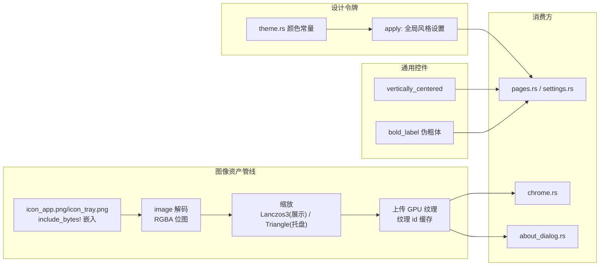

# 深度探索：UI 基建域

UI 基建域是 CLV3000 的"设计系统与工坊"——它提供所有页面共用的视觉语言与基础构件：设计令牌（颜色）、自绘图标、内置图像资源、通用布局控件、About 弹窗。你可以把它想成餐厅的中央厨房：各页面（`app` 编排域的 `pages.rs`/`settings.rs`）是门店，只负责"摆盘"，但"食材规格（配色）、餐具（控件）、招牌（Logo）"都出自中央厨房，保证全店视觉一致。这个域有 5 个源文件，是纯前端基建，不包含任何业务逻辑。

## 这个模块在做什么

四个职责：**（1）设计令牌**——`theme.rs` 定义全套深色主题颜色并全局应用；**（2）自绘矢量图标**——`icons.rs` 用 `egui::Painter` 手绘系统图标（不用图标字体）；**（3）内置图像资源**——`icon_data.rs` 把应用图标/托盘图标以字节数组嵌入二进制（`include_bytes!`），并提供缩放到各尺寸的加载器；**（4）通用控件与 About**——`widgets.rs` 提供 `vertically_centered`、伪粗体标签等通用控件；`about_dialog.rs` 渲染"关于"弹窗与全屏页。

## 模块组成与组件职责

| 组件 | 源文件 | 职责 |
|------|--------|------|
| `Theme` / `apply` | `src/theme.rs` | 深色主题颜色定义与全局设置（字体、风格、视口背景） |
| 设计令牌常量 | `src/theme.rs` | `BG_APP`/`BG_SIDEBAR`/`BG_CARD`/`BORDER`/`ACCENT_BLUE`/`GREEN`/`RED`/`TEXT_PRIMARY`/`TEXT_SECONDARY`/`TEXT_MUTED` 等 |
| 矢量图标绘制 | `src/icons.rs` | `map()`/`polyline()`/`quad_bezier()`/`shield_outline()` 等手绘图元与成品图标 |
| `AppIcon` | `src/icon_data.rs` | `icon_app.png`/`icon_tray.png` 嵌入（`include_bytes!`）+ `shield_rgba` 回退 |
| `load_app_icon_for_display` | `src/icon_data.rs` | Lanczos3 缩放到目标尺寸（`APP_ICON_SOURCE_MAX=512`） |
| `load_tray_icon` | `src/icon_data.rs` | 托盘图标加载（Triangle 滤波） |
| `vertically_centered` | `src/widgets.rs` | 垂直居中布局（用上一帧实测内容高度计算 top 偏移） |
| `bold_label` / `bold_label_nudged` | `src/widgets.rs` | 伪粗体：文本绘制两次偏移 <1px |
| About 弹窗/全屏页 | `src/about_dialog.rs` | `paint_about_modal` / `paint_about_fullscreen`（`ABOUT_CLOSED` 全局关闭标记） |

## 内部数据流

UI 基建域本身没有复杂的运行期数据流（它是"被动库"），但有一个值得注意的**渲染管线**：`about_dialog.rs` 全屏 About 页会在启动时把图标纹理上传 GPU 并缓存 `LOGO_TEX_ID`，复用同一纹理避免重复解码。`icon_data.rs` 的加载管线则是"字节 → 解码 → 缩放 → 纹理"。

## 关键组件拆解

**`Theme` 与设计令牌（`src/theme.rs`）**：深色主题的完整色板由 `src/theme.rs` 顶部常量定义，例如 `BG_APP`(10,13,18)、`BG_SIDEBAR`(6,8,11)、`BG_TITLEBAR`(8,10,14，非 Windows)、`BG_CARD`(18,22,29)、`BORDER`(34,40,50)、`ACCENT_BLUE`(58,160,224)、`ACCENT_BLUE_BG`(17,50,71)、`GREEN`(34,197,94)、`RED`(239,68,68)、`TEXT_PRIMARY`(245,247,250)、`TEXT_SECONDARY`(138,147,163)、`TEXT_MUTED`(92,100,114)。`apply(ctx)` 把这些令牌灌进 egui 的 `Style` 并设置全局字体/视口背景。**一个已知坑**：点阵网格背景色 `DOT_GRID` 用的是 premultiplied alpha 值 (8,8,8,8)——如果你在别处改色，直接照抄 RGBA 会得到错误底色，必须换算成预乘 alpha（`clv3000-design` skill 有详细说明）。

**`icons.rs` 的自绘图标**：图标不依赖任何字体或图片文件，全部用 `egui::Painter` 图元手绘。`quad_bezier()` 绘制二次贝塞尔（`shield_outline()` 的盾牌轮廓就是 6 段二次贝塞尔拼出来的），`map()`/`polyline()` 提供坐标映射与折线基础。好处是：零图标字体依赖、跨平台渲染一致、任意颜色任意尺寸可缩放。代价是：图标绘制代码较长，新增图标需要手写路径。

**`AppIcon` 与缩放（`src/icon_data.rs`）**：`icon_app.png` 与 `icon_tray.png` 通过 `include_bytes!` 直接嵌入二进制（单 exe 分发，无外部资源文件），`shield_rgba` 是兜底的盾牌像素图。`load_app_icon_for_display` 用 Lanczos3 滤波把图缩放到实际显示尺寸（`APP_ICON_SOURCE_MAX=512` 限制源图上限，避免超清图浪费内存），`load_tray_icon` 用 Triangle 滤波出托盘小图标。About 页的 `LOGO_TEX_ID="clv3000_about_logo"`、`LOGO_DISPLAY_PT=88.0` 定义 Logo 纹理的缓存键与显示大小。

**`about_dialog.rs` 的两种形态**：`paint_about_modal` 在设置页等场景以浮层显示；`paint_about_fullscreen` 在 `--tray-only` 从托盘打开时**独占主视口**渲染（窗口大小 `SIZE=[410.0,340.0]`）。为什么不用独立子视口？因为 eframe 在根视口 `Visible(false)` 时不会创建 deferred 子视口（`src/main.rs` 的 `build_viewport` 注释说明了这一点），所以全屏 About 是"复用主视口换内容"而非开新窗口。`ABOUT_CLOSED` 这个全局 `AtomicBool` 由 `take_closed()` 消费，控制 About 的打开/关闭状态跨帧持久。

**`vertically_centered`（`src/widgets.rs`）**的实现思路值得一提：egui 没有原生的"剩余空间垂直居中"，它利用**上一帧实测的内容高度**——`top_pad = (avail_height - last_height) * 0.5`，用上一帧的高度近似居中。这是 immediate-mode GUI 里常见的"帧延迟补偿"技巧，牺牲一帧精度换来布局简洁。

## 依赖关系与边界

本域依赖：`egui`（Painter/Style/Context）、`image`（PNG 解码）、`tray-icon`（托盘图标尺寸规格）。它对外提供 `Theme`、图标绘制函数、`AppIcon`、`vertically_centered`、About 弹窗；不依赖任何业务域，是依赖树的**叶节点**。消费方是 `app` 编排域的全部页面与 chrome 布局。

关联文档：`2.架构.md`（架构纪律二：状态即渲染）、`4.Deep-Exploration/app.md`（页面渲染如何消费本域构件）、`4.Deep-Exploration/platform.md`（资源条渲染）。
