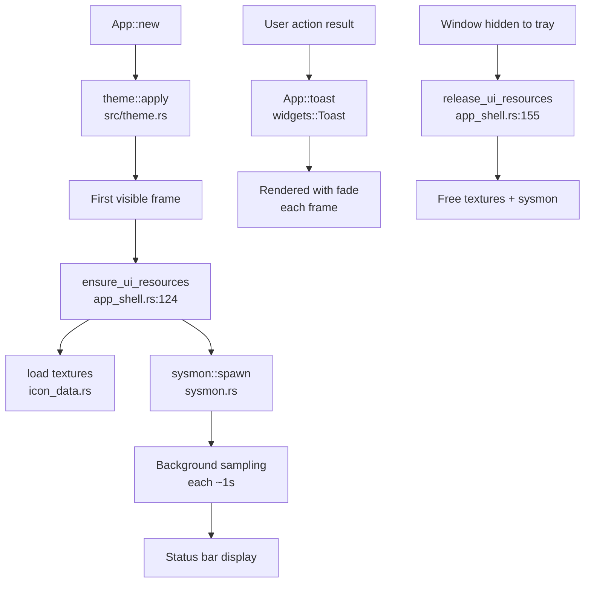

# UI Infrastructure Domain

**Module path:** `src/theme.rs`, `src/widgets.rs`, `src/icons.rs`, `src/icon_data.rs`, `src/sysmon.rs`, `src/about_dialog.rs`, `src/clv3000_plus.rs`  
**Generated:** 2026-08-25

---

## What This Module Does

Beyond scanning logic, CLV3000 needs a consistent visual identity — color palette, typography, toast notifications, embedded icons, real-time resource monitoring in the status bar, and the About dialog. The UI infrastructure domain provides these shared building blocks so page code in `app/pages/` stays focused on business functionality rather than reinventing visual elements.

---

## Core Features

1. **Global theme** — `theme::apply()` configures egui visuals with CLV3000's color palette, spacing, and widget styles on app startup (`src/theme.rs`, called from `src/app/app_shell.rs:55`).

2. **Toast notifications** — `widgets::Toast` provides transient feedback messages (quarantine success, errors) that fade automatically (`src/widgets.rs`, used via `App::toast()` at `src/app/app_shell.rs:116-118`).

3. **Embedded icon loading** — `icon_data.rs` decodes embedded PNG/ICNS assets at runtime for tray icon, window icon, and dashboard logo (`src/icon_data.rs`, loaded in `src/app/app_shell.rs:78-79`, `124-153`).

4. **Resource monitor** — `sysmon::spawn()` runs a background sampler reporting CPU and memory usage to the status bar (`src/sysmon.rs`, started in `src/app/app_shell.rs:125-127`).

5. **About dialog** — Standalone or overlay about page with version info and branding (`src/about_dialog.rs`).

6. **Dotted background tile** — Procedurally generated texture for dashboard background (`theme::dotted_tile_image()`, loaded at `src/app/app_shell.rs:146-152`).

---

## Key Components

| Component | File Path | Core Responsibility |
|-----------|-----------|---------------------|
| `theme::apply` | `src/theme.rs` | Configure egui visuals globally |
| `theme::colors` | `src/theme.rs` | Color constants (BG_APP, accents, etc.) |
| `theme::dotted_tile_image` | `src/theme.rs` | Procedural background texture |
| `Toast` | `src/widgets.rs` | Temporary notification with fade animation |
| `load_tray_icon` | `src/icon_data.rs` | Decode embedded PNG at specified size |
| `load_app_icon_for_display` | `src/icon_data.rs` | Dashboard logo with DPI scaling |
| `SysMonHandle` | `src/sysmon.rs` | Background resource sampling thread |
| `ResourceSample` | `src/sysmon.rs` | CPU % and memory MB snapshot |
| `about_dialog` | `src/about_dialog.rs` | About page rendering (standalone + overlay) |
| `clv3000_plus::launch_or_open_releases` | `src/clv3000_plus.rs` | External link from tray "Optimize PC" menu |

---

## Internal Data Flow

```mermaid
flowchart TD
    A["App::new"] --> B["theme::apply<br/>src/theme.rs"]
    B --> C["First visible frame"]
    C --> D["ensure_ui_resources<br/>app_shell.rs:124"]
    D --> E["load textures<br/>icon_data.rs"]
    D --> F["sysmon::spawn<br/>sysmon.rs"]
    F --> G["Background sampling<br/>each ~1s"]
    G --> H["Status bar display"]
    
    I["User action result"] --> J["App::toast<br/>widgets::Toast"]
    J --> K["Rendered with fade<br/>each frame"]
    
    L["Window hidden to tray"] --> M["release_ui_resources<br/>app_shell.rs:155"]
    M --> N["Free textures + sysmon"]
```

**Resource lifecycle:**
- Textures and sysmon start lazily when window first becomes visible
- Released when window hides to tray — conserving GPU/memory during long tray-only sessions
- Re-created on next show

---

## Key Interfaces and Extension Points

- **`theme::apply(&egui::Context)`** — Call once at app creation
- **`Toast::new(text) -> Toast`** — Create notification; App manages Vec lifecycle
- **`sysmon::spawn(ctx) -> SysMonHandle`** — Start background sampler tied to egui context
- **`ResourceSample`** — `{ cpu_percent, memory_mb }` displayed in status bar

---

## Interactions with Other Modules

| Module | Direction | Interface | Description |
|--------|-----------|-----------|-------------|
| app | depended | theme, widgets, sysmon, icons | App loads and renders all UI infra |
| tray | depends | `load_tray_icon` | Tray icon RGBA data |
| lifecycle | coordinated | About standalone mode | About dialog sizing |

---

## Role in Core Business Flows

**Normal operation:** Status bar continuously shows CPU/memory from sysmon. Actions (quarantine, settings change) trigger toasts for feedback.

**Tray-only → show window:** `ensure_ui_resources()` reloads textures and restarts sysmon; `release_ui_resources()` had freed them when hiding.

**Tray About:** Opens standalone about window at dedicated size without loading full dashboard resources.

---

## Performance Considerations

- Sysmon runs on background thread — doesn't block UI frame rendering
- Textures released when hidden to tray saves OpenGL memory on long-running instances
- Toast fade animation is lightweight — no separate animation thread
- Icon loading happens once per visibility cycle, not every frame

---

## Implementation Highlights

- **DPI-aware icon loading** — `load_app_icon_for_display` scales for `pixels_per_point` on HiDPI displays
- **Linear repeat background** — Dotted tile uses `TextureOptions::LINEAR_REPEAT` for seamless dashboard background
- **Clear color override** — `App::clear_color()` returns theme BG_APP for consistent window background (`src/app/app_shell.rs:185-187`)
