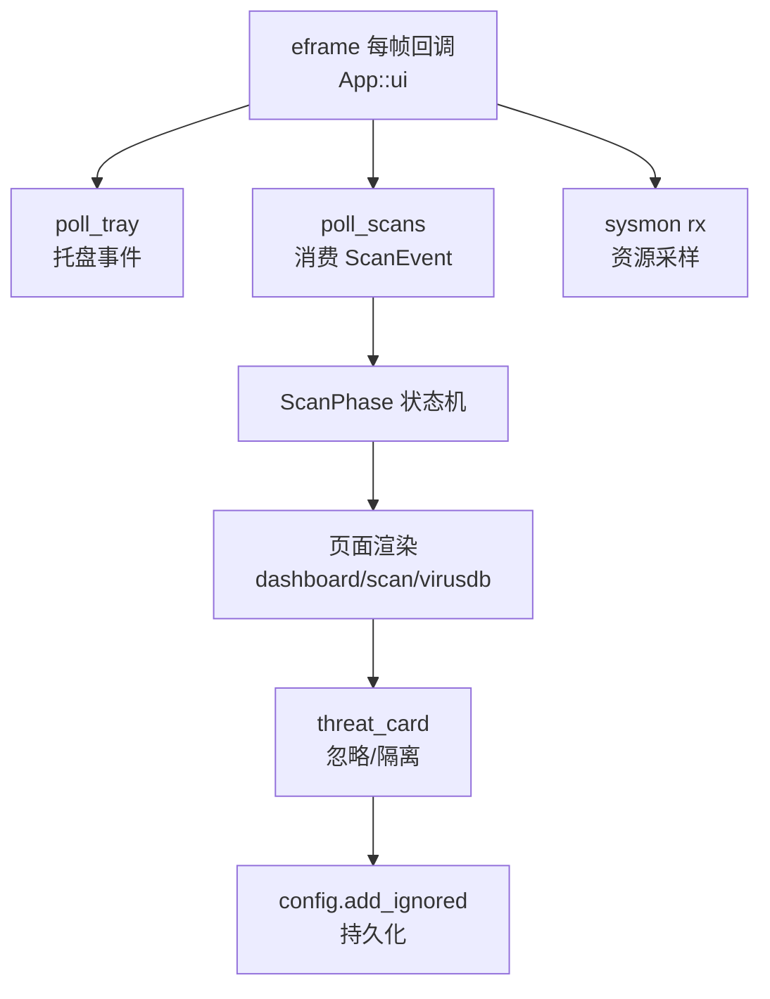

# 主界面编排领域

**模块路径**：`src/app.rs`
**生成日期**：2026-08-09

---

## 概述

`app.rs` 是 CLV3000 的"心脏"——它同时是 UI 渲染器、事件调度中心和状态机。整个程序的生命周期都从 `impl eframe::App for App::ui` 这个每帧回调开始：每帧它都要处理托盘事件、轮询扫描/病毒库/资源监控的结果、渲染四个页面之一、画标题栏和底部资源条、管理 Toast。878 行是全部 16 个源文件里最大的，因为它把"用户看得到的一切"都串起来了。

它解决的问题可以用一个词概括：**编排**。扫描引擎只管"扫"，配置只管"存"，托盘只管"通知"，而 `app.rs` 负责决定这一切在什么时机、以什么顺序、用什么状态呈现给用户。它同时也是后台线程和 UI 状态之间的"翻译官"——后台线程发来的 `ScanEvent` 被 `poll()` 消费，翻译成页面状态 `ScanPhase`，再渲染成圆环、数字、威胁卡片。

如果把整个程序比作一家小店，其他模块是货架、仓库和收银机，`app.rs` 就是那个站在柜台后面、眼观六路的店员：进货（扫描结果）、记账（配置）、招呼客人（用户操作）都在他一个人的节奏里推进。

---

## 核心功能点

1. **四页面导航与渲染**：`Page` 枚举（Dashboard/QuickScan/VirusDb/FullScan）+ 侧边栏（`sidebar`，`src/app.rs:470-514`）切页；`dashboard_page`/`quick_scan_page`/`virus_db_page`/`full_scan_page` 四个渲染函数（`src/app.rs:544-839`）。仪表盘用上次扫描摘要计算"安全/存在风险"状态（`src/app.rs:544-557`）。

2. **扫描状态机**：`ScanPageState` 持有 `ScanPhase`（Idle/Enumerating/Scanning/Done），`start()` spawn 扫描线程、`request_cancel()` 置取消标记、`poll()` 每帧消费事件并推进状态（`src/app.rs:28-172`）。这是闪电/全盘两个页面共享的同一套状态机，用 `ScanKind` 区分。

3. **威胁展示与忽略**：`FileScanned` 事件里的检出威胁（除非 `config.is_ignored`）累积成 `Threat` 列表；页面用 `widgets::threat_card` 渲染，忽略→移出列表并 `config.add_ignored`，隔离→toast 提示"后续版本提供"（`src/app.rs:129-146, 779-803`）。

4. **托盘事件轮询**：`poll_tray` 每帧从 `TrayIconEvent::receiver()` 和 `MenuEvent::receiver()` 取事件：双击/显示→显示窗口；闪电扫描→切页+启动扫描；退出→`allow_exit=true` + 关闭命令（`src/app.rs:277-309`）。

5. **病毒库更新**：`VirusDbState` 管理更新状态，`run_freshclam` 调 freshclam 子进程，结果以 toast 呈现（`src/app.rs:174-233, 334-339`）。

6. **自绘标题栏与关闭拦截**：无系统边框（`with_decorations(false)`，`src/main.rs:45`），标题栏由 `title_bar` 自绘，拖拽区用 `ViewportCommand::StartDrag`；关闭按钮默认拦截为"隐藏到托盘"（`src/app.rs:352-355, 408-461`）。

7. **Toast 通知**：`toasts` 向量 + `widgets::show_toasts`，右下角浮层，2.6 秒后过期清理（`src/app.rs:267-269, 362`）。

---

## 关键组件

| 组件/类型 | 文件路径 | 核心职责 |
|---------|---------|---------|
| `App` | `src/app.rs:235` | eframe::App 实现，持有全部页面状态与资源句柄 |
| `ScanPageState` | `src/app.rs:49` | 单个扫描页的状态机：phase/cancel/rx/threats |
| `VirusDbState` | `src/app.rs:174` | 病毒库更新状态与结果接收 |
| `ScanPhase` | `src/app.rs:28` | 扫描页生命周期：Idle/枚举/扫描/完成 |
| `Page` | `src/app.rs:20` | 四个页面枚举 |
| `run_freshclam()` | `src/app.rs:213` | freshclam.exe 子进程封装 |

这些类型的分层很清晰：`Page` 决定"用户在哪个页面"，`ScanPhase` 决定"扫描进行到哪一步"，`ScanPageState` 把这两件事绑在一起管理具体一个扫描页的全部状态（接收端、取消标记、威胁列表），`VirusDbState` 则独立管理病毒库更新的生命周期。`App` 是承载这一切的顶层容器。

---

## 内部数据流

**关键步骤说明**：
1. 每帧 `ui()`：先做所有 poll（托盘/扫描/病毒库/资源），把外部变化收敛进 `App` 的字段（`src/app.rs:357-365`）。
2. 再画标题栏、底部资源条、侧边栏、当前页面（`src/app.rs:367-402`）。
3. 扫描事件在 `poll` 内翻译：`FileScanned`→`ScanPhase::Scanning` + 威胁入列；`Finished`→`Done`（`src/app.rs:113-171`）。
4. 完成后写 `ScanRecord` 到配置并保存（`src/app.rs:311-333`）。

---

## 关键接口与扩展点

`app.rs` 实现 `eframe::App` trait（`impl eframe::App for App`，`src/app.rs:235` 起），这是它与框架的唯一契约：框架每帧调用 `ui(&mut self, ctx, frame)`，程序的所有推进都发生在这个回调里。因为 egui 是即时模式，没有"事件处理器注册"这类机制，扩展页面非常简单——新增一个 `Page` 枚举变体、写一个渲染函数、在 `sidebar` 加一项，就多了一个页面。

`ScanEvent` 是它消费后台结果的主要"接口"（`src/scan/mod.rs:25-45`）。`ScanPageState::poll()` 返回 `Option<(scanned, elapsed, cancelled)>` 这个完成三元组，让"推进状态"与"触发摘要保存"一次调用同时满足——这是它给内部其他逻辑暴露的一个精巧的钩子（`src/app.rs:113-171`）。

---

## 与其他模块的交互

| 交互模块 | 方向 | 接口/协议 | 说明 |
|---------|------|---------|------|
| `scan::quick_scan` / `scan::full_scan` | 依赖 | `ScanEvent`/`CancelFlag`/`ScanKind` | spawn 扫描线程、轮询事件 |
| `config::AppConfig` | 依赖 | `load/save/is_ignored/add_ignored` | 配置读写、忽略判断 |
| `sysmon::SysMonHandle` | 依赖 | `rx.try_recv` → `ResourceSample` | 资源采样轮询 |
| `tray::Tray` | 依赖 | `TrayMenuIds`、事件 channel | 托盘菜单分发 |
| `widgets`/`theme`/`icons` | 依赖 | `progress_ring`/`threat_card`/`Toast` 等 | UI 原语 |
| `paths` | 依赖 | `freshclam_path`/`clamav_database_dir` | 子进程与病毒库定位 |

---

## 跨模块协作场景

> 本模块在核心业务流程中的角色（引用领域模块报告中的 business_flows）

**在"闪电扫描/全盘扫描"流程中**：`app.rs` 是两套扫描的**编排中枢**。用户点击按钮 → `ScanPageState::start`（`src/app.rs:74`）spawn 对应扫描线程并持有接收端 → 每帧 `poll` 消费 `ScanEvent`、推进 `ScanPhase`、渲染进度与威胁 → 完成后把 `ScanRecord` 摘要写进配置（`src/app.rs:311-333`）。它是后台线程与用户之间唯一的"翻译官"。

**在"托盘交互"流程中**：`poll_tray`（`src/app.rs:277`）是托盘菜单的执行者——托盘"闪电扫描"被实现为"切到闪电扫描页 + 立即启动扫描"；托盘"退出"通过 `allow_exit` 门闩先放行再关闭（`src/app.rs:304-307`）。

**在"病毒库更新"流程中**：`VirusDbState::start_update`（`src/app.rs:187`）spawn `run_freshclam` 线程，结果以 toast 呈现（`src/app.rs:334-339`），失败不中断主流程。

---

## 性能考量

- **每帧 `try_recv` 而非阻塞**：所有 channel 都用 `try_recv` 非阻塞取，空队列一帧只花一次 syscall，UI 不会卡。
- **`request_repaint_after(250ms)` 节奏**：既有扫描进度时按需重绘，又保证窗口隐藏时托盘/进度事件在几百毫秒内被拾取（`src/app.rs:364-365`）。
- **状态最小化**：页面状态（`ScanPhase`）都是轻量枚举/数字/小向量，没有大对象跨线程；`Threat` 列表是唯一累积状态，受威胁数约束。
- **egui 即时模式**：无 DOM 增量更新，每帧全量绘制；对单窗口四页面的工具来说开销可接受，且天然无状态泄漏。

---

## 实现亮点

- **一次 `poll` 返回完成三元组**：`poll()` 返回 `Option<(scanned, elapsed, cancelled)>`，恰好一次调用同时满足"推进状态"与"触发保存"两个需求（`src/app.rs:113-171`）。
- **关闭拦截的 `allow_exit` 门闩**：普通关闭被 `CancelClose` 拦下并隐藏，只有托盘"退出"才先置 `allow_exit` 再发 `Close`——一个布尔值区分了"想藏起来"和"真想走"（`src/app.rs:304-307, 352-355`）。
- **egui 0.36 的 Panel 新用法**：`egui::Panel::bottom/left/top` + `CentralPanel` 直接消费传入的 `ui`，配合 `ui.ctx().clone()`（Arc 克隆）解决上下文借用（`src/app.rs:344-349` 注释详细解释了 API 迁移）。
- **`truncate`/`format_duration` 两个小工具**：路径截断（防卡片溢出）和秒数格式化（"3 分 25 秒"）都是自写几行，避免引额外依赖。
