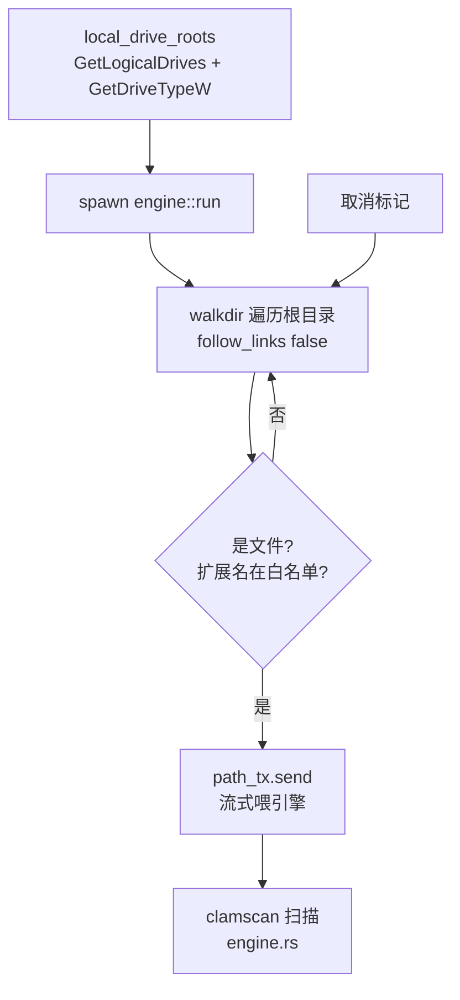

# 全盘扫描领域

**模块路径**：`src/scan/full_scan.rs`
**生成日期**：2026-08-09

---

## 概述

如果说闪电扫描是"只查活跃进程"，那么全盘扫描就是"把机器整个翻一遍"——它是闪电扫描发现可疑但无法定论时，或用户想要彻底放心时的最终手段。这个模块负责**枚举磁盘上所有候选文件**并交给扫描引擎，它扫的是"存量"——磁盘上的可执行文件，不管此刻是否在运行。

全盘扫描最核心的设计是"**边发现边喂**"：遍历目录树的循环每遇到一个命中文件，就立刻把路径发进 channel 交给 `engine.rs`，而不是先攒一个完整列表。这个选择和闪电扫描形成鲜明对比：因为磁盘文件量未知（可能几十万），攒完整列表既浪费内存（要保存全部路径），又让用户看不到进度。流式喂给 clamscan 后，UI 的"已扫描 N 个"会持续跳动，用户立刻能感觉到机器在工作（设计意图注释在 `src/scan/full_scan.rs:3-5`）。

同时它很克制：**只扫可执行文件，不做全文件扫描**。扩展名白名单 `exe/dll/sys/scr/com/cpl/ocx/drv` 决定了哪些文件值得交给杀毒引擎——普通文档、图片等不需要签名比对。这既控制了扫描时间，也避免了误报噪音。

---

## 核心功能点

1. **磁盘根目录枚举与类型判定**：`local_drive_roots()` 用 `GetLogicalDrives()` 拿到盘符位图，对每个存在的盘符 `GetDriveTypeW()` 查询类型：`DRIVE_FIXED`(3) 固定盘默认纳入，`DRIVE_REMOVABLE`(2) 按 `include_removable` 配置决定（`src/scan/full_scan.rs:70-91`）。这样不会傻扫光驱/网络盘，扫描时间可控。

2. **目录树遍历**：`walkdir` 从每个根目录递归遍历，`follow_links(false)` 防止符号链接成环（`src/scan/full_scan.rs:34-37`）；`filter_map(|e| e.ok())` 静默跳过读不了的条目（权限/损坏目录），保证一个坏目录不会中断整盘扫描。

3. **扩展名白名单过滤**：`has_executable_extension()` 大小写不敏感地比对 `EXECUTABLE_EXTENSIONS` 常量表（`src/scan/full_scan.rs:15, 58-67`）。非文件跳过、非白名单跳过，只有命中的才 `path_tx.send()`。

4. **边发现边喂 + 取消贯穿**：每个循环迭代都检查取消标记，命中文件立即入 channel；channel 断开（引擎结束/失败）则 `break 'roots` 跳出全部根目录循环（`src/scan/full_scan.rs:39-51`）。

5. **先起引擎再遍历**：注意和闪电扫描相反的启动顺序——`full_scan::run` 一进来就 spawn `engine::run`，然后才遍历（`src/scan/full_scan.rs:23-31`）。因为全盘没有总数，先让引擎（和它的写入线程）就位，路径边走边喂。

---

## 关键组件

| 组件/类型 | 文件路径 | 核心职责 |
|---------|---------|---------|
| `run(tx, cancel, include_removable)` | `src/scan/full_scan.rs:22` | 入口：起引擎→遍历磁盘→流式喂路径，阻塞执行 |
| `EXECUTABLE_EXTENSIONS` 常量 | `src/scan/full_scan.rs:15` | 参与扫描的 8 种可执行扩展名白名单 |
| `has_executable_extension(path)` | `src/scan/full_scan.rs:58` | 大小写不敏感的白名单判断 |
| `local_drive_roots(include_removable)` | `src/scan/full_scan.rs:70` | 枚举本机磁盘根，按类型过滤 |

这张表里最值得注意的一点是：全盘扫描自己的"业务逻辑"其实只有三个小函数，而真正的扫描能力全部来自复用的 `engine::run`。它和闪电扫描一样，本质上是"路径生产者"——区别只在于它的生产方式是"逛完整个磁盘"，而不是"翻看活跃进程的口袋"。

---

## 内部数据流

**关键步骤说明**：
1. 先 spawn 引擎线程（`src/scan/full_scan.rs:27-29`），建立"接收通道"。
2. `local_drive_roots` 拿根目录列表（`src/scan/full_scan.rs:31`）。
3. 对每个根目录 `walkdir` 遍历，命中白名单文件立即入 channel（`src/scan/full_scan.rs:33-51`）。
4. 遍历完 `drop(path_tx)` 关通道（EOF 信号），`engine_thread.join()` 等引擎收尾（`src/scan/full_scan.rs:54-55`）。

---

## 关键接口与扩展点

全盘扫描对外暴露的入口是 `run(tx: Sender<ScanEvent>, cancel: CancelFlag, include_removable: bool)`，比闪电扫描多了一个 `include_removable` 参数——这是它连接配置模块的"旋钮"：用户在界面上勾选"包含可移动磁盘"后，`app.rs` 读取 `config.scan_removable_drives`（`src/config.rs:28-30`）再传给本模块。这个参数本质上是一个"扫描范围控制点"。

未来若想扩展扫描范围（比如加"扫描指定文件夹"或"扫网络映射盘"），本模块是最自然的落点：`local_drive_roots` 换成更灵活的分组器即可，下游的遍历与喂路径逻辑完全不用动。

---

## 与其他模块的交互

| 交互模块 | 方向 | 接口/协议 | 说明 |
|---------|------|---------|------|
| `scan::engine` | 依赖 | `engine::run` + `path_tx` | 边发现边喂路径，由引擎驱动 clamscan |
| `scan::mod` | 依赖 | `ScanEvent` / `CancelFlag` | 共享的事件类型与取消契约 |
| `config` | 间接依赖 | `scan_removable_drives` | 决定是否包含可移动盘 |
| `app.rs` | 被依赖 | `full_scan::run(tx, cancel, include_removable)` | 全盘扫描页的启动入口 |
| windows crate | 依赖 | `GetLogicalDrives` / `GetDriveTypeW` | 磁盘枚举与类型判定 |

---

## 跨模块协作场景

> 本模块在核心业务流程中的角色（引用领域模块报告中的 business_flows）

**在"全盘扫描"流程中**：全盘扫描是核心流程（importance 9）的执行者。用户在仪表盘点击"全盘扫描"或在全盘扫描页勾选可移动盘后开始，`app.rs` 调用 `ScanPageState::start`（`src/app.rs:74`）spawn 本模块的 `run`。具体参与：
- `local_drive_roots` 枚举并过滤磁盘根（`src/scan/full_scan.rs:70`），固定盘默认纳入，可移动盘看配置。
- `walkdir` 边遍历边把白名单文件流式喂给 `engine::run`（`src/scan/full_scan.rs:34-51`）。
- 引擎把每个文件的检出结果以 `ScanEvent::FileScanned` 发回，`app.rs` 的 `poll`（`src/app.rs:113-171`）收集威胁并渲染。

**在"仪表盘系统状态"场景中**：全盘扫描的完成摘要（`ScanRecord`）被写入配置的 `last_full_scan`，仪表盘据此计算"系统状态：安全/存在风险"（`src/app.rs:544-557`）——本模块的扫描结论是这台机器"干不干净"的重要判断依据。

---

## 性能考量

- **流式零缓冲**：路径不驻留内存，遍历器 + channel + 子进程 stdin 是一条直通管道，内存占用与磁盘文件总数无关。
- **类型过滤前置**：在 `PathBuf` 进入 channel 前就用扩展名过滤掉绝大部分无关文件，减少 channel 与子进程的 IO 量。
- **符号链接不跟随**：`follow_links(false)` 避免链接循环导致的无限遍历和重复扫描。
- **可移动盘默认关闭**：`scan_removable_drives` 默认 `false`，防止用户点一下全盘扫描就扫进 U 盘导致时间失控（`src/config.rs:28-30` 注释说明了设计意图）。

---

## 实现亮点

- **与闪电扫描的"启动顺序"对比**：全盘"先起引擎再遍历"、闪电"先枚举再起引擎"，是同一台引擎面对不同信息可得性（有没有总数）时给出的不同调度方案——两个生产者、同一个消费者，代码复用率 100%。
- **`'roots` 带标签循环**：`break 'roots` 在嵌套遍历中一次性跳出所有根目录，取消/失败时干净利落（`src/scan/full_scan.rs:33, 40`）。
- **错误容忍遍历**：`filter_map(|e| e.ok())` 一行代码同时处理了"读不了目录""遍历出错""权限拒绝"三种异常，把防御逻辑压到最小。
