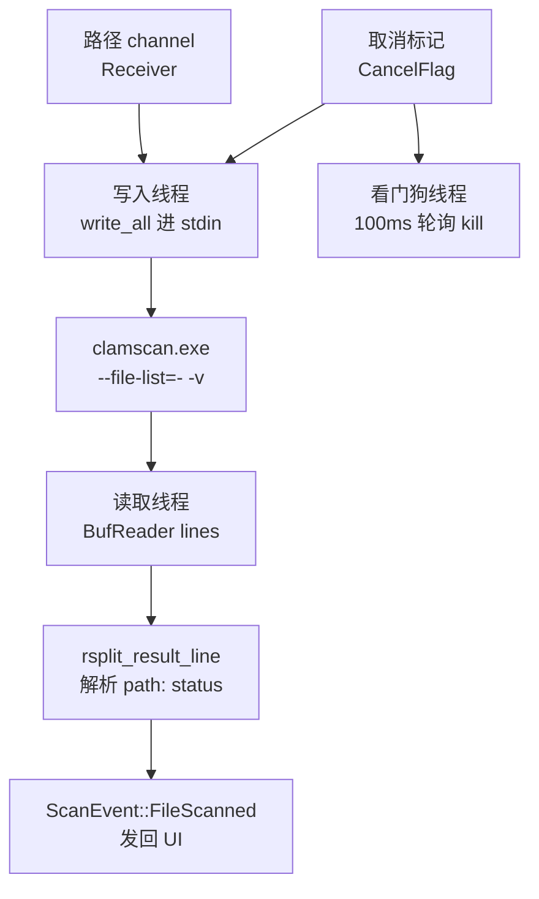

# 扫描引擎领域

**模块路径**：`src/scan/engine.rs`
**生成日期**：2026-08-09

---

## 概述

扫描引擎是 CLV3000 里**唯一一个和 ClamAV 打交道的地方**。如果把整个扫描流程比作一条流水线，那么 `engine.rs` 就是"机器本身"——流水线上的工人（闪电扫描/全盘扫描）只负责把原料（文件路径）搬到传送带上，真正把每个文件拿去比对病毒签名的，是这一台机器。它把"启动子进程 → 喂路径 → 逐行收结果 → 翻译成事件"这四件事封装成一个阻塞函数 `run()`，调用方只需要 spawn 一个线程喂它。

它存在的意义有两层。第一层是**去重**：闪电扫描和全盘扫描都需要相同的"调 clamscan"逻辑，如果不抽出来，代码会复制两份，而且很可能各自写出不同的错误处理。第二层是**性能**：它只 spawn 一次 `clamscan.exe`，用 `--file-list=-` 从 stdin 流式读路径——这样既不用等完整文件列表攒齐，也不用为每个文件重新加载一次病毒库（模块头注释 `src/scan/engine.rs:3-8` 明说）。这是"一台机器扫整条流水线"的设计。

引擎的输出是标准化的 `ScanEvent` 事件流（`src/scan/mod.rs:25-45`），这让两个截然不同的扫描策略（闪电/全盘）共用同一个事件协议，UI 端只需要一套 `poll` 逻辑。

---

## 核心功能点

1. **流式 stdin 喂路径**：启动 `clamscan.exe` 时用 `--file-list=-` 声明"路径从标准输入来"，写入线程把 channel 里的路径逐行 `write_all` 进 stdin（`src/scan/engine.rs:111-123`）。写完显式 `drop(stdin)` 关闭管道——这是给 clamscan 的"路径喂完了"信号。它让扫描可以"边走边扫"，用户立刻能看到进度。

2. **逐文件结果解析**：配合 `-v` 参数，clamscan 对每个文件输出一行 `path: OK` 或 `path: VirusName FOUND`。读取线程用 `BufReader::lines()` 逐行读，`rsplit_result_line` 从右边 `: ` 切分（Windows 路径的 `C:\` 不含"冒号+空格"，切分安全），`parse_infected` 把 `OK` 翻译成干净、把 `X FOUND` 翻译成病毒名（`src/scan/engine.rs:125-140, 162-173`）。解析容错但不漏报：坏行跳过，非 OK 一律按检出处理。

3. **双保险取消机制**：写入线程检测到取消标记就停止喂路径并关闭 stdin（软取消，等 clamscan 自然结束）；同时看门狗线程每 100ms 轮询取消标记，一旦置位直接 `child.kill()`（硬取消，立刻杀掉子进程）（`src/scan/engine.rs:92-107`）。`Arc<Mutex<Child>>` 在三个线程间共享子进程句柄。

4. **引擎缺失/启动失败的优雅降级**：`clamscan_available()` 为假时发 `Error` 事件（带路径提示）再发 `Finished{scanned:0}`；spawn 失败、stdin/stdout 拿不到时同样发 Error 并 `child.kill()`（`src/scan/engine.rs:31-42, 60-88`）。UI 收到 Error 显示"找不到扫描引擎"，状态正常复位——程序不会因为环境不全而崩溃。

---

## 关键组件

| 组件/类型 | 文件路径 | 核心职责 |
|---------|---------|---------|
| `run(path_rx, tx, cancel)` | `src/scan/engine.rs:30` | 阻塞函数：消费路径、驱动子进程、广播事件；由调用方 spawn 线程 |
| `rsplit_result_line(line)` | `src/scan/engine.rs:162` | 从 clamscan 输出行右边切出 `path` 与 `status` |
| `parse_infected(status)` | `src/scan/engine.rs:166` | 把 `OK`→无威胁、`X FOUND`→病毒名 |
| `CREATE_NO_WINDOW` 常量 | `src/scan/engine.rs:25` | Win32 标记 `0x0800_0000`，隐藏子进程控制台窗口 |

---

## 内部数据流

**关键步骤说明**：
1. 路径从 `path_rx` 流入写线程，逐行写入子进程 stdin（`src/scan/engine.rs:111-123`）——这是"流式"的体现，不用等列表攒齐。
2. 子进程逐行回 stdout，读线程（当前线程）解析出 `(path, infected)` 并计数，发 `ScanEvent::FileScanned`（`src/scan/engine.rs:125-140`）。
3. 写线程结束 → `drop(stdin)` → 看门狗关停 → `child.wait()` 收尸 → 发 `ScanEvent::Finished`（`src/scan/engine.rs:142-155`）。

---

## 关键接口与扩展点

引擎对外只有一个入口函数 `run(path_rx: Receiver<PathBuf>, tx: Sender<ScanEvent>, cancel: CancelFlag)`，但它实际上是一个"**可插拔路径生产者**"的消费端：只要任何模块能往 `path_rx` 里发 `PathBuf`，就能复用整套扫描能力。当前有两个生产者（闪电扫描、全盘扫描），未来如果新增第三种扫描策略（比如"扫描指定文件夹"），只需写一个新的路径生产者，无需改动引擎本身。

`ScanEvent` 协议（`src/scan/mod.rs:25-45`）是引擎与 UI 之间的唯一契约，四个变体（`Enumerating`/`FileScanned`/`Finished`/`Error`）覆盖了从"开始"到"结束"的完整生命周期。它也是扩展点：新增事件类型时，UI 的 `poll`（`src/app.rs:113-171`）需要同步处理。

---

## 与其他模块的交互

| 交互模块 | 方向 | 接口/协议 | 说明 |
|---------|------|---------|------|
| `scan::quick_scan` | 被依赖 | `engine::run` | 闪电扫描枚举完成后把路径喂给引擎 |
| `scan::full_scan` | 被依赖 | `engine::run` | 全盘扫描边发现边喂 |
| `app.rs` | 被依赖 | `ScanEvent` / `CancelFlag` | UI 消费事件、发起取消 |
| `paths.rs` | 依赖 | `clamscan_path` / `clamav_database_dir` / `clamscan_available` | 定位引擎与病毒库目录 |

---

## 跨模块协作场景

> 本模块在核心业务流程中的角色（引用领域模块报告中的 business_flows）

**在"闪电扫描"中**：引擎扮演"安检机"角色。闪电扫描先枚举进程模块、去重拿到有序列表，然后 spawn `engine::run`（`src/scan/quick_scan.rs:61-65`），把路径逐条喂入；引擎逐行解析 clamscan 输出，把每个文件的检出结果以 `FileScanned` 事件发回 UI。具体参与：
- `quick_scan::run` 通过 mpsc channel 传入路径，引擎负责与子进程的全部 IO。
- 引擎把 `Finished` 事件发回，UI 据此结束进度环、保存扫描摘要。

**在"全盘扫描"中**：引擎同样作为共享消费者，但调度顺序相反——`full_scan::run` 先 spawn 引擎再开始遍历（`src/scan/full_scan.rs:27-29`），路径边走边喂，体现"流式零缓冲"的设计。

**在"取消扫描"中**：引擎的看门狗线程是取消机制的关键执行者——UI 置取消标记后，看门狗 100ms 内 `kill` 子进程，保证取消即时生效（`src/scan/engine.rs:92-107`）。

---

## 性能考量

- **单次子进程启动 + 单次病毒库加载**：闪电扫描和全盘扫描全程只有一次 `clamscan.exe` 启动，路径全部流式喂入，避免重复启动和重复加载病毒库的开销（`src/scan/engine.rs:3-8`）。
- **看门狗 100ms 轮询**：为换取"取消响应及时"，用 100ms 间隔做轮询——够快且几乎不耗 CPU（一个 `sleep` 一个 `AtomicBool` 读取）。
- **`Arc<Mutex<Child>>` 短锁**：写线程与看门狗共享子进程句柄，锁粒度极小、持锁时间极短（`kill`/`wait` 一下），不会成为瓶颈。
- **不引入异步**：整个引擎是阻塞 IO 等待，用线程天然契合"等待子进程"的语义；没有高并发场景，async 只会增加复杂度。

---

## 实现亮点

- **`rsplit_once(": ")` 的切分技巧**：Windows 路径自带 `C:` 盘符，但盘符后紧跟 `\` 而非"冒号+空格"，因此从右边找 `: ` 是安全的（`src/scan/engine.rs:158-161` 专门解释了这个边界）。
- **stdin 关闭即 EOF 契约**：`drop(stdin)` 是给 clamscan 的信号——"路径喂完了"，配合 `--file-list=-` 完成流式协议，无需额外握手。
- **解析容错不漏报**：`parse_infected` 把一切非 `OK` 状态都当作威胁名处理（去掉 ` FOUND` 后缀），宁可多报不可漏报，符合杀毒工具的语义。
