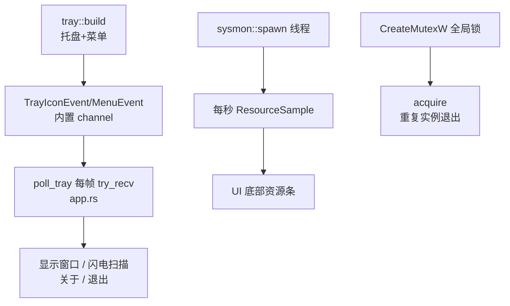

# 系统集成领域

**模块路径**：`src/tray.rs` + `src/sysmon.rs` + `src/single_instance.rs`
**生成日期**：2026-08-09

---

## 概述

系统集成模块是 CLV3000 和 Windows 桌面生态"咬合"的三个齿——**托盘图标**（让程序在后台常驻、随时可唤起）、**资源监控**（告诉用户机器现在吃多少 CPU/内存）、**单实例锁**（防止用户开两个窗口打架）。它们共同定义了程序的"后台行为"：关闭按钮只是藏起来、托盘可以一键闪电扫描、机器资源实时可见、多开自动让位。

这三个功能虽然互相独立，却共享同一个设计哲学：**轻量、可降级、不阻塞主线程**。托盘初始化失败→无托盘继续跑（`src/main.rs:23-29`）；单实例拿不到 Mutex→允许运行（`src/single_instance.rs:21-24`）；资源采样线程是独立的、Drop 时自动停（`src/sysmon.rs:32-36`）。在"老机器 + 可能环境不完整"的定位下，每个系统能力都是"尽力而为"的。

一个值得展开的技术点：托盘事件走**轮询而非事件驱动**。tray-icon 官方推荐 `TrayIconEvent::set_event_handler` + `EventLoopProxy` 立即唤醒事件循环，但 eframe 把 winit 的 `EventLoop` 封装在内部、拿不到 proxy。于是作者改用 `TrayIconEvent::receiver()` / `MenuEvent::receiver()` 内置 channel，由 `App::update` 每帧 `try_recv`，配合 `request_repaint_after` 轮询（模块头注释 `src/tray.rs:3-9` 详细说明了这个取舍：用几百毫秒延迟换不碰 eframe 内部实现）。

---

## 核心功能点

1. **托盘图标与菜单**：`tray::build()` 用 `icon_data::shield_rgba(32, ...)` 生成托盘图标，构建 `Menu`（显示主窗口/闪电扫描/分隔线/关于/退出），记录各 `MenuId` 供分发（`src/tray.rs:29-61`）。`Tray` 结构体特意持有 `icon` 字段并 `#[allow(dead_code)]`——Drop 后托盘图标立刻消失，所以必须一直持有（`src/tray.rs:22-27`）。

2. **托盘事件分发**：`poll_tray` 每帧从两个 channel 取事件：`TrayIconEvent::DoubleClick` → 显示+聚焦；菜单 id 匹配 `show`/`quick_scan`/`about`/`quit` 分别处理（`src/app.rs:277-309`）。闪电扫描菜单项直接切页 + `quick.start()`。

3. **资源监控后台线程**：`sysmon::spawn()` 创建线程：`System::new_all()` 热身一次 CPU 采样（sysinfo 要求两次采样至少间隔 `MINIMUM_CPU_UPDATE_INTERVAL`），然后循环"refresh_cpu_usage + refresh_memory → send(ResourceSample) → 100ms 步进检查停止标记"，实际约每秒一发（`src/sysmon.rs:39-70`）。`SysMonHandle` Drop 时置停止标记（`src/sysmon.rs:32-36`）。

4. **单实例保护**：`single_instance::acquire()` 用 `CreateMutexW(None, true, "Global\CLV3000_SingleInstance_Mutex")` 创建全局具名 Mutex，再用 `GetLastError() == ERROR_ALREADY_EXISTS` 区分"新建成功"与"已存在"（`src/single_instance.rs:11-25`）。拿到的 HANDLE 故意不 close——让 OS 在进程退出时自动释放。

---

## 关键组件

| 组件/类型 | 文件路径 | 核心职责 |
|---------|---------|---------|
| `Tray` / `TrayMenuIds` | `src/tray.rs:15-27` | 托盘图标持有者 + 菜单 id 集合 |
| `tray::build()` | `src/tray.rs:29` | 构造托盘图标与右键菜单（失败返回 Err） |
| `SysMonHandle` / `ResourceSample` | `src/sysmon.rs:10-30` | 资源监控句柄（rx + 停止标记）/ 一次采样 |
| `sysmon::spawn()` | `src/sysmon.rs:39` | 启动采集线程，返回 handle |
| `acquire()` | `src/single_instance.rs:11` | 全局互斥锁：重复启动返回 false |

这三个文件各自只做一件事：`tray` 负责"图标和菜单"，`sysmon` 负责"数据采集"，`single_instance` 负责"进程唯一性"。它们没有任何互相依赖——通过 `app.rs`/`main.rs` 组合进程序，这正是"系统集成"模块名字的由来：不是一个大模块，而是三个贴着 Windows 生态的小零件。

---

## 内部数据流

**关键步骤说明**：
1. `main()` 先 `acquire()`，失败直接 return（第二个实例退出）（`src/main.rs:18-21`）。
2. `tray::build()` 成功则持有 `Tray`；`App::new` 里 `sysmon::spawn()` 常驻采集（`src/app.rs:258`）。
3. 每帧 `poll_tray` 分发托盘命令、`sysmon.rx.try_recv` 更新资源条（`src/app.rs:357-361`）。

---

## 关键接口与扩展点

`tray::build() -> Result<Tray, TrayError>` 是托盘模块的对外接口，失败时 `main.rs` 选择降级运行而非退出（`src/main.rs:23-29`）。`TrayMenuIds`（`src/tray.rs:15-27`）暴露给 `app.rs` 的 `poll_tray` 用于菜单分发——想新增托盘菜单项，只需在 `build` 里加一个 `MenuId`、在 `poll_tray` 里加一个分支。

`SysMonHandle` 对外暴露 `rx`（接收端）与内部的停止标记（`src/sysmon.rs:10-30`），`app.rs` 每帧 `try_recv` 一次采样；`ResourceSample` 是它推给 UI 的唯一数据类型。新增监控指标只需扩展 `ResourceSample` 结构体。

`acquire() -> bool` 是最简单也最清晰的接口：true 表示"我是唯一实例"，false 表示"已有实例在跑"。返回布尔值而非错误，语义直白。

---

## 与其他模块的交互

| 交互模块 | 方向 | 接口/协议 | 说明 |
|---------|------|---------|------|
| `app.rs` | 被依赖 | `poll_tray` 消费事件、`last_sample` 渲染 | 事件分发与展示 |
| `main.rs` | 被依赖 | `tray::build()`、`sysmon::spawn()` | 启动装配 |
| `icon_data` | 依赖 | `shield_rgba` | 托盘图标数据 |

---

## 跨模块协作场景

> 本模块在核心业务流程中的角色（引用领域模块报告中的 business_flows）

**在"托盘交互"流程中**：本模块是**后台行为的执行者**。`tray::build` 建好图标与菜单（`src/tray.rs:29-61`），`app.rs` 的 `poll_tray`（`src/app.rs:277`）每帧消费事件——双击唤醒窗口、菜单"闪电扫描"直接触发一次扫描、菜单"退出"通过 `allow_exit` 门闩真正结束进程。

**在"资源监控"流程中**：`sysmon::spawn()`（`src/sysmon.rs:39`）在程序启动时即常驻后台，每秒把 `ResourceSample` 推给 UI，渲染为底部资源条（`src/app.rs:359-361`）——它是仪表盘"机器健康感"的数据来源。

**在"程序启动"流程中**：`acquire()`（`src/main.rs:18-21`）是第一个执行的动作，保证整个程序只有一个实例；`tray::build` 失败则以无托盘模式继续，保证老机器上环境不全也能用。

---

## 性能考量

- **托盘轮询几乎零开销**：每帧 `try_recv` 空队列即返回，加上 250ms 重绘节流，后台时 CPU 占用可忽略。
- **资源线程 100ms 步进**：`for _ in 0..10 { sleep(100ms) }` 循环既维持了约 1 秒采样间隔，又让关闭时不用干等一整秒（`src/sysmon.rs:63-68` 注释明说）。
- **无线程间共享可变状态**：`stop` 是 `AtomicBool`，采样值经 channel 单向流动——没有锁、没有竞争。

---

## 实现亮点

- **"Drop 即消失"的句柄语义**：`Tray` 持有一个从不读的 `icon` 字段，纯靠 Drop 析构保证托盘生命周期——用类型系统表达"所有权"而非靠手动清理（`src/tray.rs:22-27`）。
- **`ERROR_ALREADY_EXISTS` 区分新建 vs 打开**：`CreateMutexW` 即使"打开已存在"也返回句柄，必须查 `GetLastError` 才知道是不是第一个实例——这是 Win32 的经典陷阱，代码注释专门点出（`src/single_instance.rs:17-18`）。
- **句柄故意不 close**：Mutex 句柄随进程退出由内核自动释放，显式 close 反而可能造成竞态（`src/single_instance.rs:1-2` 注释）。
