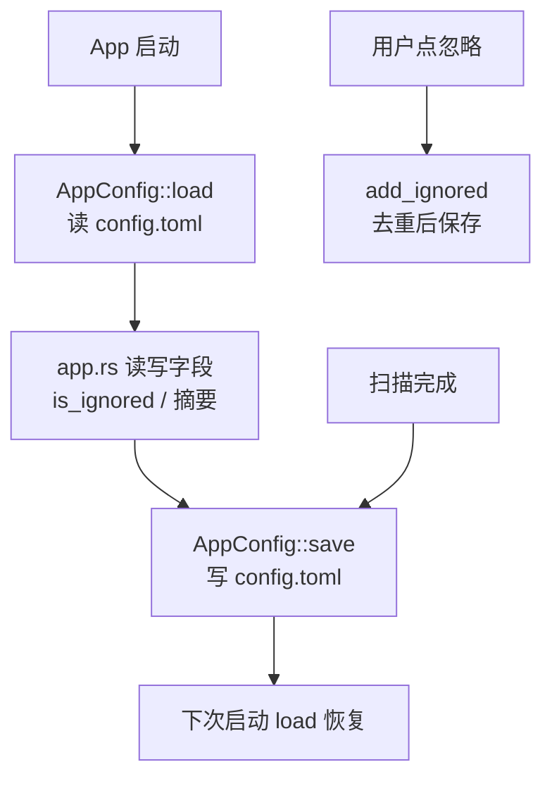

# 配置持久化领域

**模块路径**：`src/config.rs` + `src/paths.rs` + `src/localtime.rs`
**生成日期**：2026-08-09

---

## 概述

配置持久化模块是 CLV3000 的"记忆"——它决定程序重启后还记得什么。整个系统只有三类信息值得记住：**上次扫描的摘要**（让仪表盘能显示"上次全盘扫描·今天 09:12·未发现威胁"）、**用户忽略过的威胁**（同一个文件+病毒名下次不再打扰）、**可移动盘扫描开关**。这些信息量加起来不到几十 KB，用单文件 TOML 恰到好处——`%APPDATA%\CLV3000\config.toml`。

这个模块其实是三个小文件协作：`config.rs` 定义数据结构和读写逻辑，`paths.rs` 负责"配置文件在哪"，`localtime.rs` 提供可序列化的时间戳。三者分工清晰：**数据、定位、时间**。它们的存在让"记得住状态"这件事和业务逻辑解耦——`app.rs` 只需要调 `AppConfig::load()` / `save()` / `is_ignored()` / `add_ignored()`，完全不用关心文件系统细节。

值得强调的设计取舍是**极简**：时间戳不引 chrono（只用 `GetLocalTime`，`src/localtime.rs:1`），路径解析不引任何路径库，配置加载失败直接 `unwrap_or_default` 回退——对一个小工具来说，"跑得起来"远比"功能完整"重要。

---

## 核心功能点

1. **配置读写**：`AppConfig::load()` 读文件 + `toml::from_str`（失败回退默认），`save()` 先 `create_dir_all` 再 `toml::to_string_pretty` 写入（`src/config.rs:33-48`）。`serde` 的 `#[derive(Serialize, Deserialize)]` + `#[serde(default)]` 让新字段自动兼容旧配置文件。

2. **忽略列表**：`IgnoredEntry` 是 `(path, virus_name)` 对；`is_ignored` 精确匹配判断是否该跳过提示，`add_ignored` 去重后追加并保存（`src/config.rs:50-62`）。这是"忽略"按钮背后的数据支撑。

3. **路径集中解析**：`paths.rs` 全部函数式、无状态：`exe_dir()` 用 `current_exe().parent()` 定位，`clamav_dir()`/`clamscan_path()`/`freshclam_path()`/`clamav_database_dir()` 依次拼接，`app_data_dir()` 用 `directories` crate 拿 `%APPDATA%\CLV3000\`（失败回退 exe 目录下 `config\`）（`src/paths.rs:7-45`）。

4. **极简时间戳**：`Timestamp` 只有 5 个字段（年/月/日/时/分，精度到分钟就够），`now()` 调 `GetLocalTime`，`display_relative_to` 渲染"今天 09:12"/"8月8日 09:12"（`src/localtime.rs:6-39`）。

---

## 关键组件

| 组件/类型 | 文件路径 | 核心职责 |
|---------|---------|---------|
| `AppConfig` | `src/config.rs:22` | 配置总类型：扫描摘要×2 + 忽略列表 + 可移动盘开关 |
| `ScanRecord` | `src/config.rs:8` | 一次扫描摘要（时间/威胁数/扫描文件数） |
| `IgnoredEntry` | `src/config.rs:16` | 被忽略的（路径, 病毒名）对 |
| `paths::*` 路径函数族 | `src/paths.rs:7-45` | exe 相对 clamav 目录与 %APPDATA% 配置目录定位 |
| `Timestamp` | `src/localtime.rs:6` | 可 serde 序列化的极简本地时间戳 |

`ScanRecord` 和 `IgnoredEntry` 是配置里真正有业务含义的两类数据：前者回答"上次扫得怎么样"，后者回答"哪些不要烦我"。`AppConfig` 把这两类加上开关字段组合成一个整体；`paths` 和 `localtime` 则是它们的"基础设施"。

---

## 内部数据流

**关键步骤说明**：
1. 启动时 `AppConfig::load()`，路径由 `paths::config_file_path()` 给出（`src/app.rs:254`）。
2. 运行中扫描结束写 `ScanRecord` 摘要（`src/app.rs:311-333`）、点忽略追加 `IgnoredEntry`（`src/app.rs:799-802`）。
3. 每次变更即 `save()` 落盘，下次启动 `load()` 恢复——无内存缓存一致性问题（读已是最新）。

---

## 关键接口与扩展点

配置模块对外的接口就是 `AppConfig` 的四个方法——`load()`、`save()`、`is_ignored(path, virus_name)`、`add_ignored(entry)`（`src/config.rs:33-62`）。它们把"文件系统 + 序列化"完全封装在模块内部，`app.rs` 永远只和内存里的结构体打交道。

`#[serde(default)]`（`src/config.rs:26-31`）是天然的向前兼容扩展点：未来若新增配置字段，老用户没有该字段也能正常反序列化，新字段取默认值。这意味着配置格式的演进不需要迁移脚本。

---

## 与其他模块的交互

| 交互模块 | 方向 | 接口/协议 | 说明 |
|---------|------|---------|------|
| `app.rs` | 被依赖 | `load/save/is_ignored/add_ignored` | 仪表盘状态、威胁忽略、扫描摘要 |
| `scan/engine.rs` | 被依赖 | `paths::clamscan_path/clamav_database_dir` | 定位引擎与病毒库 |
| `scan/full_scan.rs` | 间接 | `paths` | 磁盘枚举无依赖 |
| `localtime` | 依赖 | `Timestamp` | 扫描摘要时间戳（config 复用） |

---

## 跨模块协作场景

> 本模块在核心业务流程中的角色（引用领域模块报告中的 business_flows）

**在"威胁忽略"流程中**：本模块是忽略功能的**数据支撑**。用户在全盘/闪电扫描页点击威胁卡片的"忽略"按钮（`src/app.rs:799-802`），`add_ignored` 把 `(path, virus_name)` 去重后写入配置并保存；下次扫描同一文件时 `is_ignored` 让 `app.rs` 跳过提示（`src/app.rs:129-146`）。

**在"扫描完成"流程中**：闪电/全盘扫描结束后，`app.rs` 把 `ScanRecord`（时间 + 威胁数 + 扫描文件数）写入 `last_quick_scan` 或 `last_full_scan` 并 `save()`（`src/app.rs:311-333`）。仪表盘据此渲染"上次扫描摘要"和"系统状态：安全/存在风险"（`src/app.rs:544-557`）——本模块的持久化让"历史"变得可见。

**在"全盘扫描范围"决策中**：`scan_removable_drives` 开关（`src/config.rs:28-30`）在扫描启动时被 `app.rs` 读取并传给 `full_scan::run`，决定是否包含 U 盘——一个配置位影响了整个扫描的时长。

---

## 性能考量

- **读写时机克制**：只在"扫描完成""点忽略""改开关"三个时机 `save()`，没有高频写盘。
- **文件极小**：几十字节到几十 KB 的 TOML，读写是微秒级，无缓存必要。
- **`create_dir_all` 幂等**：每次保存前确保目录存在，首次运行自动创建。

---

## 实现亮点

- **`#[serde(default)]` 向前兼容**：`ignored` 和 `scan_removable_drives` 加了 default，旧配置文件没有这两个字段也能正常反序列化——新增配置项不会炸掉老用户（`src/config.rs:26-31`）。
- **单实例文件的路径回退链**：`directories` 拿不到配置目录（非常规系统）时回退到 exe 目录下 `config\`，保证绿色版也能持久化（`src/paths.rs:37-41`）。
- **时间戳精度刻意降级到分钟**：杀毒工具的"上次扫描时间"不需要秒级精度，5 字段结构 + `GetLocalTime` 是"够用且零依赖"的范本（`src/localtime.rs:6-13`）。
