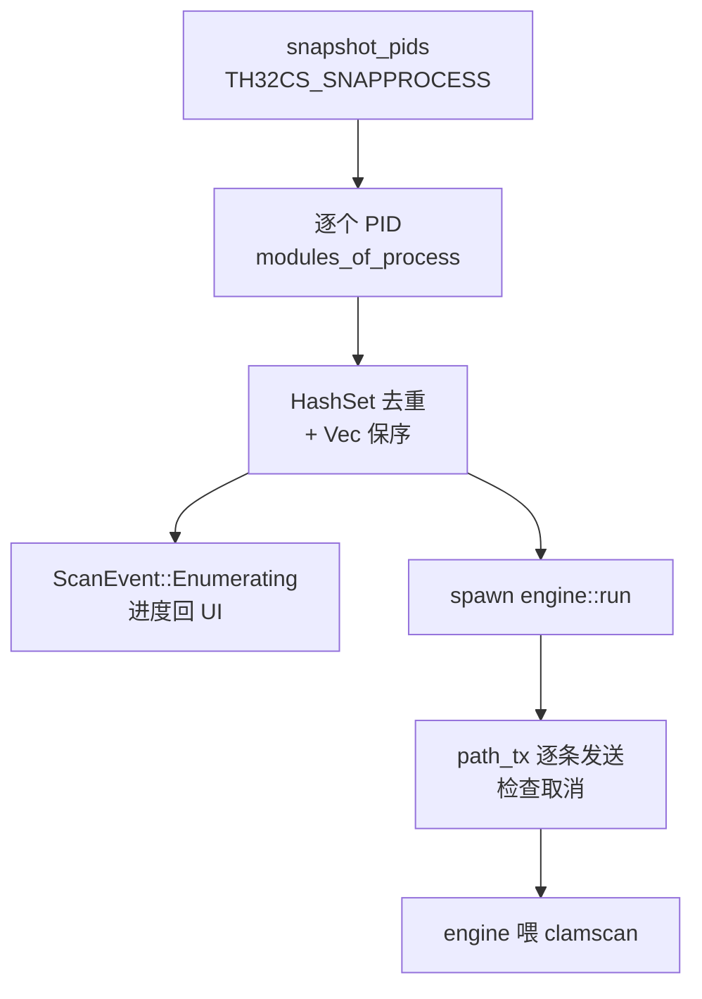

# 闪电扫描领域

**模块路径**：`src/scan/quick_scan.rs`
**生成日期**：2026-08-09

---

## 概述

闪电扫描是 CLV3000 最快的扫描路径，也是整个产品最鲜明的卖点。它和全盘扫描的思路完全不同：**不扫磁盘上所有文件，只扫"此刻正在运行的进程加载了哪些 exe/DLL"**。换句话说，它扫的是"活物"——凡是已经被加载进内存的模块，几乎必然是这台机器上活跃运行的代码。对于一个"怀疑机器被装了东西"的用户，先扫活跃模块是性价比最高的第一动作。

这个模块的角色是"**路径生产者**"：它不负责真正的病毒比对（那归 `engine.rs`），只负责回答一个问题——"现在有哪些文件应该被检查？"答案是：枚举所有进程、逐个枚举每个进程加载的模块（DLL 会包含系统 DLL、浏览器插件、可疑的后门 DLL 等等）、按路径去重、把结果交给引擎。

它选择了两阶段策略而不是边发现边扫：**先把进程和模块枚举完，拿到去重后的完整列表，再启动 clamscan**。这样做的原因是闪电扫描的枚举阶段通常一两秒内就能完成，而"知道总数"能让 UI 画出确定的百分比进度环——这是"信息完整性优先"的取舍（注释在 `src/scan/quick_scan.rs:22-25` 明说）。

---

## 核心功能点

1. **进程快照枚举**：`snapshot_pids()` 用 `CreateToolhelp32Snapshot(TH32CS_SNAPPROCESS)` 拍一次全进程快照，只取 PID 列表（`src/scan/quick_scan.rs:80-102`）。每个进程之后单独开模块快照，避免一次性拿全部进程的模块——那会非常慢且占内存。

2. **进程模块枚举**：`modules_of_process(pid)` 用 `TH32CS_SNAPMODULE | TH32CS_SNAPMODULE32` 快照某个进程的加载模块，从 `MODULEENTRY32W.szExePath` 取出 UTF-16 路径（`wide_to_path` 转 `PathBuf`，`src/scan/quick_scan.rs:105-137`）。32 位进程（Wow64）的模块需要 `TH32CS_SNAPMODULE32` 这个额外标记，所以两个标志都传。

3. **权限容错**：普通用户权限下，部分系统/受保护进程打不开或枚举不到模块，`CreateToolhelp32Snapshot` 返回 Err 时直接返回空列表，计入统计但不阻塞整体（`src/scan/quick_scan.rs:108-110`，模块头注释说明"不是 bug"）。

4. **路径去重**：用 `HashSet<PathBuf>` 做去重（同一个 DLL 被几十个进程共享），同时用 `Vec<PathBuf>` 保住**有序**的完整列表（`src/scan/quick_scan.rs:29-30`）。去重既减少了扫描量，也避免同一威胁被重复显示。

5. **两阶段交给引擎**：枚举完成后 spawn `engine::run`，把有序路径逐条 `path_tx.send()` 给引擎；发送前检查取消标记（`src/scan/quick_scan.rs:61-76`）。

---

## 关键组件

| 组件/类型 | 文件路径 | 核心职责 |
|---------|---------|---------|
| `run(tx, cancel)` | `src/scan/quick_scan.rs:26` | 入口：枚举→去重→两阶段调引擎，阻塞执行 |
| `snapshot_pids()` | `src/scan/quick_scan.rs:80` | 拍进程快照，返回全部 PID |
| `modules_of_process(pid)` | `src/scan/quick_scan.rs:105` | 枚举单进程加载模块，权限不足返回空 |
| `wide_to_path(buf)` | `src/scan/quick_scan.rs:132` | 把 UTF-16 宽字符缓冲区转成 `PathBuf` |

这四件事的组合构成了整个闪电扫描：前两个是"侦察"，负责把系统里跑着什么搞清楚；`wide_to_path` 是侦察兵手里的翻译器，把 Win32 返回的宽字符路径变成 Rust 能舒服处理的 `PathBuf`；`run` 则是总指挥，决定两阶段的调度顺序和取消语义。

---

## 内部数据流

**关键步骤说明**：
1. 进程快照 → 循环里逐进程枚举模块，每处理完一个进程发一次 `ScanEvent::Enumerating`（进度 `done/total` + 已发现文件数）（`src/scan/quick_scan.rs:32-59`）。
2. 去重列表完成后 spawn 引擎线程（`src/scan/quick_scan.rs:61-65`），主线程负责把路径喂给引擎。
3. 喂完 drop `path_tx` 关闭 channel，`engine_thread.join()` 等引擎收尾（`src/scan/quick_scan.rs:75-76`）。取消时：枚举阶段直接发 `Finished{cancelled:true}` 返回；喂路径阶段停止发送（`src/scan/quick_scan.rs:39-46, 67-74`）。

---

## 关键接口与扩展点

闪电扫描对外暴露的接口只有 `run(tx: Sender<ScanEvent>, cancel: CancelFlag)` 一个函数，没有返回值和复杂的状态对象——它和 UI 的交流完全通过 `ScanEvent` 事件流（`src/scan/mod.rs:25-45`）完成。调用方（`app.rs` 的 `ScanPageState::start`，`src/app.rs:74`）只需要：spawn 线程、持有事件接收端、置取消标记。这种"函数即接口"的设计让扫描策略之间可以无缝互换。

它也是 `engine::run` 的"路径生产者"之一。要增加新的扫描策略（比如"扫描某文件夹"），只需要再写一个实现了"枚举 → 发 `ScanEvent` → 喂 `path_rx`"的函数，UI 侧几乎零改动。

---

## 与其他模块的交互

| 交互模块 | 方向 | 接口/协议 | 说明 |
|---------|------|---------|------|
| `scan::engine` | 依赖 | `engine::run` + `path_tx` | 枚举完成后把去重路径流式喂给引擎 |
| `scan::mod` | 依赖 | `ScanEvent` / `CancelFlag` / `ScanKind` | 共享的事件类型与取消契约 |
| `app.rs` | 被依赖 | `quick_scan::run(tx, cancel)` | `ScanPageState::start` 的闪电扫描分支 |
| windows crate | 依赖 | ToolHelp API（`CreateToolhelp32Snapshot` 等） | 进程/模块枚举 |

---

## 跨模块协作场景

> 本模块在核心业务流程中的角色（引用领域模块报告中的 business_flows）

**在"闪电扫描"流程中**：闪电扫描是核心流程（importance 10）的执行者。用户在仪表盘、闪电扫描页或托盘菜单触发后，`app.rs` 调用 `ScanPageState::start`（`src/app.rs:74`），spawn 本模块的 `run`。具体参与：
- `snapshot_pids` 枚举进程（`src/scan/quick_scan.rs:80`）→ `modules_of_process` 逐个枚举模块（`src/scan/quick_scan.rs:105`）。
- 去重后的有序路径交给 `engine::run`（`src/scan/quick_scan.rs:61-65`），由引擎驱动 clamscan 完成签名比对。
- 每个 `ScanEvent` 被 `app.rs` 的 `poll` 消费（`src/app.rs:113-171`），推进 `ScanPhase` 状态机、渲染进度环和威胁卡片。

**在"威胁忽略"流程中**：闪电扫描页展示的威胁卡片来自本模块枚举的文件，用户点"忽略"后 `config.add_ignored` 记下 `(path, virus_name)`，下次扫描该文件时 `app.rs` 不再重复提示——本模块的产物是忽略列表的数据来源。

---

## 性能考量

- **只扫活跃模块**：进程模块数量级远小于磁盘文件数，这是"闪电"二字的根源。
- **进程级快照而不是全局快照**：先拿 PID 列表，再逐个开小快照，避免一次 `TH32CS_SNAPMODULE` 全系统快照的卡顿。
- **`TH32CS_SNAPMODULE32` 双标志**：确保 32 位进程（Wow64）的模块也能枚举到，避免漏检。
- **去重 `HashSet`**：DLL 共享场景下可减少重复扫描数十倍。

---

## 实现亮点

- **两阶段进度的"总数先知"**：与全盘扫描"不知道总数只能显示已扫个数"相反，闪电扫描特意先枚举拿总数再扫，UI 能显示确定的百分比——这是对"用户最关心进度是否确定"这一心理的洞察（`src/scan/quick_scan.rs:22-25`）。
- **有序 + 去重并行维护**：`HashSet` 判重、`Vec` 保序的经典组合，既去重又不丢失枚举顺序（`src/scan/quick_scan.rs:29-30`）。
- **取消语义贯穿两阶段**：枚举中、喂路径中、引擎运行时三个阶段都检查取消，用户点取消任何时刻都能快速停下来。
