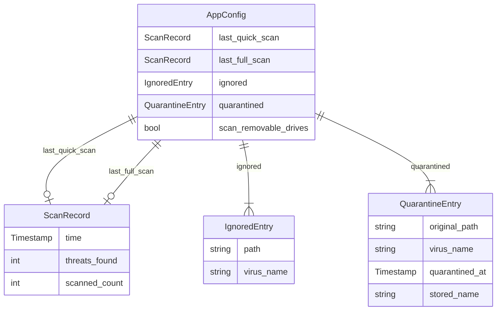

# Database Overview

CLV3000 does not use a traditional relational database, ORM, or SQL migration system. This is a deliberate architectural choice: the application targets portable USB deployment and resource-constrained legacy hardware, where adding SQLite or similar dependencies would increase binary size and complexity without proportional benefit.

Instead, all persistent state lives in human-readable flat files under the user's application data directory. This section explains what data is stored, where, and how the pieces relate.

## Persistence Strategy

Think of CLV3000's data layer as a filing cabinet rather than a database server. Each drawer holds a specific kind of record, and the application reads/writes whole files rather than executing queries.

| Storage | Path (relative to app data dir) | Format | Purpose |
|---------|--------------------------------|--------|---------|
| User configuration | `config.toml` | TOML | Scan history, ignored threats, quarantine records, settings |
| Content scan cache | `scan_cache.tsv` | TSV | Maps blake3 content hash → scan result + DB revision |
| Path hash index | `scan_cache_paths.tsv` | TSV | Maps file path → (size, mtime, hash) for fast re-hash skip |
| Scan request IPC | `scan_request.txt` | Plain text | Temporary file for forwarding scan paths between instances |
| Instance lock | `clv3000.sock` | Unix socket | macOS single-instance lock file |

**App data directory resolution** (`src/paths.rs`):
- Windows: `%APPDATA%\CLV3000\`
- macOS: `~/Library/Application Support/CLV3000/`

## Configuration Schema (config.toml)

The `AppConfig` struct in `src/config.rs:33-44` defines the schema:

### ScanRecord

Stores summary of a completed scan for display on the dashboard.

| Field | Type | Description |
|-------|------|-------------|
| `time` | Timestamp | When the scan completed |
| `threats_found` | usize | Number of threats detected |
| `scanned_count` | usize | Total files scanned |

### IgnoredEntry

A user decision to suppress future alerts for a specific path + virus name combination.

| Field | Type | Description |
|-------|------|-------------|
| `path` | String | Full path to the file |
| `virus_name` | String | ClamAV detection name |

Checked during scan event processing in `apply_scan_event` (`src/app/core/scan_state.rs:134-136`).

### QuarantineEntry

Metadata for a file moved to the quarantine directory.

| Field | Type | Description |
|-------|------|-------------|
| `original_path` | String | Where the file came from |
| `virus_name` | String | Detection name at quarantine time |
| `quarantined_at` | Timestamp | When quarantine occurred |
| `stored_name` | String | Filename in quarantine dir (blake3-derived, `.quarantined` suffix) |

## Scan Cache Schema

The content cache (`src/scan/cache.rs`) uses TSV format with security constraints:

- Each entry records the virus database revision (`dbrev`) at scan time — entries become invalid when freshclam updates signatures
- TTL of 30 days (`TTL_SECS` at `src/scan/cache.rs:30`)
- Maximum 200,000 entries with LRU eviction (`MAX_ENTRIES` at `src/scan/cache.rs:33`)

This ensures new signatures can detect previously "clean" cached files while keeping disk usage bounded on low-end machines.

## Why No SQL Database

| Consideration | File-based approach | SQL alternative |
|---------------|--------------------|-----------------|
| Portability | Copy one directory to backup/restore | Requires DB file + schema migration |
| Binary size | Zero additional dependencies | SQLite adds ~1MB+ to binary |
| Complexity | serde + toml (already in dependency tree) | ORM, migrations, connection pooling |
| Query needs | Simple load-all / append / filter-by-key | Overkill for <200K cache entries |

For CLV3000's scale and deployment model, flat files are the right trade-off.
