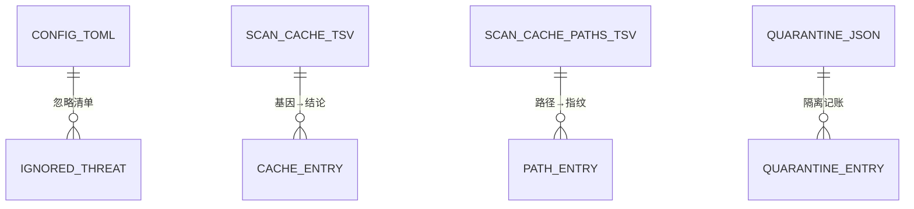

# CLV3000 数据库概览

**本项目未检测到数据库相关文件。**

## 为什么没有数据库

对 CLV3000 做数据库触发条件扫描（`.sql`/`.sqlproj` 文件、`migrations/`、`sql/`、`db/`、`database/` 目录、ORM 依赖、数据库配置文件），全部未命中。这是一个有意的架构决策，而不是疏忽：

- 数据量小且结构简单——配置几十 KB、缓存最多 20 万条、记账最多数千条，没有引入数据库引擎的必要；
- 杀毒工具的便携性要求——数据库意味着额外的运行时依赖、更大的分发包、更复杂的数据目录；TSV/TOML 纯文本文件让"插上 U 盘就能用"和"损坏时可手工救援"成为可能；
- 全项目 `Cargo.toml` 中没有任何 ORM/数据库依赖（依赖清单见 `1.概述.md` 技术选型）。

## "准持久化"文件清单

CLV3000 的持久化是四个纯文本/JSON 文件，全部位于 `app_data_dir`（Windows `%APPDATA%\CLV3000`，macOS `~/Library/Application Support/CLV3000`）：

| 文件 | 格式 | 内容 | 管理代码 |
|------|------|------|---------|
| `config.toml` | TOML | 扫描设置、忽略清单、上次扫描信息 | `src/config.rs` |
| `scan_cache.tsv` | TSV | 文件基因（BLAKE3）→ 扫描结论缓存 | `src/scan/cache.rs` |
| `scan_cache_paths.tsv` | TSV | 路径 → 大小/时间/哈希，跳过未变化文件 | `src/scan/cache.rs` |
| `quarantine_entries.json` | JSON | 隔离区记账（原路径/原始文件名/时间/病毒名） | `src/quarantine.rs` |

这些文件扮演了"数据库"的角色，但都刻意保持人类可读、可删除、可手工编辑。唯一的约束是 **TSV 缓存列顺序不能随意改动**（`scan_cache.tsv` 的基因/结论列、`scan_cache_paths.tsv` 的路径/大小/修改时间/哈希列），因为读写双方必须对齐；若格式损坏，删除缓存文件即可自动重建。

## 数据模型示意图

四份文件的关系可以用一张非正式的数据模型图表示（不是数据库 ER 图，而是文件间的关系）：

| 实体 | 关键字段 | 用途 |
|------|---------|------|
| `CONFIG_TOML` | 扫描设置、忽略清单、last_scans | 应用配置与用户偏好 |
| `IGNORED_THREAT` | 威胁路径 | "忽略"动作落点，后续扫描跳过 |
| `CACHE_ENTRY` | BLAKE3 基因、结论 | 内容哈希 → 上次扫描结果（性能加速） |
| `PATH_ENTRY` | 路径、大小、mtime、哈希 | 未变化文件快速跳过（性能加速） |
| `QUARANTINE_ENTRY` | 原路径、原始文件名、时间、病毒名 | 威胁处置记账（还原依据） |

## 结论

CLV3000 不依赖任何数据库系统，其持久化由 TOML 配置、TSV 缓存与 JSON 记账三类文本文件承担。对运维与救援场景，这意味着：**任何文件都可安全备份、手工编辑或直接删除重建**——这正是便携杀毒工具对持久化层的要求。
