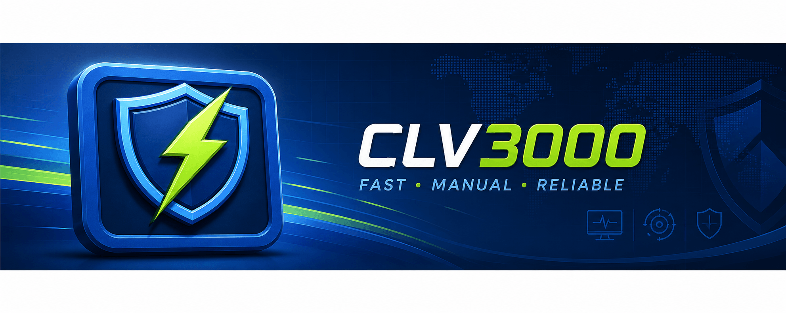
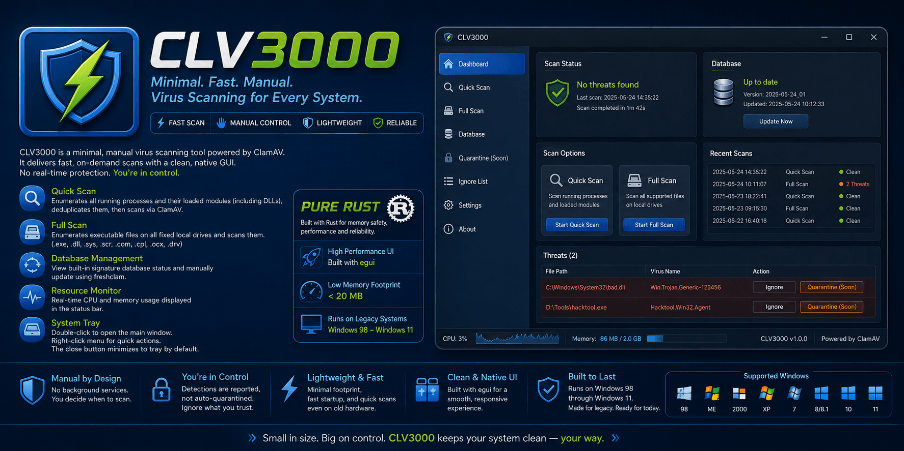

<p align="center">
  
</p>

<h1 align="center">CLV3000（A tribute to the KV3000）</h1>

<p align="center">
  A portable, high-performance on-demand antivirus scanner for Windows, built in Rust with ClamAV.
</p>

<p align="center">
  <a href="#features">Features</a> &bull;
  <a href="#quick-start">Quick Start</a> &bull;
  <a href="#build-from-source">Build</a> &bull;
  <a href="#mock-mode-macos--linux">Mock Mode</a> &bull;
  <a href="#verification-checklist">Verification</a>
</p>

---

CLV3000 is a portable, fast virus scanning tool for Windows, designed as a standalone emergency scanner you can carry on a USB drive. It provides on-demand scans powered by ClamAV with a clean native GUI, system tray integration, and a full range of post-scan actions.

## Use Cases

- **Portable emergency scanner** — Keep CLV3000 on a USB drive alongside a portable ClamAV. When a system behaves suspiciously, plug it in and run a scan immediately — no installation required.
- **System rescue (PE mode)** — When Windows is unbootable due to infection, run CLV3000 from a WinPE / recovery environment to scan and clean offline system drives. The lightweight executable and CLI-friendly `--scan-path` argument make it ideal for scripted batch scanning in rescue workflows.
- **Everyday protection** — Run silently in the system tray with `--tray-only` for quick on-demand scans whenever needed. The autostart feature ensures it's always ready.
- **Legacy hardware** — Built with older machines in mind: optimized for small binary size and low memory footprint, with a responsive native GUI that runs well on resource-constrained PCs.

## Features

- **Quick Scan** — Enumerates all running processes and their loaded modules (including DLLs), deduplicates them, then scans via ClamAV.
- **Full Scan** — Enumerates executable files (`.exe`, `.dll`, `.sys`, `.scr`, `.com`, `.cpl`, `.ocx`, `.drv`) on all fixed local drives and scans them.
- **Single-file / folder scan** — Right-click any file or folder in Explorer and select "Scan with CLV3000". Supports both cold start (new instance) and forwarding to an already running instance.
- **Threat management** — Detected threats can be **ignored** (recorded so future scans skip that alert) or **quarantined** (moved to a secure isolated directory with full restore capability).
- **Virus Database Management** — View built-in signature database status and manually trigger `freshclam` to update.
- **Resource Monitor** — Real-time CPU and memory usage displayed in the bottom status bar.
- **System Tray** — Double-click to open the main window; right-click menu for quick scan, about dialog, and exit. The close button minimizes to tray by default.
- **Tray-only startup** — Launch with `--tray-only` to start silently in the system tray without showing a window. Ideal for autostart on boot.
- **Autostart** — Register CLV3000 to start automatically with Windows (via `--tray-only`), configurable from the Settings page.
- **Single-instance lock** — Only one instance runs at a time. A second instance forwards its scan request to the running one then exits cleanly.
- **Code-signature pre-filter** — On Windows, files signed by trusted publishers are skipped before reaching the scan engine, reducing scan time.
- **File gene cache** — Content-hash based cache (blake3) that remembers scan results for unchanged files, accelerating rescanning the same paths.
- **Quarantine management** — The Settings page provides a full quarantine list with **restore** (move back to original location) and **delete permanently** options.

<p align="center">
  
</p>

## Quick Start

### Prerequisites

A portable ClamAV installation must be placed alongside the executable:

```
<exe directory>/
  clamav/
    clamscan.exe
    freshclam.exe
    *.dll              (libclamav and dependencies)
    database/
      *.cvd / *.cld   (signature database files)
```

Download the Windows installer from [clamav.net](https://www.clamav.net/downloads), install it on any machine, then copy the files listed above. You can also use the official portable build.

Before the first run, update the database manually:

```bash
freshclam.exe --datadir=clamav\database
```

You can also trigger updates from the "Database" page inside the application.

> If the `clamav/` directory is missing, CLV3000 will not crash — it will display a "scan engine not found" message on the scan page.

### Run

```bash
clv3000.exe
```

Place the executable and the `clamav/` directory in the same folder, then double-click or run from a terminal.

To start silently in the system tray:

```bash
clv3000.exe --tray-only
```

## Build from Source

### Windows (recommended)

```bash
cargo build --release
```

Output: `target/release/clv3000.exe`

### Cross-compile from macOS / Linux

Requires [mingw-w64](https://www.mingw-w64.org/) (`brew install mingw-w64` on macOS). The repository's `.cargo/config.toml` already configures the linker for the target.

```bash
cargo build --release --target x86_64-pc-windows-gnu
```

Output: `target/x86_64-pc-windows-gnu/release/clv3000.exe`

> This produces a Windows executable that **cannot** run on macOS/Linux. Tray behavior, process enumeration, and single-instance locking must be verified on a real Windows machine.

## Real Mode (macOS / Windows) vs. Mock Mode (Linux / other)

The app does **real scanning** on both Windows and macOS — process/module enumeration, disk
enumeration, the ClamAV engine call, code-signature pre-filtering and single-instance locking
are all implemented per platform. To build/run natively on macOS (no cross-compile):

```bash
cargo run          # macOS: real scanning (needs ClamAV — see below)
```

On macOS, ClamAV is required: either `brew install clamav` (picked up from `PATH`) or drop a
portable `clamav/` directory next to the executable (same layout as Windows:
`clamav/clamscan`, `clamav/freshclam`, `clamav/database/*.cvd`). Without it, the scan page
reports "engine not found" instead of crashing.

**Mock Mode** applies only to Linux and other non-Windows, non-macOS targets — used purely to
preview the UI/interaction flow. There, the `windows` crate is excluded from the dependency
graph and all Win32-specific logic is replaced with mock implementations:

| Module | Windows | macOS | Mock (Linux / other) |
|--------|---------|-------|----------------------|
| Quick Scan | Real process/module enumeration via `Toolhelp32` | Real process enumeration via `sysinfo` (running binaries) | Simulated ~342 processes with generated module lists |
| Full Scan | Real disk enumeration + file traversal | Real mount enumeration (`/` + optional `/Volumes`) + Mach-O detection | ~3000 generated fake paths, no filesystem access |
| Scan Engine | Calls `clamscan.exe` subprocess | Calls `clamscan` subprocess (PATH or bundled) | Simulated delay, alternating OK/FOUND results across runs |
| Code-sign pre-filter | `WinVerifyTrust` (PE/catalog) | `codesign --verify` (Mach-O) | n/a |
| Single-instance Lock | Named Mutex | Unix socket lock in app data dir | Always allowed (no lock) |
| Local Time | `GetLocalTime` | `SystemTime` (UTC) | `SystemTime` (UTC) |
| Database Status | Checks for `clamscan.exe` / `freshclam.exe` | Checks for `clamscan` / `freshclam` (PATH or bundled) | Always reports "Ready"; manual update sleeps 1.2s |
| Config, Tray, UI | Real | Real — same as Windows | Real — same as Windows |

To see the "threat found" red result page in Mock Mode, click "Rescan" multiple times — the mock engine flips its result each run.

> Mock mode is for UI/interaction preview only. Process counts, file paths, and scan results are synthetic and do not represent real security status. On macOS/Windows the scans are real (subject to OS permissions such as Full Disk Access on macOS).

## Verification Checklist

Verify these on a real Windows machine before release:

1. Place `clamscan.exe`, `freshclam.exe`, DLLs, and `database/` in the `clamav/` subdirectory. Double-click `clv3000.exe`.
2. Place an [EICAR test file](https://en.wikipedia.org/wiki/EICAR_test_file) on the desktop. Run a full scan and confirm it is detected and displayed in the UI.
3. Quick scan: confirm process/file counts are shown, and elapsed time + files scanned are displayed after completion.
4. Database page: click "Update Database" and confirm it connects and updates (requires `freshclam.exe`).
5. Tray: double-click opens the window; right-click menu items work; close button minimizes to tray (process still running in Task Manager); tray "Exit" terminates the process.
6. Launch a second instance — it should exit immediately (single-instance lock).
7. Cross-check CPU/memory values in the bottom status bar against Task Manager.
8. During a scan, click "Cancel" — confirm `clamscan.exe` subprocess is terminated and UI resets properly.
9. Right-click a file in Explorer → "Scan with CLV3000" — confirm the scan starts and results are displayed.
10. Quarantine a detected threat, then verify it appears in Settings → Quarantine & Ignore, and can be restored or deleted.
11. Launch with `--tray-only` — confirm the process starts without any window, and the tray icon is present.

## License

[MIT](LICENSE) &copy; 2026 Sopaco